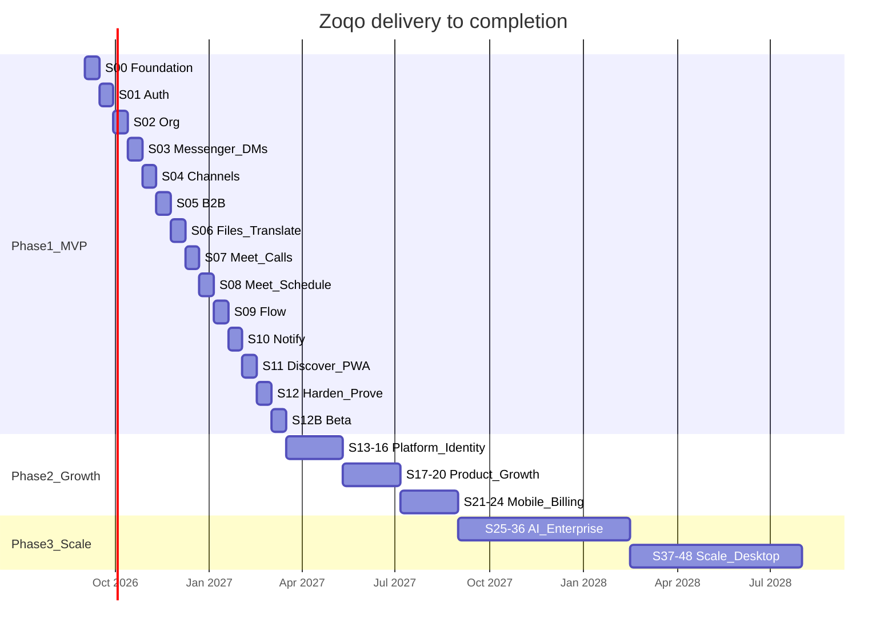

# Zoqo — Sprint Series to Completion
## Document ID: ZOQO-SPRINTS-001 · Version 1.2 · August 2026

| Field | Detail |
|---|---|
| **Companion to** | [ZOQO-SDP-001](./ZOQO-SDP-001.md) · [ZOQO-SRS-001](./ZOQO-SRS-001.md) v1.6 · [ZOQO-QA-001](./ZOQO-QA-001.md) |
| **Cadence** | 2 weeks per sprint |
| **Method** | Outside-in BDD + TDD (§21 of the SRS) |
| **Architecture** | Hexagonal modular monolith + sidecars (§4.4–§4.9) |
| **Phase 1 outcome** | Installable PWA on a single self-hosted host, all P0 journeys live (S0–S12B, 28 weeks) |
| **Full completion** | End of Phase 3 (Sprint 48) — enterprise + scale + desktop |

This is the **execution plan**. The SDP is **how we run**. The SRS is the **what**. This file is the **when** and **in what order**. A sprint that ships behaviour not listed here needs an SRS version increment first (`SYS-DEV-010`). Sprint 0 must not start until [ZOQO-SDP-001](./ZOQO-SDP-001.md) §12 is signed.

---

## 1. How to use this plan

1. Start every sprint by writing Gherkin for the SRS IDs in that sprint's table. Tag `@ORG-AUTH-002 @P0`.
2. Build **vertical slices**: use case → API → UI in the same sprint. Do not bank six sprints of API with no screen.
3. A sprint is closed only when its **Sprint Exit** checklist is green, including the Definition of Done in SRS §21.5 and the sprint QA list in [ZOQO-QA-001](./ZOQO-QA-001.md) §10.
4. If a P0 item slips, it consumes the next sprint's P1 buffer. P0 never jumps a later P0.

**Assumed capacity:** 3 full-stack engineers, 2-week sprints, ~40–45 productive engineer-days after meetings. If the team is smaller, keep the sequence and stretch the calendar; do not skip slices.

**Ceremonies (lightweight):**

| When | What |
|---|---|
| Day 1, 60 min | Planning: confirm SRS IDs, write/adjust Gherkin, split PRs |
| Daily, 10 min | Stand-up: blocked tests, not status theatre |
| Day 10, 45 min | Review / demo against the sprint Goal |
| Day 10, 30 min | Retro: one change to the next sprint |
| Continuous | PR review per SRS §21.6 |

---

## 2. Program view



Dates above are **illustrative** from 1 Sep 2026. Shift the start; keep the order.

**The chart is sequential, and that is deliberate.** At the assumed capacity of three engineers there is no second track to staff. Phase 1 is 28 weeks: 13 sprints of two weeks, S0 through S12B. Earlier versions of this file drew Meet, Flow and Discover as parallel bars finishing around week 16; that was never staffable at three engineers, and it also started Notify before Meet had produced the call events Notify consumes.

**Where parallelism becomes available:** if you add a second team, these are the true constraints, and nothing else may move:

| Sprint | Earliest start | Why |
|---|---|---|
| S7 Meet calls | after S3 | Calls launch from a conversation |
| S9 Flow | after S2 | Needs org, departments, manager roles |
| S11 Discover | after S5 | Connect button reuses the B2B flow |
| S10 Notify | after **S3, S7 and S9** | Consumes message, call and approval events |
| S12 Harden | after all feature sprints | Load, pen-test and restore act on the whole system |

```
S0  Foundation
S1  Auth (+ thin mail, migrations, staging)
S2  Org  (+ invites, migrations)
S3  Messenger DMs (+ E2EE envelope + X3DH)
S4  Channels
S5  B2B
S6  Files + Translate + channel search
S7  Meet calls            [may overlap after S3 with a second team]
S8  Meet scheduling
S9  Flow                  [may overlap after S2 with a second team]
S10 Notify                [needs S3 + S7 + S9 events]
S11 Discover + PWA        [may overlap after S5 with a second team]
S12 Harden + prove
S12B Beta
```

---

## 3. Standing rules (every sprint)

Copied from the SRS so this file stands alone:

- Gherkin before code. TDD for domain/application. UI last in the slice.
- Two images only: `apps/api`, `apps/web`. New capability is a **module**, not a new service.
- `tenant_id` from auth context. Second-tenant test on every write path.
- Ports for mail, storage, push, search, identity, translate.
- Optional sidecars fail open (translate, search, mail, push). Send-message never 500s because LibreTranslate is down.
- PR named with the SRS ID. Squash to `main`. CI deploys staging.
- **Every sprint that adds a table ships its migration in that sprint.** No module runs on an in-memory store past its own sprint.
- **Every sprint closes at ≥90% coverage on the `domain/` and `application/` folders it touched**, and >80% overall (SRS §22). This is not just a Sprint 1 rule.
- **Every new endpoint appears in the OpenAPI document in the same PR.** Every new page joins the `@a11y` pack in the same PR.

**Thin-now / complete-later (do not wait for the “home” sprint):**

| Capability | Thin slice | Completes in |
|---|---|---|
| Email | `MailerPort` + Mailpit from S1 (OTP, invites) | S10 (templates, bounce, digest, prefs) |
| Audit | Append-only log middleware from S1 | S12 (search, export, retention) |
| Rate limit | Auth endpoints from S1 | S12 (all limits + headers) |
| Notify | Persist + in-app bell stub from S3 | S10 |
| Search | `tsvector` column on **channel** messages from S3 | S6/S11 (UI + filters) |
| Encryption | Message envelope + X3DH key exchange from S3 | S12 (Double Ratchet, rotation) |

**Search scope decision (binding):** full-text search covers **channel messages only**. Internal DMs and B2B DMs are end-to-end encrypted (`SHIELD-CORE-001`, `MSG-XLANG-006`), so the server holds no plaintext to index and a `tsvector` over DM bodies cannot exist. `MSG-SEARCH-001` currently reads "all messages the user has access to" and needs the amendment listed in §11. Client-side DM search over the IndexedDB cache is a Phase 2 candidate, not a Phase 1 commitment.

---

## 4. Phase 1 — Sprints 0 to 12B (MVP)

### Sprint 0 — Foundation
**Weeks 1–2 · Goal:** A developer clones the repo, runs `docker compose up`, and CI is green on an empty walking skeleton.

| | |
|---|---|
| **SRS** | §4.6–§4.9, §20.4, §21, `SYS-DEP-003` |
| **Depends on** | Nothing |
| **Demo** | `GET /health` and `/ready` return 200. Web shows a branded empty shell. Mailpit open. MinIO console open. |

**Build**

- [ ] Monorepo (Turborepo or Nx): `apps/api`, `apps/web`, `packages/shared`, `packages/ui`, `packages/config`
- [ ] Hexagonal folder skeleton for `identity` and `org` (empty use case + fake port)
- [ ] Docker Compose: Postgres 16, Valkey 8, RabbitMQ, MinIO, Traefik, Mailpit, ClamAV, LiveKit, coturn, LibreTranslate (profile), Loki/Prometheus/Grafana/GlitchTip (profile `obs`)
- [ ] Profiles: `default`, `minimal` (no LibreTranslate), `obs`, `test`
- [ ] Migrator, RLS helper, `tenant` AsyncLocalStorage
- [ ] Port interfaces + in-memory fakes: `MailerPort`, `ObjectStoragePort`, `PushPort`, `SearchPort`, `IdentityProviderPort`, `TranslationPort`, `EventBusPort`, `ClockPort`
- [ ] Jest, Cucumber.js, Playwright, ESLint boundaries, licence scan, SOPS+age, `.env.example`
- [ ] axe-core in Playwright + `pnpm test:a11y` (WCAG 2.1 AA is an SRS design principle and a QA §4 PR gate — it needs a harness before the first page ships)
- [ ] RTM generator: `docs/qa/rtm.csv` built from Gherkin tags in CI (QA §4)
- [ ] Seed script stub (empty orgs to be filled S2)
- [ ] GitHub Actions self-hosted runner pipeline (lint, unit, bdd smoke, a11y, trivy, image build)
- [ ] Staging VPS ordered (SDP §12) — provisioning and the deploy pipeline land in S1

**BDD to write**

```gherkin
@SYS-DEP-003 @P0
Scenario: Stack starts with no vendor accounts
  Given a clean clone and copied .env.example
  When I run docker compose up
  Then api /health is 200 within 5 minutes
  And no outbound call is made to a third-party SaaS
```

**Sprint exit**

- [ ] `pnpm test:unit`, `pnpm lint`, `pnpm typecheck` green
- [ ] `docker compose --profile minimal up` works on 8 GB
- [ ] Boundary lint fails a deliberate `domain → infrastructure` import
- [ ] `pnpm test:a11y` runs and passes on the empty shell
- [ ] `docs/qa/rtm.csv` generated by CI and published as an artifact
- [ ] ADR-0001: modular monolith confirmed

---

### Sprint 1 — Identity & Auth
**Weeks 3–4 · Goal:** A person can register, verify email, log in, and manage sessions. No OAuth.

| | |
|---|---|
| **SRS** | `ORG-AUTH-001`, `002`, `003` (P1 MFA), `004`, `005` |
| **Depends on** | S0 |
| **Demo** | Register → OTP in Mailpit → login → sessions page → logout all devices. Failed login five times locks. |

**Stories**

1. Register with email + password (strength + common-password list)
2. Verify email with 6-digit OTP (also shown in-app if invited — stub until S2)
3. Login / refresh-token rotation / logout
4. Forgot / reset password; invalidate sessions
5. List / revoke sessions
6. MFA TOTP enable + backup codes (P1 — ship if time; else first day of S2)

**Build**

- [ ] `identity` module: users, password hash bcrypt 12, JWT 15 min, refresh 30 d
- [ ] **Migrations for `users`, `sessions`, `audit_log` (SRS §17.1) with RLS policies.** In-memory stores do not survive this sprint
- [ ] `SmtpMailer` (Mailpit) driver
- [ ] Auth pages: register, verify, login, forgot, reset, sessions
- [ ] Audit events for login success/fail
- [ ] Rate limit on `/v1/auth/*` (5 / 15 min / IP)
- [ ] **Staging host provisioned; CI deploys `main` to staging.** QA §5 requires staging from the first sprint review, and QA §10 checks new `@P0` scenarios there
- [ ] **OpenAPI document generated from the controllers and served at `/docs`** (Phase 1 exit criterion; cheap now, expensive to backfill)

**BDD:** `@ORG-AUTH-001` through `@ORG-AUTH-005` (MFA may be `@P1`)

**Sprint exit**

- [ ] Unverified user cannot access app APIs
- [ ] Generic error on bad login (no email enumeration)
- [ ] Tenant-less user can exist (org comes in S2)
- [ ] Coverage ≥90% on `identity` domain/application
- [ ] A restarted API still knows the users registered before the restart
- [ ] Staging reachable, seeded, and green on the sprint's `@P0` scenarios

---

### Sprint 2 — Organization
**Weeks 5–6 · Goal:** A registered user creates an org, invites a colleague, and that colleague joins.

| | |
|---|---|
| **SRS** | `ORG-SETUP-001`–`006` (org chart `004` is P1) |
| **Depends on** | S1 |
| **Demo** | Create “Acme”, invite two emails, accept, see #general, change a setting, see org chart if P1 lands. |

**Stories**

1. Create organization (slug, defaults: General/Management, #general, #announcements, Discover profile stub)
2. Invite members (single + CSV), 7-day expiry, member cap
3. Departments and teams (max 5 levels)
4. User profile (avatar via MinIO pre-signed URL, presence status field)
5. Org settings + invitation policy
6. Org chart auto-generated (P1 — may slip to S12)

**Build**

- [ ] `org` module + membership + RBAC guard
- [ ] **Migrations for `organizations`, `memberships`, `departments`, `teams`, `invitations`, `channels`, `member_profiles` (SRS §17.1) with `tenant_id` RLS policies**
- [ ] Default channels created as rows (messaging behaviour in S4; rows exist now)
- [ ] Switch-org in the web shell
- [ ] Seed: two orgs, all roles, for later B2B — against the real database, so the running API sees it

**Sprint exit**

- [ ] User in two orgs; JWT/org header selects tenant
- [ ] Second tenant cannot see Acme members
- [ ] Journey 1 (§6.2) Playwright green
- [ ] **Journey 10 (manage departments, teams and roles) Playwright green** — QA §8 Pack B requires J10 first-green in this sprint
- [ ] **Invite expiry and CSV-junk scenarios automated** (QA §11, Sprint 2 row)
- [ ] RLS proven: set `app.tenant_id` to Acme, query Nodi rows, get zero (QA §7.3)

---

### Sprint 3 — Messenger: Direct messages
**Weeks 7–8 · Goal:** Two org members can DM with typing, receipts, presence, and message actions.

| | |
|---|---|
| **SRS** | `MSG-DM-001`–`005`, `SHIELD-CORE-001` (envelope + X3DH only) |
| **Depends on** | S1, S2 |
| **Demo** | Two browsers: type, send, edit, react, reply, presence goes away after idle. Server log shows ciphertext, not words. |

**Stories**

1. Send/receive DM (<200 ms when both online)
2. Edit (15 min), delete, react, reply, forward, copy, pin (manager+), report
3. Typing indicators
4. Read receipts (privacy toggle)
5. Presence via Valkey heartbeat
6. **Encrypted message envelope + X3DH key exchange for DMs**

**Build**

- [ ] `messenger` module: conversations, messages (Postgres JSONB), RLS
- [ ] **Encrypted envelope from day one:** DM bodies are ciphertext columns, keys exchanged via X3DH, client holds the private key. The Double Ratchet lands in S12; the *storage shape and key exchange* must not
- [ ] Socket.IO + Valkey adapter; events from §18.5
- [ ] In-app notification stub on new DM (full Notify in S10) — payload carries sender and conversation only, never body text
- [ ] `tsvector` on **channel** messages only (see the search scope decision in §3)
- [ ] Web: sidebar, conversation view, composer

> **Why the envelope moves here from S12.** `SHIELD-CORE-001` says the server cannot read DM content. Every sprint after this one reads messages — S6 indexes and translates them, S10 previews them in email. If DMs are plaintext until S12, then S12 is not a hardening sprint, it is a rewrite of the message pipeline, the search index, and the notification payloads while the same two weeks are also spending a load test, a pen test and a restore drill. Ship the shape now; ship the ratchet later.

**Sprint exit**

- [ ] Offline reconnect delivers missed messages
- [ ] Journey 2 (DM part) green
- [ ] Load smoke: 100 concurrent WS connections locally
- [ ] **A DM row read straight from Postgres contains no plaintext** (QA Pack C)

---

### Sprint 4 — Channels
**Weeks 9–10 · Goal:** Public and private channels with threads and @mentions.

| | |
|---|---|
| **SRS** | `MSG-CH-001`–`004` |
| **Depends on** | S3 |
| **Demo** | Create #marketing, @mention a user, reply in a thread, browse/join a public channel. |

**Stories**

1. Create public/private channel; name format; limits
2. Channel messaging = all DM features + @user/@channel/@here
3. Threads (don't clutter main view)
4. Manage: members, archive, mute, pin, notification pref
5. Channel browser

**Sprint exit**

- [ ] `@channel` fans out notify stubs to members
- [ ] Unread counts in sidebar
- [ ] Tenant isolation: cannot join another org's channel by ID

---

### Sprint 5 — B2B connections and external chat
**Weeks 11–12 · Goal:** Two organizations connect and chat. This is the product differentiator.

| | |
|---|---|
| **SRS** | `MSG-B2B-001`, `002` (`003`/`004` are P1 — backlog unless ahead) |
| **Depends on** | S3, S4 |
| **Demo** | Acme sends connection request to Nodi → accept → External sidebar DM. Disconnect archives. |

**Stories**

1. Connection request + intro + daily limit
2. Accept / reject / block
3. B2B DMs (all MSG-DM features, visual distinction, org name on bubbles)
4. Disconnect
5. Shared channels + guest portal → **not this sprint** (Phase 2)

**Sprint exit**

- [ ] Journey 3 green
- [ ] Cross-tenant leak test: Acme user cannot list Nodi internal channels
- [ ] B2B audit events written

---

### Sprint 6 — Files, search, and cross-language translation
**Weeks 13–14 · Goal:** Attach files safely; search messages; two people chat across languages.

| | |
|---|---|
| **SRS** | `MSG-FILE-001`, `MSG-SEARCH-001` (P1), `MSG-XLANG-001`–`007` |
| **Depends on** | S3–S5 |
| **Demo** | Rahim (`bn`) auto-translated B2B chat with Sarah (`en`); PDF upload with scan; search “Q1 report”. |

**Stories**

1. Upload (pre-signed MinIO), ClamAV, thumbnails, quotas
2. On-demand translate + auto-translate (B2B default on)
3. Language detect; preferred language on profile
4. E2E path: client decrypt → translate; no server cache
5. Message search UI over **channel messages** (FTS already on the table). DMs are excluded and the UI says so — see the search scope decision in §3
6. B2B intro translation
7. Translation down: banner, chat still works

**Build**

- [ ] `files` module + `LibreTranslate` driver (internal network only)
- [ ] `message_translations`, `conversation_translation_prefs`
- [ ] Quality fixture repo files for bn↔en, hi↔en, ar↔en (review may finish S12)

**Sprint exit**

- [ ] Journeys 2 (files) and 11 green
- [ ] Malware sample quarantined (EICAR)
- [ ] LibreTranslate stop-container test: send still 201
- [ ] Searching a phrase that exists only in a DM returns nothing, and the UI explains why

---

### Sprint 7 — Meet: live calls
**Weeks 15–16 · Goal:** 1:1 and group calls from a conversation, with screen share.

| | |
|---|---|
| **SRS** | `MEET-CALL-001`, `002`, `003`, `005` |
| **Depends on** | S3 (can start in parallel after S3) |
| **Demo** | Call from a DM; second user joins; screen share; hang up. Group call from a channel, late join. |

**Stories**

1. Instant audio/video 1:1 via LiveKit; 30 s missed-call
2. Group call up to 25; host end-for-all
3. Screen share
4. In-call controls (mute, camera, chat, hand, reactions, devices)
5. TURN credentials from Meet service; NAT test

**Sprint exit**

- [ ] Journey 4 green
- [ ] Call works with TCP 443-only firewall (coturn)
- [ ] Missed call creates notify stub

---

### Sprint 8 — Meet: scheduling and history
**Weeks 17–18 · Goal:** Schedule a meeting, invite, RSVP, remind, join from history.

| | |
|---|---|
| **SRS** | `MEET-CALL-004`, `008` (`006` lobby is P1) |
| **Depends on** | S7 |
| **Demo** | Create meeting with .ics in Mailpit, RSVP, calendar grid, join at start. |

**Stories**

1. Schedule (timezone, recurrence, agenda, unique link)
2. Invite internal + B2B + external email
3. 15-min reminder
4. Meeting history + calendar views
5. Waiting room for B2B (P1 if time)

**Sprint exit**

- [ ] Journey 5 green
- [ ] External guest join via link (no account) for scheduled meetings

---

### Sprint 9 — Flow: approvals
**Weeks 19–20 · Goal:** Employee submits leave; manager approves; purchase routes on amount.

| | |
|---|---|
| **SRS** | `FLOW-CORE-001`–`005` |
| **Depends on** | S2 |
| **Demo** | Leave request → manager dashboard → approve. Purchase over threshold → extra step. Reject with reason. |

**Stories**

1. Three templates (Leave, Purchase with condition, General)
2. Submit + validation + attachments
3. Approve / reject / request changes
4. Status tracker + history
5. My Requests / My Approvals

**Sprint exit**

- [ ] Journeys 8 and 9 green
- [ ] Approver cannot approve own request
- [ ] Immutable `workflow_actions`

---

### Sprint 10 — Notify
**Weeks 21–22 · Goal:** The right person is notified in-app, by email, and by Web Push, with preferences.

| | |
|---|---|
| **SRS** | `NOTIF-CORE-001`–`004` |
| **Depends on** | S3, S7, S9 (events already firing) |
| **Demo** | Mention → bell + push. Offline user gets email. Quiet hours swallow a DM, not a call. |

**Stories**

1. In-app bell, unread, mark read, navigate to source
2. Email via Postfix in staging/prod; SPF/DKIM/DMARC/PTR
3. Web Push VAPID
4. Preferences + quiet hours + per-channel mute
5. Replace stub notify calls from S3–S9

**Sprint exit**

- [ ] Journey 7 green
- [ ] Bounce/queue Prometheus alerts
- [ ] Email fallback documented if deliverability <95% (`MailerPort` exception)

---

### Sprint 11 — Discover + PWA
**Weeks 23–24 · Goal:** Publish a business profile, find another company, connect. App installable.

| | |
|---|---|
| **SRS** | `DISC-PROFILE-001`–`003` (verification badge is P2) |
| **Depends on** | S5 |
| **Demo** | Publish Acme profile; search “textiles Bangladesh”; Connect; install PWA on Android/desktop. |

**Stories**

1. Enrich + publish/unpublish profile; completion meter
2. Public SSR page `zoqo.com/biz/{slug}`
3. Directory search (FTS + filters)
4. Connect button → existing B2B flow
5. PWA: manifest, service worker, home screen, Web Push permission flow
6. Message search polish if slipped from S6

**Sprint exit**

- [ ] Journeys 6 and 3 (from profile) green
- [ ] Profile unpublished ⇒ not in search
- [ ] Lighthouse PWA checks pass on `/app`

---

### Sprint 12 — Harden and prove
**Weeks 25–26 · Goal:** Production host is boring: secure, backed up, fast enough, documented.

| | |
|---|---|
| **SRS** | `SHIELD-CORE-001`–`004`, §16, §20.7, Phase 1 exit criteria |
| **Depends on** | All feature sprints |
| **Demo** | Restore drill timed; load test report; audit export; pen-test findings closed. |

**Stories / work**

1. **Double Ratchet completion** on the S3 envelope, plus key rotation (`SHIELD-CORE-001`). The envelope, X3DH and ciphertext storage already exist from S3
2. Audit log UI + export
3. Rate-limit headers everywhere; per-user 100/min (`SHIELD-CORE-004`)
4. Pen-test tenant isolation suite (QA Pack C in full)
5. Load: 1,000 concurrent, p95 API <200 ms
6. Backup restore drill ≤4 h
7. Translation quality sign-off `SYS-XLANG-002`
8. OpenAPI document reviewed and published; runbooks: deploy, rebuild, email, TURN

**Sprint exit = Phase 1 exit** (SRS §22), except the two-week staging soak and beta feedback, which S12B carries.

---

### Sprint 12B — Beta
**Weeks 27–28 · Goal:** Real organizations use it for two weeks and the P1 debt is paid.

| | |
|---|---|
| **SRS** | Phase 1 exit criteria (soak, beta) |
| **Depends on** | S12 |
| **Demo** | Two real orgs chatting in two languages on `app.zoqo.com`, two weeks with no Blocker. |

**Stories / work**

1. Onboard 5–10 friendly organizations; support rota; feedback triage
2. P1 leftovers: org chart (`ORG-SETUP-004`), MFA (`ORG-AUTH-003`), meeting lobby (`MEET-CALL-006`), search UX polish
3. Fix-forward on beta defects by QA §9 severity
4. Staging stable for 2+ weeks — the Phase 1 exit clause that cannot be compressed

> **Why S12 was split.** The single sprint held ten workstreams — a Signal-protocol implementation, an audit UI, a pen test, a 1,000-user load test, a restore drill, a translation sign-off, three P1 features, four runbooks and beta onboarding — against 40–45 engineer-days. Items 1, 4, 5 and 6 could each consume the sprint alone, and "staging stable for 2+ weeks" cannot fit inside the two weeks that are also building the thing. Phase 2 still starts at S13, so every downstream sprint number and the release-train table are unchanged.

---

## 5. Phase 1 backlog (explicitly not in S0–S12B)

Do not sneak these in. They have a home in Phase 2+.

| Item | Phase |
|---|---|
| Google / Microsoft OAuth | 2 |
| Flutter iOS/Android, FCM/APNs | 2 |
| Stripe billing | 2 |
| B2B shared channels, guest portal | 2 |
| Message search on OpenSearch | 2 (only if FTS misses p95) |
| Client-side DM search over the IndexedDB cache | 2 (the only way to search E2E content) |
| Meeting recording, lobby polish, breakout | 2 |
| Visual workflow builder, delegation, SLA | 2 |
| Insights dashboards | 2 |
| DeepL driver | 2 (only if fixture fails) |
| Ollama summarisation | 2 |
| SSO/SAML, Tauri, Kafka, EKS | 3 |

---

## 6. Phase 2 — Sprints 13 to 24 (Growth)

Cadence stays 2 weeks. Each sprint still vertical + BDD.

### Sprints 13–14 — Platform: k3s and search
**Goal:** Run on three self-hosted nodes. `SearchPort` OpenSearch driver behind the same API.

- k3s, ingress, certs, replicated Postgres/Valkey/Rabbit
- OpenSearch driver; keep Postgres FTS as fallback
- Cloudflare free CDN optional
- Uptime target moves toward 99.9%

### Sprints 15–16 — Identity: OAuth
**Goal:** Google and Microsoft login via `IdentityProviderPort`. Existing passwords still work.

### Sprints 17–18 — Messenger growth
**Goal:** Voice notes, polls, B2B shared channels, guest portal, message search UX polish, client-side DM search over the IndexedDB cache.

### Sprints 19–20 — Meet + Flow growth
**Goal:** Lobby default-on for B2B, recording to MinIO, breakout rooms; visual workflow builder + parallel approval.

### Sprints 21–22 — Discover + Insights + Shield
**Goal:** Business feed, promoted posts, RFQ; admin dashboards (`INS-001`/`002`); GDPR export; SOC 2 control mapping (not certification yet).

### Sprints 23–24 — Billing + Flutter
**Goal:** Stripe via `PaymentPort` (first paid vendor — SRS sign-off). Flutter iOS/Android + FCM/APNs `PushPort` driver. Apple/Google developer accounts required.

**Phase 2 exit**

- [ ] Paying customer can subscribe
- [ ] Native apps on both stores
- [ ] Multi-node; recorded meetings; shared B2B channel
- [ ] DeepL only if `SYS-XLANG-002` failed and exception signed

---

## 7. Phase 3 — Sprints 25 to 48 (Scale)

Grouped in 8-week blocks. Re-plan at Sprint 25 with real usage data.

Each block is four sprints — eight weeks, about two months. Months are counted from the start of Sprint 0, with Phase 1 running to month 7 (28 weeks) and Phase 2 to month 12.

| Sprints | Months (approx.) | Goal |
|---|---|---|
| **25–28** | 13–14 | Self-hosted Ollama summaries (`AI-001`); meeting notes (`AI-004`); live captions if models allow |
| **29–32** | 15–16 | SSO/SAML, IP allow-list, data-residency switch, compliance reports |
| **33–36** | 17–18 | Public API + webhooks + developer portal; first vertical pack (e.g. trading / garments) |
| **37–40** | 19–20 | Multi-region or EKS; Kafka for the event bus; S3/RDS if cost now beats ops |
| **41–44** | 21–22 | Tauri desktop; UI i18n (bn, hi, ar, es, fr, de, ja) + chrome RTL |
| **45–48** | 23–24 | Hardening, 10k-webinar path, performance, **v2.0 launch** |

**Product complete** means Phase 3 exit: enterprise SSO, public API, desktop, localised chrome, scaled media, AI suite on ports (self-hosted first).

---

## 8. Release trains

| Release | After sprint | What users get |
|---|---|---|
| **Internal dogfood** | 6 | Auth, org, DMs, channels, B2B, files, translation |
| **Private beta** | 12B | Full P0 + PWA on `app.zoqo.com` |
| **Public beta** | 16 | OAuth, multi-node, better uptime |
| **GA** | 24 | Billing + mobile |
| **v2.0** | 48 | Enterprise + scale + desktop |

---

## 9. Sprint board columns

Use the same columns every sprint (GitHub Projects or analogue):

`Specified (Gherkin)` → `Red` → `TDD in progress` → `Review` → `Done (§21.5)`

No card in `Done` without an SRS ID and a green tagged scenario.

---

## 10. Risk register (delivery)

| Risk | Sprint hit | Mitigation |
|---|---|---|
| E2E encryption slower than expected | 3, 12 | Envelope + X3DH in S3 so the storage shape is right from the start; Double Ratchet in S12. A late ratchet delays a security property, not a rewrite |
| DM search demanded after the channels-only decision | 6, 11 | Say it in the UI from S6; client-side IndexedDB search is a Phase 2 candidate, not a Phase 1 promise |
| LibreTranslate quality on bn | 6, 12 | Fixture in S6; human review S12; DeepL only with sign-off |
| Email in spam | 1, 2, 10 | Mailpit locally; PTR/SPF from S10; in-app OTP always |
| LiveKit/NAT | 7 | coturn in S0; dedicated NAT test day in S7 |
| S6 overloaded | 6 | Search UI may slip to S11; translation is P0 and does not slip |
| Notify late | 10 | Stubs from S3 so product is demoable; S10 replaces stubs |
| Staging never gets built and QA runs on laptops | 1 onward | Staging is an S1 build item and an S1 exit criterion, not an ambient assumption |
| Persistence deferred "just one more sprint" | 1, 2 | Migrations are a standing rule and an S1/S2 exit criterion: a restart must not lose data |
| Team of 1–2 | All | Keep sequence, 3-week sprints, cut P1 (org chart, MFA, lobby, search UI) |

---

## 11. Amendments this plan requires in other documents

This file may not silently contradict the SRS (`SYS-DEV-010`). Each row below is a change v1.2 assumes; until it is made, the documents disagree and the SRS wins.

| Document | Change needed | Reason |
|---|---|---|
| SRS `MSG-SEARCH-001` | Scope from "all messages the user has access to" to **channel messages only**; note DM search as Phase 2 | A server-side `tsvector` cannot index content the server is forbidden to read (`SHIELD-CORE-001`, `MSG-XLANG-006`) |
| SRS `NOTIF-CORE-002` | Email for a new DM carries sender and conversation, not a body preview | Same reason: no server-side plaintext for DMs |
| SRS §22 Phase 1 table | Phase 1 is sprints 0–12B, weeks 1–28 | Sprint 12 split into harden (S12) and beta (S12B) |
| SRS §22 Phase 1 table | Add the migration, staging, a11y and OpenAPI owners now named in S0–S2 | They were exit criteria with no sprint that built them |
| QA §11 Sprint 2 row | Already correct — the sprint file was the one out of step | S2 exit now requires J10, invite expiry and CSV junk |

---

## Document history

| Version | Date | Changes |
|---|---|---|
| 1.0 | August 2026 | Initial sprint series: S0–S12 detailed, S13–S48 outlined, aligned to SRS v1.3 |
| 1.1 | August 2026 | Linked to ZOQO-SDP-001; Sprint 0 gated on SDP §12 |
| 1.2 | August 2026 | Encryption envelope + X3DH moved S12 → S3; search scoped to channels only; S12 split into S12 (harden) and S12B (beta); Gantt made sequential and the S10 dependency corrected; migrations, staging, a11y, OpenAPI and RTM given sprint owners; S2 exit aligned to QA Pack B (J10, invite expiry, CSV junk); coverage/migration/OpenAPI/a11y promoted to standing rules; Phase 3 month arithmetic fixed; §11 amendment register added |
