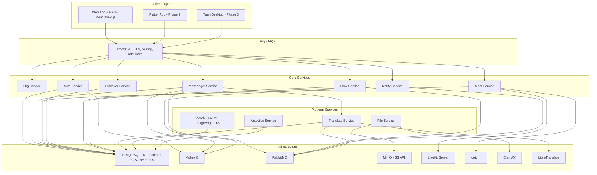
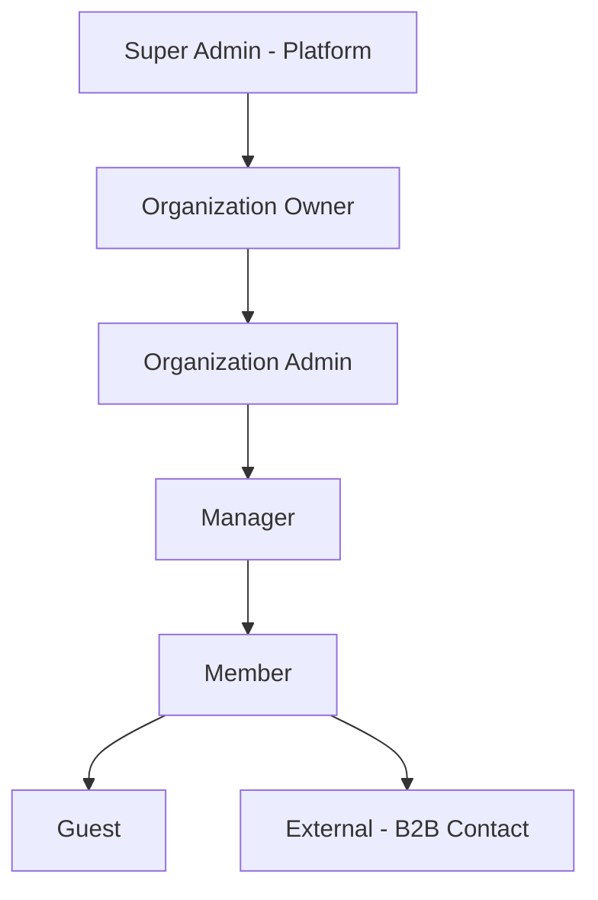

# Zoqo — Software Requirements Specification (SRS)
## Version 1.6 · August 2026

| Field | Detail |
|---|---|
| **Document ID** | ZOQO-SRS-001 |
| **Version** | 1.6 |
| **Status** | Draft — Pending Review |
| **Prepared By** | Zoqo Architecture Team |
| **Standard** | IEEE 830 / ISO/IEC/IEEE 29148 |
| **Revision Theme** | Zero external dependency; hexagonal modular monolith; BDD + TDD; sprints; QA; program SDP |

---

## Table of Contents

1. Introduction
2. Overall Description
3. Technology Stack
4. System Architecture *(v1.3: modular monolith, hexagonal, bounded contexts)*
5. User Roles & Permissions
6. Phase 1 MVP Scope
7. Functional Requirements — Zoqo Org
8. Functional Requirements — Zoqo Messenger
9. Functional Requirements — Zoqo Meet
10. Functional Requirements — Zoqo Discover
11. Functional Requirements — Zoqo Notify
12. Functional Requirements — Zoqo Flow
13. Functional Requirements — Zoqo AI
14. Functional Requirements — Zoqo Shield
15. Functional Requirements — Zoqo Insights
16. Non-Functional Requirements
17. Data Models
18. API Design Standards
19. Third-Party Integrations *(v1.1: self-hosted only)*
20. Deployment Architecture *(v1.1: single-host Docker Compose)*
21. Development Principles & Approach *(v1.3: BDD + TDD; QA: ZOQO-QA-001)*
22. Development Phases & Milestones *(v1.4: ZOQO-SPRINTS-001; program: ZOQO-SDP-001)*
23. Glossary

---

## 1. Introduction

### 1.1 Purpose

This Software Requirements Specification (SRS) defines the complete functional and non-functional requirements for the **Zoqo** unified business platform. How the program is run (roles, RAID, Sprint 0 gate) is **[ZOQO-SDP-001](./ZOQO-SDP-001.md)**. This SRS remains the authority for **what** to build.

### 1.2 Scope

Zoqo is a cloud-native, multi-tenant B2B platform comprising 6 core modules, 3 cross-cutting services, and client applications. Phase 1 ships as a responsive web app and installable PWA. Native mobile (Flutter) and desktop (Tauri) clients are deferred to Phase 2 and Phase 3 respectively because they require paid developer-programme accounts. This document covers:

- All functional requirements organized by module
- Non-functional requirements (performance, security, scalability)
- Data models and API design standards
- Phase 1 MVP scope and feature priorities
- Deployment and infrastructure requirements

### 1.4 Self-Hosting Principle (v1.1)

Phase 1 must be buildable, runnable, and launchable **without registering for any third-party account and without incurring any recurring software cost**. Every component in the Phase 1 stack is open-source software that the team self-hosts on infrastructure it controls.

This is a deliberate constraint with three motivations:

| Motivation | Detail |
|---|---|
| **Cost control** | Pre-revenue, the only spend is compute and bandwidth for servers the team already pays for. No per-seat, per-message, or per-API-call fees. |
| **No vendor lock-in** | Architecture decisions are not shaped around a specific vendor's SDK or pricing model. Swapping in a managed service later is a configuration change, not a rewrite. |
| **Unblocked development** | No sprint stalls waiting for account approval, API key provisioning, billing setup, or vendor review (e.g., Apple developer enrolment, Google OAuth verification). |

**The managed and paid services named in v1.0 are not discarded — they are deferred.** Every Phase 1 component is chosen to be interface-compatible with its managed counterpart so the migration in Phase 2/3 is low-risk. The mapping is defined in §3.1 and §19.

### 1.3 Definitions & Conventions

**Requirement IDs** follow this format:

```
[MODULE]-[CATEGORY]-[NUMBER]
```

| Prefix | Module |
|---|---|
| `ORG` | Zoqo Org (Organization Management) |
| `MSG` | Zoqo Messenger (Communication) |
| `MEET` | Zoqo Meet (Audio-Visual) |
| `DISC` | Zoqo Discover (Business Discovery & Promotion) |
| `NOTIF` | Zoqo Notify (Notifications) |
| `FLOW` | Zoqo Flow (Decision & Workflow) |
| `AI` | Zoqo AI (Intelligence Layer) |
| `SHIELD` | Zoqo Shield (Security & Compliance) |
| `INS` | Zoqo Insights (Analytics) |
| `SYS` | System-wide / Cross-cutting |

**Priority Levels:**

| Priority | Label | Meaning |
|---|---|---|
| P0 | 🔴 Critical | Must be in Phase 1 MVP. Launch blocker. |
| P1 | 🟡 High | Phase 1 target but can slip to early Phase 2 if needed. |
| P2 | 🟢 Medium | Phase 2 feature. |
| P3 | 🔵 Low | Phase 3+ feature. Nice to have. |

---

## 2. Overall Description

### 2.1 Product Perspective

Zoqo is a **new, standalone platform** — not an extension of any existing system. It is composed of:

```
┌─────────────────────────────────────────────────────────┐
│                    CLIENT APPLICATIONS                   │
│  ┌──────────────────────────┐  ┌─────────────────────┐  │
│  │ Web App + PWA (Phase 1)  │  │ Flutter (Phase 2)   │  │
│  │ React / Next.js          │  │ Tauri   (Phase 3)   │  │
│  └──────────────────────────┘  └─────────────────────┘  │
├─────────────────────────────────────────────────────────┤
│                      API GATEWAY                         │
│              Traefik v3  (Phase 3: Kong / AWS)           │
├─────────────────────────────────────────────────────────┤
│                   MICROSERVICES LAYER                     │
│  ┌────────┐ ┌────────┐ ┌────────┐ ┌────────┐ ┌────────┐│
│  │  Org   │ │Messengr│ │  Meet  │ │Discover│ │  Flow  ││
│  │Service │ │Service │ │Service │ │Service │ │Service ││
│  └────────┘ └────────┘ └────────┘ └────────┘ └────────┘│
│  ┌────────┐ ┌────────┐ ┌────────┐ ┌────────┐          │
│  │ Notify │ │   AI   │ │ Shield │ │Insights│          │
│  │Service │ │Service │ │Service │ │Service │          │
│  └────────┘ └────────┘ └────────┘ └────────┘          │
├─────────────────────────────────────────────────────────┤
│          DATA & INFRA LAYER  (all self-hosted)           │
│  ┌──────────┐ ┌────────┐ ┌──────────┐ ┌────────────┐   │
│  │PostgreSQL│ │ Valkey │ │ RabbitMQ │ │ MinIO      │   │
│  │ 16 + FTS │ │   8    │ │    3     │ │ (S3 API)   │   │
│  │ + JSONB  │ │        │ │          │ │            │   │
│  └──────────┘ └────────┘ └──────────┘ └────────────┘   │
│  ┌──────────────────┐ ┌──────────┐ ┌───────────────┐   │
│  │ LiveKit (WebRTC) │ │  coturn  │ │ ClamAV        │   │
│  └──────────────────┘ └──────────┘ └───────────────┘   │
└─────────────────────────────────────────────────────────┘
```

### 2.2 Operating Environment

| Component | Requirement |
|---|---|
| **Web Browser** | Chrome 90+, Firefox 88+, Safari 15+, Edge 90+ |
| **Mobile (Phase 1)** | Same browsers on iOS 16.4+ / Android 10+, via installable PWA |
| **Mobile (Phase 2)** | Native Flutter apps, iOS 15+ / Android 10+ |
| **Desktop (Phase 1)** | Same browsers on Windows 10+, macOS 12+, Linux (Ubuntu 20.04+) |
| **Desktop (Phase 3)** | Tauri wrapper of the web app |
| **Server** | Linux containers (Docker Compose in Phase 1; k3s in Phase 2; Kubernetes in Phase 3) |
| **Cloud** | Phase 1: any Linux VPS (Hetzner, DigitalOcean, OVH, or on-premise bare metal). Phase 3: AWS primary, GCP failover |

### 2.3 Design Constraints

| Constraint | Detail |
|---|---|
| **Self-Hosted Only (Phase 1)** | No component may require a third-party SaaS account, API key, or paid licence to run. See §2.4. |
| **Multi-Tenancy** | All services must support multi-tenant architecture with strict data isolation |
| **Horizontal Scaling** | All services must be stateless and horizontally scalable |
| **Real-Time** | Messaging and notifications must use WebSocket with <200ms delivery |
| **Offline Support** | Mobile apps must support offline message drafting and sync on reconnection |
| **i18n/l10n** | All user-facing strings externalized for translation (Day 1: English; Phase 2: 7 more languages) |
| **API-First** | All features accessible through REST/GraphQL APIs before building any UI |
| **Accessibility** | WCAG 2.1 Level AA compliance for all web interfaces |
| **Adapter Boundary** | Every external-capability call (mail, storage, push, payments, AI) must sit behind an internal interface with a swappable driver. See §2.4.2. |
| **Architecture** | Phase 1 is a hexagonal **modular monolith** (§4.4–§4.9). Microservices are a Phase 2 extraction, not a starting shape. |
| **Delivery method** | Outside-in **BDD + TDD** is mandatory (§21). No P0 ships without an executable scenario. |

### 2.4 Zero-Dependency Constraint (v1.1)

#### 2.4.1 Rules

| ID | Rule |
|---|---|
| `SYS-DEP-001` | No Phase 1 component may require a paid licence, subscription, or usage-metered billing account. |
| `SYS-DEP-002` | No Phase 1 component may require an account with a third-party provider in order to run in development, staging, or production. |
| `SYS-DEP-003` | All Phase 1 infrastructure must start from a single `docker compose up` on a developer machine with no secrets sourced from outside the repository. |
| `SYS-DEP-004` | Every dependency must carry a permissive or copyleft-compatible OSS licence (MIT, Apache 2.0, BSD, MPL, AGPL-with-review). Licences requiring commercial terms at our scale (e.g. SSPL, BSL, Elastic Licence) are prohibited — see §3.3. |
| `SYS-DEP-005` | Where a capability genuinely cannot be self-hosted (SMS delivery, app-store push, card payments), the feature is deferred out of Phase 1 rather than solved with a paid vendor. |
| `SYS-DEP-006` | Introducing any external or paid dependency requires an SRS version increment and stakeholder sign-off. |

#### 2.4.2 Adapter Boundary Pattern

To keep the future migration cheap, every capability that *might later* be served by a managed provider is accessed through a driver interface. Phase 1 ships the self-hosted driver; Phase 2/3 adds the managed driver behind the same interface.

```typescript
// packages/shared/src/ports/mailer.port.ts
export interface MailerPort {
  send(msg: OutboundMail): Promise<MailReceipt>;
}

// Phase 1 driver — self-hosted, zero cost
export class SmtpMailer implements MailerPort { /* Postfix / Mailpit */ }

// Phase 2 driver — added later, no call-site changes
export class SesMailer  implements MailerPort { /* AWS SES */ }
```

Driver selection is environment-variable driven (e.g. `MAILER_DRIVER=smtp`). Required ports for Phase 1:

| Port | Phase 1 Driver | Phase 2/3 Driver |
|---|---|---|
| `MailerPort` | Postfix SMTP (prod), Mailpit (dev) | AWS SES / SendGrid |
| `ObjectStoragePort` | MinIO | AWS S3 |
| `PushPort` | Web Push (VAPID) | FCM / APNs |
| `SearchPort` | PostgreSQL full-text search | OpenSearch |
| `IdentityProviderPort` | Local email + password | Google / Microsoft OAuth, SAML |
| `TranslationPort` | LibreTranslate (self-hosted) | DeepL API if quality is insufficient |
| `LlmPort` | Not implemented (Phase 2) | OpenAI / Anthropic / self-hosted Ollama |
| `PaymentPort` | Not implemented (Phase 2) | Stripe |
| `SmsPort` | Not implemented (Phase 3) | Twilio / MessageBird |

**Acceptance criteria:**

- [ ] No call site imports a vendor SDK directly; all vendor access is inside a driver class
- [ ] Every port has a working in-memory fake used by unit tests
- [ ] Swapping a driver requires only an environment variable change and a container restart
- [ ] An automated CI check fails the build if a vendor SDK is imported outside its designated driver file

---

## 3. Technology Stack

### 3.1 Decided Stack

Two columns are binding. **Phase 1** is what gets built and launched — all self-hosted, all zero-cost. **Phase 2/3 Target** is the managed replacement adopted only when scale or revenue justifies it, reached through the adapter boundary in §2.4.2.

| Layer | Phase 1 (Self-Hosted, $0) | Phase 2/3 Target | Notes on the change |
|---|---|---|---|
| **Frontend — Web** | React 18+ with Next.js 14+ | Unchanged | Self-hosted Node server, not Vercel |
| **Frontend — Mobile** | Flutter 3+ (Phase 2 release) | Unchanged | Deferred to Phase 2 — see §3.4 |
| **Frontend — Desktop** | Tauri (Phase 3) | Unchanged | Tauri over Electron: smaller binary, no extra cost either way |
| **API Gateway** | Traefik v3 | Kong / AWS API Gateway | Traefik is MIT, handles TLS + routing + rate limiting, auto-configures from Docker labels |
| **Backend Services** | Node.js (NestJS) | Unchanged | — |
| **Real-Time** | WebSocket (Socket.IO) | Unchanged | Redis-compatible adapter for multi-node fan-out |
| **Video/Audio** | LiveKit (self-hosted) + coturn | Unchanged (or LiveKit Cloud) | coturn added — a self-hosted TURN server is **required**, see §3.5 |
| **Primary Database** | PostgreSQL 16+ | Amazon RDS PostgreSQL | Same engine, managed later |
| **Document Store** | PostgreSQL 16+ `JSONB` | MongoDB 7+ | **Changed** — see §3.2 |
| **Cache / Presence** | Valkey 8 | Valkey or ElastiCache | **Changed from Redis** — licence, see §3.3 |
| **Search Engine** | PostgreSQL full-text search (`tsvector` + `pg_trgm`) | OpenSearch 2+ | **Changed from Elasticsearch** — licence + resource cost, see §3.3 |
| **Message Queue** | RabbitMQ 3 | RabbitMQ → Kafka (Phase 3) | Unchanged, MPL-2.0, self-hosted |
| **Object Storage** | MinIO (S3-compatible) | AWS S3 | Same S3 API — driver swap is a URL and credential change |
| **CDN** | Traefik + long-lived cache headers on origin | CloudFront / Cloudflare | Cloudflare free tier is an optional Phase 1 add-on, not a requirement |
| **Container Orchestration** | Docker Compose (single host) | k3s (Phase 2) → EKS (Phase 3) | See §20 |
| **CI/CD** | GitHub Actions on a self-hosted runner | GitHub Actions hosted runners | Self-hosted runner avoids minute limits on private repos |
| **Container Registry** | Self-hosted Docker Registry v2 | AWS ECR | Registry v2 is Apache 2.0 |
| **Monitoring** | Prometheus + Grafana | Unchanged | Both AGPL/Apache, self-hosted |
| **Logging** | Grafana Loki + Promtail | ELK / OpenSearch | **Changed from ELK** — Loki indexes labels not full text, ~10× lighter on a single host |
| **Error Tracking** | GlitchTip (self-hosted) | Sentry SaaS | GlitchTip is wire-compatible with the Sentry SDK — swap the DSN, no code change |
| **Uptime / Alerting** | Uptime Kuma + Alertmanager | PagerDuty | New addition; both free |
| **Transactional Email** | Postfix relay (prod), Mailpit (dev) | AWS SES / SendGrid | **Changed** — deliverability caveat in §19.3 |
| **Push Notifications** | Web Push (VAPID) | FCM + APNs | **Changed** — no Google/Apple account needed, see §3.4 |
| **Malware Scanning** | ClamAV (self-hosted) | Unchanged | Already self-hosted in v1.0 |
| **Authentication** | Custom JWT, local email + password | + OAuth 2.0, + SAML SSO | **Changed** — social login deferred, see §3.4 |
| **Message translation** | LibreTranslate (self-hosted Argos models) | DeepL API via same `TranslationPort` | **v1.2** — Phase 1, no API key. See §3.7 |
| **Secrets Management** | SOPS + age, encrypted in-repo | HashiCorp Vault / AWS Secrets Manager | Both SOPS and age are free and offline |

### 3.2 Document Store Decision — PostgreSQL JSONB over MongoDB

**Change from v1.0.** MongoDB is dropped from the Phase 1 stack. Messages and notifications are stored in PostgreSQL using `JSONB` columns for the flexible sub-documents (attachments, reactions, mentions, read receipts) and typed columns for everything queried or indexed.

| Driver | Detail |
|---|---|
| **Licence** | MongoDB moved to the SSPL in 2018. Self-hosting Zoqo's own workload is permitted, but the SSPL is broadly viewed as non-OSS and creates diligence friction in future funding or acquisition. §2.4.2's `SYS-DEP-004` flags it for review. |
| **Operational cost** | One database engine to run, back up, monitor, secure, and upgrade instead of two. On a single-host Phase 1 deployment this roughly halves the persistence-layer footprint. |
| **Transactional integrity** | Message writes and their side effects (unread counters, conversation `last_message_at`, audit rows) become a single ACID transaction rather than a cross-database dual write with no rollback path. |
| **Capability parity** | PostgreSQL `JSONB` with GIN indexes covers every query pattern listed in §17.2. `tsvector` covers message search. Partitioning by month covers retention and TTL. |

**Migration path:** if message volume exceeds what a partitioned PostgreSQL table serves within the §16.1 latency budget, the message store moves behind a `MessageStorePort` to MongoDB or ScyllaDB in Phase 3. The revised schema is in §17.2.

> The `JSONB` document shapes in §17.2 and §17.3 are deliberately kept identical to the v1.0 MongoDB documents, so this decision is reversible.

### 3.3 Open-Source Licence Policy

`SYS-DEP-004` prohibits licences that would require commercial terms for a multi-tenant SaaS. Several components named in v1.0 fail this test, which is why they changed above.

| Component (v1.0) | Licence | Verdict | Phase 1 replacement |
|---|---|---|---|
| Elasticsearch 8 | Elastic Licence 2.0 | ❌ Not OSS; restricts hosted-service use | PostgreSQL FTS → OpenSearch (Apache 2.0) in Phase 2 |
| Redis 7.4+ | RSALv2 / SSPL dual | ❌ Not OSS as of 7.4 | **Valkey 8** — BSD-3, Linux Foundation, drop-in Redis protocol and client compatibility |
| MongoDB 7 | SSPL | ⚠️ Permitted for internal use, flagged | PostgreSQL `JSONB` (§3.2) |
| Kong Gateway | Apache 2.0 core, paid Enterprise | ⚠️ Core is fine, feature-gated | Traefik v3 (MIT) |
| LiveKit | Apache 2.0 | ✅ Approved | — |
| RabbitMQ | MPL-2.0 | ✅ Approved | — |
| PostgreSQL | PostgreSQL Licence | ✅ Approved | — |
| MinIO | AGPL-3.0 | ✅ Approved — used as an unmodified network service, no linking | — |
| Grafana / Loki | AGPL-3.0 | ✅ Approved — same reasoning | — |
| LibreTranslate | AGPL-3.0 | ✅ Approved — unmodified network service | — |
| ClamAV | GPL-2.0 | ✅ Approved — invoked over a socket, not linked | — |

**Acceptance criteria:**

- [ ] A licence scanner (`license-checker` or Syft) runs in CI and fails on any prohibited licence
- [ ] An `ALLOWED_LICENSES` list is committed to the repo and reviewed each release
- [ ] AGPL components are used as standalone network services only, never linked into Zoqo code

### 3.4 Capabilities Deferred Because They Require an External Account

These are not descoped for technical reasons — they are descoped purely because each requires registering with, and in some cases paying, a third party. Each has a Phase 1 substitute that delivers the same user-facing outcome through a different channel.

| Capability | External requirement | Phase 1 substitute | Restored in |
|---|---|---|---|
| **Google / Microsoft social login** | OAuth app registration; Google verification review for sensitive scopes | Email + password with OTP verification (`ORG-AUTH-001`) | Phase 2 |
| **iOS push notifications** | Apple Developer Program, $99/year, APNs certificates | Web Push via VAPID in the PWA | Phase 2 |
| **Android push notifications** | Google Firebase account and project | Web Push via VAPID in the PWA | Phase 2 |
| **Native mobile apps** | Apple ($99/yr) and Google Play ($25) developer accounts | Installable PWA — offline support, home-screen install, push | Phase 2 |
| **SMS notifications** | Twilio / MessageBird, per-message billing | Email + Web Push | Phase 3 |
| **Subscription billing** | Stripe account, KYC, payout setup | Plan tiers enforced in-app; manual invoicing for early customers | Phase 2 |
| **Paid translation APIs** | DeepL / Google Translate API keys | Self-hosted LibreTranslate (`MSG-XLANG`, §3.7) | Phase 2 quality upgrade only |
| **LLM features** | OpenAI / Anthropic API keys, per-token billing | Not offered (already Phase 2/3 in v1.0). Self-hosted Ollama is the evaluated first option. | Phase 2 |
| **Business verification badge** | Third-party KYC/KYB vendor | Manual document review by the Zoqo team | Phase 2 |

> **Consequence for the MVP:** Phase 1 ships as a **responsive web application and installable PWA**, not a native mobile app. §6.1 and §21 are updated accordingly. This resolves an inconsistency in v1.0, which listed mobile push in the Phase 1 MVP while scheduling the Flutter app release in Phase 2.

### 3.5 TURN Server — New Phase 1 Requirement

v1.0 specified LiveKit but omitted a TURN server. Without one, calls fail for any participant behind a symmetric NAT or a restrictive corporate firewall — typically 8–15% of business users, which is precisely Zoqo's market.

| Item | Decision |
|---|---|
| **Software** | coturn (self-hosted, BSD-3) |
| **Ports** | 3478 UDP/TCP, 5349 TLS, relay range 49152–65535 UDP |
| **Auth** | Short-lived HMAC credentials minted by the Meet Service, 10-minute TTL |
| **Placement** | Same host as LiveKit in Phase 1; dedicated host in Phase 2 |

**Acceptance criteria:**

- [ ] coturn runs in the Docker Compose stack
- [ ] Meet Service issues time-limited TURN credentials with each LiveKit join token
- [ ] Calls verified working from behind a symmetric NAT and a firewall allowing only TCP 443
- [ ] TURN relay bandwidth is monitored (it is the single largest bandwidth cost driver)

### 3.6 Language & Framework Standards

| Area | Standard |
|---|---|
| **Server Language** | TypeScript 5+ (strict mode) |
| **Client Language** | TypeScript (web/PWA). Dart (Flutter) from Phase 2. |
| **API Format** | REST (primary) + GraphQL (for complex queries) |
| **Data Format** | JSON (API), Protocol Buffers (inter-service) |
| **Date/Time** | ISO 8601 format, UTC storage, timezone display conversion |
| **Currency** | ISO 4217 codes, amounts stored as integers (cents/smallest unit) |
| **Language Codes** | IETF BCP 47 (e.g., `en-US`, `bn-BD`, `de-DE`) |

### 3.7 Cross-Language Translation Engine (v1.2)

Zoqo is a B2B network. Colleagues and counterparties will not share a language. **Message translation is a Phase 1 launch feature**, delivered entirely on infrastructure the team hosts. No DeepL, Google Translate, or other API key is required to run it.

This is **content translation**, not UI localisation. The product UI stays English in Phase 1 (`SYS-I18N-001`). Users write messages in their own language; recipients read them in theirs.

| Item | Decision |
|---|---|
| **Port** | `TranslationPort` — `detect(text)` and `translate(text, source, target)` |
| **Phase 1 driver** | LibreTranslate, self-hosted, Argos Translate models. AGPL — used as an unmodified network service, same policy as MinIO (`SYS-DEP-004`). |
| **Phase 2 driver** | DeepL API, same port, only if a documented quality review fails the pairs in `SYS-XLANG-002` |
| **Env** | `TRANSLATION_DRIVER=libretranslate`, `LIBRETRANSLATE_URL`, `LIBRETRANSLATE_API_KEY` (local, generated at setup — not a vendor key) |
| **Placement** | Own container on the Phase 1 host. Not on the public internet; reachable only from the Translate Service. |
| **RAM budget** | ~8 GB for the launch language pack. Already covered by the 64 GB recommended host. The `minimal` Compose profile omits it. |

**Launch language pack (Phase 1):** English, Bengali, Hindi, Arabic, Urdu, Chinese (Simplified), Spanish, French, German, Japanese, Portuguese, Turkish, Indonesian, Malay, Thai, Vietnamese, Korean, Russian, Dutch, Italian.

**Quality gate (`SYS-XLANG-002`):** before beta launch, a 50-sentence fixture for each of **bn↔en**, **hi↔en**, and **ar↔en** is reviewed by a native speaker. The bar is *intelligible business meaning* (request, date, amount, and proper names survive), not DeepL-level fluency. If a pair fails, swap in additional Argos/Opus-MT models still self-hosted. A paid API is a last resort and requires the §2.4.1 sign-off.

**Do not use** Meta NLLB-200 or SeamlessM4T — both are CC-BY-NC and fail `SYS-DEP-004` for a commercial SaaS.

**Acceptance criteria:**

- [ ] LibreTranslate is in the default production Compose stack
- [ ] Translate Service is the only component that talks to it
- [ ] No message content is sent to a host outside the Zoqo network
- [ ] If LibreTranslate is down, messaging still works; translation controls show "Translation unavailable"
- [ ] Quality fixture for bn↔en, hi↔en, ar↔en is in the repo and signed off before launch

---

## 4. System Architecture

### 4.1 Microservices Map

> Logical map of bounded contexts. **Phase 1 does not deploy each box as its own microservice** — see §4.4. Boxes under Infrastructure and LiveKit/LibreTranslate *are* separate processes.



### 4.2 Communication Patterns

| Pattern | Use Case | Technology |
|---|---|---|
| **Synchronous (Request/Response)** | CRUD operations, authentication, profile management | REST API over HTTPS |
| **Asynchronous (Event-Driven)** | Notifications, search indexing, analytics, AI processing, translation jobs | RabbitMQ message queue |
| **Real-Time (Bidirectional)** | Chat messages, presence, typing indicators, delivered translations | WebSocket (Socket.IO) |
| **Real-Time (Media)** | Video/audio calls, screen sharing | WebRTC via LiveKit |
| **Service-to-Service** | Internal service calls | gRPC with Protocol Buffers |

### 4.3 Multi-Tenancy Model

```
┌──────────────────────────────────────────┐
│           SHARED APPLICATION LAYER        │
│  (All services run shared instances)      │
├──────────────────────────────────────────┤
│         TENANT-ISOLATED DATA LAYER        │
│                                          │
│  Approach: Shared PostgreSQL database    │
│           + schema-per-tenant for large  │
│             orgs                         │
│           + RLS on every table           │
│                                          │
│  ┌──────────┐ ┌──────────┐ ┌──────────┐ │
│  │ Tenant A │ │ Tenant B │ │ Tenant C │ │
│  │ Schema   │ │ Schema   │ │ Schema   │ │
│  └──────────┘ └──────────┘ └──────────┘ │
│                                          │
│  Every DB query includes tenant_id       │
│  Row-Level Security (RLS) on all tables  │
└──────────────────────────────────────────┘
```

| Aspect | Strategy |
|---|---|
| **PostgreSQL (relational)** | Shared database, schema-per-tenant for large orgs, shared schema with RLS for small orgs |
| **PostgreSQL (JSONB documents)** | `messages` and `notifications` tables with typed `tenant_id` column covered by RLS, plus GIN indexes on JSONB |
| **Valkey** | Key prefix: `{tenant_id}:{key}` |
| **Full-text search** | PostgreSQL `tsvector` constrained by `tenant_id` before ranking. Phase 2: OpenSearch index-per-tenant for large orgs |
| **File Storage** | MinIO path: `/{tenant_id}/{module}/{file_id}` |

### 4.4 Architectural Style

Zoqo has one **logical** architecture and a simpler **physical** architecture in Phase 1. They must not be confused.

| View | Phase 1 | Phase 2–3 |
|---|---|---|
| **Logical** | Bounded contexts matching the product modules (Org, Messenger, Meet, Discover, Flow, Notify, Shield, Translate) | Unchanged |
| **Physical** | **Modular monolith** — one NestJS process, strict module boundaries, extractable later | Split hot contexts into independently deployable services (Messenger, Meet, Translate first) |
| **Sidecars** | Always separate processes: PostgreSQL, Valkey, RabbitMQ, MinIO, Traefik, LiveKit, coturn, LibreTranslate, ClamAV | Same, plus OpenSearch / k3s |

**Binding decision (`SYS-ARCH-001`):** Phase 1 ships a modular monolith, not a mesh of ten microservices. The map in §4.1 is the *logical* service map. Putting every box in its own container on a single host would add network hops, distributed transactions, and ops load without adding capacity.

**Why this, not microservices from day one:**

| Driver | Implication |
|---|---|
| One team, one host | Coordination cost of ten deployables exceeds their benefit |
| Shared PostgreSQL | Cross-service joins become distributed; better as module calls in-process |
| WebSocket + REST | One Node process with the Valkey Socket.IO adapter is enough for the Phase 1 connection target |
| Extractability | Modules are shaped *as if* they were services, so a later split is a move, not a rewrite |

**What stays a separate process even in Phase 1:** anything that is not Zoqo business code — databases, queues, LiveKit, LibreTranslate, ClamAV, Traefik. Those are sidecars, not microservices we wrote.

**Extraction triggers (Phase 2, not before):** a module is split out only when at least one is true — it needs independent scale (Messenger WebSocket, Meet SFU load), it has a different runtime (LibreTranslate already does), or two teams are blocked on the same deployable.

### 4.5 Bounded Contexts

Each context owns its tables, events, and public API. **No context may query another context's tables.** Cross-context work goes through an application service, a domain event on RabbitMQ, or a port.

| Context | Owns | Publishes (examples) | Consumes |
|---|---|---|---|
| **Identity / Auth** | Users, sessions, MFA, tokens | `user.registered`, `session.revoked` | — |
| **Org** | Organizations, members, departments, roles, settings | `org.created`, `member.invited`, `member.joined` | Auth |
| **Messenger** | Conversations, messages, channels, B2B threads, presence | `message.created`, `channel.created`, `b2b.requested` | Org, Translate, File, Notify |
| **Meet** | Meetings, LiveKit rooms, RSVP | `call.started`, `meeting.scheduled`, `call.missed` | Org, Messenger, Notify |
| **Discover** | Business profiles, directory search | `profile.published`, `connection.accepted` | Org, Messenger |
| **Flow** | Templates, instances, actions | `workflow.submitted`, `workflow.approved` | Org, Notify |
| **Notify** | In-app, email, Web Push, preferences | — | All of the above |
| **Translate** | Detection, translation jobs, channel cache, prefs | `message.translated` | Messenger |
| **Files** | Object metadata, scan status, quotas | `file.scanned` | Messenger, Flow, Discover |
| **Shield** | Audit log, rate limits, tenant guard | — | All (middleware) |

Shared kernel (allowed): UUID types, `tenant_id`, clock, result/error types, the port interfaces in `packages/shared`. Nothing else.

### 4.6 Hexagonal Layers (every module)

Every NestJS module is sliced the same way. Controllers and database code never sit next to domain rules.

```
apps/api/src/modules/messenger/
├── domain/                 # no Nest, no HTTP, no SQL
│   ├── message.ts          # entity + invariants
│   ├── conversation.ts
│   └── events.ts
├── application/            # use cases; depends only on domain + ports
│   ├── send-message.usecase.ts
│   ├── ports/
│   │   ├── message-store.port.ts
│   │   └── realtime.port.ts
│   └── dtos.ts
├── infrastructure/         # adapters
│   ├── http/message.controller.ts
│   ├── persistence/message.postgres.ts
│   ├── realtime/socketio.adapter.ts
│   └── messaging/rabbit.publisher.ts
└── messenger.module.ts
```

**Dependency rule (`SYS-ARCH-002`):** `domain` → nothing. `application` → `domain` + port interfaces. `infrastructure` → `application` ports. Inner layers never import outer layers. Enforced by ESLint `boundaries` / `n/no-restricted-imports` in CI.

This is the same adapter-boundary idea as §2.4.2, applied to *all* I/O, not only paid vendors.

### 4.7 Request and Event Lifecycle

**Synchronous command (example: send a channel message):**

```
Client (Next.js)
  → Traefik (TLS, rate limit)
    → Auth guard (JWT, tenant_id on AsyncLocalStorage)
      → Messenger HTTP controller (validate DTO)
        → SendMessage use case
          → domain invariants
          → MessageStorePort (PostgreSQL)
          → RealtimePort (Socket.IO → Valkey adapter)
          → EventBusPort (RabbitMQ: message.created)
            → Notify (in-app / push / email)
            → Translate (if auto-translate)
            → Search index update (same row, tsvector)
```

**Asynchronous reaction (example: auto-translate for a B2B recipient):**

```
message.created on RabbitMQ
  → Translate Service consumer
    → TranslationPort (LibreTranslate)
    → persist cache only if not E2E (MSG-XLANG-006)
    → RealtimePort.emit(message:translated) to that user only
```

**Failure policy:** a failed consumer never blocks the original command. Retry with backoff, then dead-letter. Core messaging succeeds even if Notify or Translate is down (`SYS-AVAIL-009`).

### 4.8 Frontend Architecture

Phase 1 client is **Next.js App Router** as a PWA. It is a rendering and interaction layer, not a second place to put business rules.

| Rule | Detail |
|---|---|
| **Feature folders** | `apps/web/src/features/{auth,org,messenger,meet,discover,flow,notify}` — one folder per bounded context |
| **No domain duplication** | Validation of money, workflow transitions, permission checks happen on the server. The client mirrors them only for UX and re-validates on the response |
| **Server state** | TanStack Query (or equivalent) against the REST API. No ad-hoc `useEffect` fetch in pages |
| **Real-time** | One Socket.IO client, one connection per org session, events dispatched into query cache |
| **UI kit** | Shared `packages/ui` — buttons, bubbles, dialogs. No business strings hardcoded (`SYS-I18N-006`) |
| **PWA** | Service worker for offline draft + Web Push. Offline send-queue is client-side; server remains source of truth on reconnect |
| **Public vs app** | `app/(public)/biz/[slug]` is SSR for Discover profiles. `app/(app)/` is the authenticated SPA shell |

### 4.9 Repository Layout

One monorepo (Nx or Turborepo). Phase 1 deployables are **two application images** plus sidecars.

```
zoqo/
├── apps/
│   ├── api/                 # NestJS modular monolith (all contexts)
│   └── web/                 # Next.js PWA
├── packages/
│   ├── shared/              # ports, DTOs, events, tenant context, result types
│   ├── ui/                  # design system
│   └── config/              # ESLint, TSConfig, Jest, Cucumber
├── features/                # Gherkin (.feature) mapped to SRS IDs
├── infra/
│   ├── compose/             # docker-compose.yml + profiles
│   ├── traefik/
│   └── postgres/            # migrations (one folder, owned by modules)
├── tests/
│   ├── unit/                # also colocated next to source
│   ├── integration/
│   └── e2e/                 # Playwright
└── docs/                    # this SRS, ADRs, runbooks
```

**Migrations** live with the module that owns the table (`infra/postgres/messenger/…`) and are applied by a single migrator at boot. No module runs migrations against another module's schema.

**ADR rule (`SYS-ARCH-003`):** any decision that changes §4.4–§4.9 is recorded as an Architecture Decision Record under `docs/adr/` and requires an SRS version increment if it contradicts this section.

---

## 5. User Roles & Permissions

### 5.1 Role Hierarchy



### 5.2 Permission Matrix

| Permission | Super Admin | Org Owner | Org Admin | Manager | Member | Guest | External |
|---|---|---|---|---|---|---|---|
| **Organization** | | | | | | | |
| Create organization | — | ✅ | — | — | — | — | — |
| Edit org settings | — | ✅ | ✅ | — | — | — | — |
| Manage billing | — | ✅ | — | — | — | — | — |
| View org chart | — | ✅ | ✅ | ✅ | ✅ | — | — |
| Manage departments | — | ✅ | ✅ | — | — | — | — |
| Invite/remove members | — | ✅ | ✅ | ✅* | — | — | — |
| Assign roles | — | ✅ | ✅ | — | — | — | — |
| **Messenger** | | | | | | | |
| Send DMs (internal) | — | ✅ | ✅ | ✅ | ✅ | ❌ | — |
| Create channels | — | ✅ | ✅ | ✅ | ✅ | ❌ | — |
| Send messages in channels | — | ✅ | ✅ | ✅ | ✅ | ✅** | — |
| Send B2B messages | — | ✅ | ✅ | ✅ | ✅ | ❌ | ✅ |
| Create shared B2B channels | — | ✅ | ✅ | ✅ | — | — | — |
| Executive broadcasts | — | ✅ | ✅ | — | — | — | — |
| Delete any message | — | ✅ | ✅ | — | — | — | — |
| **Meet** | | | | | | | |
| Start instant call | — | ✅ | ✅ | ✅ | ✅ | ❌ | ✅*** |
| Schedule meeting | — | ✅ | ✅ | ✅ | ✅ | ❌ | ❌ |
| Host webinar | — | ✅ | ✅ | ✅ | — | — | — |
| Access recordings | — | ✅ | ✅ | ✅ | ✅**** | ❌ | ❌ |
| **Discover** | | | | | | | |
| Edit business profile | — | ✅ | ✅ | — | — | — | — |
| Send connection requests | — | ✅ | ✅ | ✅ | ✅ | ❌ | — |
| Post to business feed | — | ✅ | ✅ | ✅ | — | — | — |
| Create promoted posts | — | ✅ | ✅ | — | — | — | — |
| **Flow** | | | | | | | |
| Create workflow templates | — | ✅ | ✅ | — | — | — | — |
| Submit workflow requests | — | ✅ | ✅ | ✅ | ✅ | ❌ | ❌ |
| Approve/reject requests | — | ✅ | ✅ | ✅ | — | — | — |
| View all decisions | — | ✅ | ✅ | — | — | — | — |
| **Notify** | | | | | | | |
| Configure notification rules | — | ✅ | ✅ | — | — | — | — |
| Personal notification settings | — | ✅ | ✅ | ✅ | ✅ | ✅ | ✅ |
| **Platform Admin** | | | | | | | |
| Access admin console | ✅ | — | — | — | — | — | — |
| Manage all tenants | ✅ | — | — | — | — | — | — |
| View platform analytics | ✅ | — | — | — | — | — | — |

> `*` Managers can invite to their own team only  
> `**` Guests can only access channels they are explicitly invited to  
> `***` External can only join calls initiated by an internal member  
> `****` Members can only access recordings of meetings they attended

---

## 6. Phase 1 MVP Scope

### 6.1 MVP Feature Matrix

| Module | Phase 1 (MVP) 🔴 | Phase 2 🟢 | Phase 3 🔵 |
|---|---|---|---|
| **Zoqo Org** | Org setup, email/password auth, user management, roles, departments, org chart. **PWA installable.** | Social login (OAuth), multi-branch, onboarding workflows, Flutter apps | Custom roles, SSO/SAML, device management, Tauri desktop |
| **Zoqo Messenger** | DMs, group channels, threading, file sharing, B2B external chat, connection requests, typing indicators, read receipts. Message search via PostgreSQL FTS (P1). **Cross-language auto-translate (self-hosted).** | Voice notes, polls, DeepL quality upgrade, smart replies, cascading directives, OpenSearch | AI summarization, sentiment analysis, priority inbox |
| **Zoqo Meet** | 1:1 calls, group calls (up to 25), screen sharing, scheduled meetings | Breakout rooms, recording, webinars (500), whiteboard, virtual backgrounds | AI meeting summary, live captions, live translation, 10K webinars |
| **Zoqo Discover** | Business profile creation, basic directory search, connection requests | Smart matching, RFQ marketplace, industry communities, promoted posts, geographic search | AI recommendations, digital storefront, trade leads, SEO pages |
| **Zoqo Notify** | In-app notifications, email notifications, Web Push (browser/PWA), basic preferences | Native mobile push (FCM/APNs), smart batching, priority classification, actionable notifications, digest | AI priority, timezone-aware delivery, escalation, WhatsApp/SMS |
| **Zoqo Flow** | Basic linear approval workflow, 3 pre-built templates (Leave, Purchase, General) | Visual workflow builder, conditional routing, parallel approval, form builder, SLA | Cross-org workflows, decision analytics, AI precedent search |
| **Zoqo AI** | Message translation only (`MSG-XLANG`, self-hosted LibreTranslate). No LLM. | Self-hosted Ollama for summarisation (`LlmPort`). DeepL driver if translation quality fails the fixture. | Full AI suite |
| **Zoqo Shield** | JWT auth (email/password), E2E encryption (messages), MFA, audit logs, data isolation | OAuth/SSO, SOC 2 prep, GDPR tools, data export, IP whitelisting | Full certifications, data residency, breach notification |
| **Zoqo Insights** | Not in Phase 1 | Basic dashboards (message volume, active users) | Full analytics suite |

### 6.2 MVP User Stories Summary

| # | As a... | I want to... | Priority |
|---|---|---|---|
| 1 | Business owner | Register my organization on Zoqo and set up my team | P0 |
| 2 | Team member | Send messages to colleagues via DMs and channels | P0 |
| 3 | Sales manager | Connect with businesses on Zoqo and chat with them (B2B) | P0 |
| 4 | Team member | Start a video call directly from a chat | P0 |
| 5 | Manager | Schedule a meeting with agenda and invitations | P0 |
| 6 | Business owner | Create a business profile visible to other companies | P0 |
| 7 | Team member | Receive notifications for messages, mentions, and meetings | P0 |
| 8 | Employee | Submit a leave request through a structured approval workflow | P0 |
| 9 | Manager | Approve or reject workflow requests | P0 |
| 10 | Admin | Manage departments, teams, and user roles | P0 |
| 11 | Sales manager | Chat with a foreign counterpart in my language while they write in theirs | P0 |

---

## 7. Functional Requirements — Zoqo Org

### ORG-AUTH: Authentication & Registration

---

#### ORG-AUTH-001: User Registration 🔴 P0

**Description:** Users can register on Zoqo using email and password.

> **Revised in v1.1.** Social login (Google, Microsoft, Apple) is deferred to Phase 2 — it requires third-party app registration and, for Google, a verification review. See §3.4. The registration flow is built behind `IdentityProviderPort` so an OAuth driver can be added without touching the flow.

**Inputs:**
- Full name (required, 2–100 characters)
- Email address (required, valid format, unique)
- Password (required, min 8 chars, 1 uppercase, 1 number, 1 special)

**Process:**
1. Validate all input fields
2. Check email uniqueness
3. Hash password using bcrypt (12 rounds)
4. Create user record with `status: pending_verification`
5. Send verification email with 6-digit OTP (expires in 15 minutes)
6. On OTP verification, set `status: active`

**Outputs:**
- User account created
- JWT access token (15 min expiry) + refresh token (30 days)
- Welcome email

**Acceptance Criteria:**
- [ ] User can register with email + password
- [ ] Duplicate emails are rejected with clear error message
- [ ] Password strength requirements are enforced
- [ ] Password is checked against a bundled list of the 10,000 most common passwords (offline, no external API)
- [ ] Email verification OTP is sent and works
- [ ] OTP is also retrievable in-app when the user registered via an invitation link, so a failed email delivery does not block onboarding (§19.3)
- [ ] Unverified users cannot access the platform
- [ ] Registration is implemented behind `IdentityProviderPort`, with an OAuth driver addable in Phase 2 without changing the flow

> `ORG-AUTH-001a: Social Login` 🟢 **P2** — Google, Microsoft, and Apple OAuth registration and login. Deferred to Phase 2 per §3.4.

---

#### ORG-AUTH-002: User Login 🔴 P0

**Description:** Registered users can log in to Zoqo.

**Inputs:**
- Email address
- Password

**Process:**
1. Validate credentials
2. Check account status (active, suspended, locked)
3. If MFA enabled, prompt for MFA code
4. Generate JWT access token + refresh token
5. Record login event in audit log (IP, device, timestamp)
6. If >5 failed attempts in 15 min, lock account for 30 min

**Outputs:**
- JWT access token + refresh token
- User profile data
- List of organizations the user belongs to

**Acceptance Criteria:**
- [ ] User can log in with email + password
- [ ] Invalid credentials show generic error (no email enumeration)
- [ ] Account lockout after 5 failed attempts
- [ ] Login events are logged for audit
- [ ] Refresh token rotation works correctly

---

#### ORG-AUTH-003: Multi-Factor Authentication (MFA) 🟡 P1

**Description:** Users can enable TOTP-based MFA for additional security.

**Acceptance Criteria:**
- [ ] User can enable MFA via settings
- [ ] QR code generated for authenticator app setup
- [ ] Backup codes provided (10 single-use codes)
- [ ] MFA prompt appears after password authentication
- [ ] Admin can enforce MFA for all organization members

---

#### ORG-AUTH-004: Password Reset 🔴 P0

**Description:** Users can reset forgotten passwords.

**Process:**
1. User enters email on forgot-password page
2. System sends password reset link (expires in 1 hour)
3. User clicks link and enters new password
4. All active sessions invalidated on password change

**Acceptance Criteria:**
- [ ] Reset email sent within 30 seconds
- [ ] Reset link expires after 1 hour or single use
- [ ] New password must differ from last 3 passwords
- [ ] All sessions invalidated on password change
- [ ] No email enumeration (always show "If email exists, reset link sent")

---

#### ORG-AUTH-005: Session Management 🔴 P0

**Acceptance Criteria:**
- [ ] View active sessions (device, IP, location, last active)
- [ ] Terminate individual sessions
- [ ] "Log out all devices" option
- [ ] Sessions auto-expire based on token lifetime
- [ ] Refresh token rotation (old refresh token invalidated on use)

---

### ORG-SETUP: Organization Management

---

#### ORG-SETUP-001: Create Organization 🔴 P0

**Description:** A registered user can create a new organization on Zoqo.

**Inputs:**
- Organization name (required, 2–200 characters)
- Industry (required, from predefined list of 50+ industries)
- Organization size (1–10, 11–50, 51–200, 201–1000, 1000+)
- Country (required, ISO 3166 alpha-2)
- Timezone (required, IANA timezone)
- Logo (optional, max 2MB, PNG/JPG/SVG)

**Process:**
1. Validate inputs
2. Create organization record with unique `org_id` (UUID v4)
3. Create default departments: "General", "Management"
4. Assign creator as `Organization Owner` role
5. Create default channels: #general, #announcements
6. Generate unique organization slug (URL-friendly name)
7. Create empty business profile for Zoqo Discover

**Outputs:**
- Organization created with unique ID and slug
- Creator assigned as Owner
- Default channels and departments created
- Business profile stub created

**Acceptance Criteria:**
- [ ] User can create an organization with required fields
- [ ] Organization slug is auto-generated and unique
- [ ] Default channels (#general, #announcements) are auto-created
- [ ] Creator is assigned Owner role
- [ ] Logo upload works with size/format validation
- [ ] User can belong to multiple organizations (max 10 in free tier)

---

#### ORG-SETUP-002: Invite Members 🔴 P0

**Description:** Organization Owners and Admins can invite new members via email.

**Inputs:**
- Email addresses (single or bulk CSV, max 100 per batch)
- Role to assign (Member, Manager, Admin)
- Department assignment (optional)

**Process:**
1. Validate email formats
2. Check organization member limit (free tier: 25)
3. For each email:
   - If user exists on Zoqo: send in-app invitation + email
   - If user does not exist: send registration invitation email
4. Create invitation record with `status: pending`, expiry: 7 days
5. On acceptance: add user to org, assign role and department, add to #general

**Acceptance Criteria:**
- [ ] Single and bulk email invitation works
- [ ] Existing Zoqo users receive in-app notification
- [ ] New users receive registration invitation email
- [ ] Invitation expires after 7 days
- [ ] Member count limit enforced per pricing tier
- [ ] Invited users are auto-added to #general channel
- [ ] Duplicate invitations to same email prevented

---

#### ORG-SETUP-003: Department & Team Management 🔴 P0

**Description:** Admins can create and manage departments and teams.

**Inputs:**
- Department name, description, parent department (optional)
- Team name, description, department assignment

**Acceptance Criteria:**
- [ ] Create, edit, delete departments
- [ ] Create, edit, delete teams within departments
- [ ] Assign/remove users to departments and teams
- [ ] Hierarchical departments supported (max 5 levels)
- [ ] Deleting a department requires reassigning all members
- [ ] Department changes reflected in org chart immediately

---

#### ORG-SETUP-004: Organization Chart 🟡 P1

**Description:** Visual organizational hierarchy auto-generated from department and role data.

**Acceptance Criteria:**
- [ ] Auto-generated org chart from department/team/role data
- [ ] Interactive: click on person to view profile
- [ ] Supports drag-and-drop for manual adjustments
- [ ] Export as PNG/PDF
- [ ] Reporting relationships are visualized

---

#### ORG-SETUP-005: User Profile Management 🔴 P0

**Description:** Users can manage their personal profile.

**Inputs:**
- Display name, title, department (auto), phone, avatar, timezone, language preference, bio

**Acceptance Criteria:**
- [ ] User can edit their own profile
- [ ] Avatar upload with crop tool (max 5MB)
- [ ] Timezone auto-detected but editable
- [ ] Language preference is the user's **target language** for message translation (`MSG-XLANG`). Phase 1 UI remains English (`SYS-I18N-001`); switching this field does not switch chrome until Phase 2.
- [ ] Profile visible to org members and B2B contacts
- [ ] Status: Online / Away / Do Not Disturb / Offline (auto-detected + manual override)

---

#### ORG-SETUP-006: Organization Settings 🔴 P0

**Description:** Owners and Admins can configure organization-wide settings.

**Settings:**
| Setting | Options |
|---|---|
| Organization name & logo | Editable |
| Default timezone | From IANA list |
| Default language | Supported languages |
| Member invitation policy | Anyone / Admins only / Owner only |
| External communication | Allow B2B chat / Disable |
| File sharing limits | Max file size per tier |
| Channel creation policy | Anyone / Managers+ / Admins only |

**Acceptance Criteria:**
- [ ] Settings page accessible to Owner and Admins
- [ ] Changes take effect immediately
- [ ] Audit log entry created for every settings change
- [ ] Tier limits enforced and displayed

---

## 8. Functional Requirements — Zoqo Messenger

### MSG-DM: Direct Messages

---

#### MSG-DM-001: Send Direct Message 🔴 P0

**Description:** Users can send 1:1 direct messages to any member of their organization.

**Inputs:**
- Recipient user ID
- Message content (text, max 10,000 characters)
- Attachments (optional, max 5 files, max 25MB each)

**Process:**
1. Validate recipient is in same organization OR is an approved B2B contact
2. Create message row in PostgreSQL (`messages` table — typed columns plus `JSONB` for attachments, reactions, mentions; see §17.2):
   ```json
   {
     "message_id": "uuid-v4",
     "conversation_id": "uuid-v4",
     "sender_id": "uuid-v4",
     "tenant_id": "uuid-v4",
     "content": "Hello, how are you?",
     "content_type": "text",
     "attachments": [],
     "reactions": [],
     "thread_id": null,
     "reply_to": null,
     "is_edited": false,
     "is_deleted": false,
     "read_by": [],
     "source_language": "en",
     "created_at": "2027-01-15T10:30:00Z",
     "updated_at": "2027-01-15T10:30:00Z"
   }
   ```
3. Publish message event to WebSocket room
4. Detect `source_language` asynchronously (`MSG-XLANG-004`) and enqueue auto-translate jobs (`MSG-XLANG-003`)
5. Publish event to notification queue
6. If recipient is offline, queue for push notification

**Acceptance Criteria:**
- [ ] Message delivered in <200ms to online recipient
- [ ] Message persisted in database
- [ ] Offline messages delivered on reconnection
- [ ] Typing indicator shown while composing
- [ ] Read receipts (blue ticks) displayed
- [ ] Messages support markdown formatting
- [ ] File attachments work (images, PDFs, docs, zip)
- [ ] Image attachments show inline preview
- [ ] Message timestamps adjust to recipient's timezone

---

#### MSG-DM-002: Message Actions 🔴 P0

**Description:** Users can perform actions on sent/received messages.

**Acceptance Criteria:**
- [ ] **Edit** own messages (within 15 minutes, shows "edited" indicator)
- [ ] **Delete** own messages (shows "message deleted" placeholder)
- [ ] **React** with emoji (max 20 unique emojis per message)
- [ ] **Reply** to a specific message (quoted reply)
- [ ] **Forward** message to another conversation
- [ ] **Copy** message text
- [ ] **Pin** message in conversation (Managers+ only)
- [ ] **Report** message for abuse
- [ ] **Translate** into preferred language (`MSG-XLANG-002`)

---

#### MSG-DM-003: Typing Indicators 🔴 P0

**Description:** Show real-time typing indicators when a user is composing a message.

**Process:**
1. Client emits `typing_start` event via WebSocket when user begins typing
2. Client emits `typing_stop` after 3 seconds of inactivity
3. Server broadcasts typing status to conversation participants
4. Client UI shows "User is typing..." indicator

**Acceptance Criteria:**
- [ ] Typing indicator appears within 100ms
- [ ] Auto-clears after 3 seconds of inactivity
- [ ] Multiple users typing shows "User1, User2 are typing..."
- [ ] No typing indicator for deleted/blocked users

---

#### MSG-DM-004: Read Receipts 🔴 P0

**Description:** Message delivery and read status tracking.

**States:**
1. `✓` Sent — stored on server
2. `✓✓` Delivered — received by recipient device
3. `✓✓` (blue) Read — message viewed by recipient

**Acceptance Criteria:**
- [ ] Sent status shown immediately on send
- [ ] Delivered status when recipient device acknowledges
- [ ] Read status when message enters viewport for 1+ seconds
- [ ] Users can disable read receipts in privacy settings

---

#### MSG-DM-005: User Presence & Online Status 🔴 P0

**Description:** Show real-time online/offline status of users.

**States:** Online (green dot) | Away (yellow, after 5 min idle) | DND (red) | Offline (gray)

**Process:**
1. Track WebSocket connection state
2. Heartbeat ping every 30 seconds
3. Mark as "Away" after 5 minutes of no activity
4. Mark as "Offline" after WebSocket disconnect + 60s grace period
5. Store presence in Valkey for fast lookup

**Acceptance Criteria:**
- [ ] Green dot for online users in sidebar and chat header
- [ ] Auto-away after 5 minutes of inactivity
- [ ] Manual DND mode suppresses notifications
- [ ] Presence updates propagate in <2 seconds
- [ ] Presence visible for B2B contacts (configurable)

---

### MSG-CH: Channels

---

#### MSG-CH-001: Create Channel 🔴 P0

**Description:** Users can create topic-based group channels.

**Inputs:**
- Channel name (required, 2–80 chars, unique per org, lowercase + hyphens)
- Description (optional, max 500 chars)
- Visibility: Public (anyone can join) or Private (invite-only)
- Initial members (optional)

**Acceptance Criteria:**
- [ ] Channel name validates format (#channel-name)
- [ ] Public channels appear in channel browser
- [ ] Private channels visible only to members
- [ ] Creator is auto-assigned as channel admin
- [ ] Channel limit: 500 per org (free tier: 50)
- [ ] Members receive a "channel created" notification

---

#### MSG-CH-002: Channel Messaging 🔴 P0

**Description:** Members can send messages in channels they belong to.

**Acceptance Criteria:**
- [ ] All message features from MSG-DM-001 work in channels
- [ ] @mentions notify specific users (`@user`, `@channel`, `@here`)
- [ ] `@channel` notifies all members, `@here` only online members
- [ ] Message threading: reply to a message creates a thread
- [ ] Thread replies do not clutter main channel view
- [ ] Thread reply count shown on parent message
- [ ] Unread count shown per channel in sidebar
- [ ] Channel supports up to 10,000 members

---

#### MSG-CH-003: Channel Management 🔴 P0

**Acceptance Criteria:**
- [ ] Add/remove members (channel admin or org admin)
- [ ] Edit channel name, description, topic
- [ ] Archive channel (read-only, searchable, restorable)
- [ ] Delete channel (admin only, with confirmation)
- [ ] Pin messages to channel (visible in pinned section)
- [ ] Mute channel (stop notifications but remain a member)
- [ ] Set channel notification preference (all, mentions, none)

---

#### MSG-CH-004: Channel Browser 🔴 P0

**Description:** Browse and join public channels in the organization.

**Acceptance Criteria:**
- [ ] List all public channels with name, description, member count
- [ ] Search channels by name
- [ ] Sort by: most members, recently active, alphabetical
- [ ] "Join" button on each channel card
- [ ] Preview last few messages before joining

---

### MSG-B2B: B2B External Communication

---

#### MSG-B2B-001: Send B2B Connection Request 🔴 P0

**Description:** Users can send connection requests to other businesses on Zoqo.

**Inputs:**
- Target organization ID
- Introduction message (required, max 500 chars)
- Requester's role/title (auto-filled from profile)

**Process:**
1. Validate target org exists and is not already connected
2. Check daily connection request limit (free tier: 10/day)
3. Create connection request with `status: pending`
4. Notify target org admins and owners via Zoqo Notify
5. Target org can: Accept, Reject, or Block

**Acceptance Criteria:**
- [ ] Connection request sent with introduction message
- [ ] Target org owners/admins receive notification
- [ ] Pending requests visible in a "B2B Connections" panel
- [ ] Accept creates a B2B contact relationship
- [ ] Reject removes request (requester sees "pending" for 30 days)
- [ ] Block prevents future requests from that organization
- [ ] Daily limit enforced per pricing tier

---

#### MSG-B2B-002: B2B Direct Messaging 🔴 P0

**Description:** After connection is accepted, users from connected organizations can exchange messages.

**Acceptance Criteria:**
- [ ] All MSG-DM features work for B2B conversations
- [ ] B2B conversations visually distinguished (different color/icon in sidebar)
- [ ] Organization name and verification badge shown on messages
- [ ] File sharing works with cross-org permission checks
- [ ] B2B conversations appear in a separate "External" sidebar section
- [ ] B2B conversations are logged for compliance (Zoqo Shield)
- [ ] Either organization can disconnect (archives conversation, notifies both)

---

#### MSG-B2B-003: B2B Shared Channels 🟡 P1

**Description:** Connected organizations can create shared channels for ongoing collaboration.

**Acceptance Criteria:**
- [ ] Create shared channel between two connected organizations
- [ ] Both orgs can add their own members to the shared channel
- [ ] Shared channel has separate permission controls
- [ ] Files shared in channel accessible to both orgs
- [ ] Channel can be archived by either org's admin
- [ ] Shared channels visually marked with both org logos

---

#### MSG-B2B-004: Guest Portal 🟡 P1

**Description:** Invite external users not on Zoqo to a limited conversation.

**Acceptance Criteria:**
- [ ] Generate secure guest link (configurable expiry: 1–30 days)
- [ ] Guest can access specific conversation via web browser (no app required)
- [ ] Guest can send text messages and share files
- [ ] Guest cannot see org directory, other channels, or internal data
- [ ] Guest link can be revoked anytime by channel admin
- [ ] Max 5 active guest links per conversation
- [ ] Guest activity logged in audit trail

---

### MSG-FILE: File Sharing

---

#### MSG-FILE-001: File Upload & Sharing 🔴 P0

**Description:** Users can share files in any conversation.

**Accepted File Types & Limits:**

| Category | Extensions | Max Size |
|---|---|---|
| Images | JPG, PNG, GIF, WebP, SVG | 10MB |
| Documents | PDF, DOC, DOCX, XLS, XLSX, PPT, PPTX, TXT, CSV | 25MB |
| Archives | ZIP, RAR, 7Z | 50MB |
| Videos | MP4, WebM, MOV | 100MB (Pro+ only) |
| Audio | MP3, WAV, OGG | 25MB |

**Process:**
1. Client validates file type and size
2. Upload to a pre-signed MinIO URL, chunked for files over 5MB (S3-compatible API, `ObjectStoragePort`)
3. Server scans file for malware (ClamAV) — file is quarantined and unreadable until the scan passes
4. Generate thumbnail for images/videos (sharp for images, ffmpeg for video — both self-hosted)
5. Create file record with metadata
6. Attach file to message

**Acceptance Criteria:**
- [ ] Drag-and-drop upload works
- [ ] Click-to-browse upload works
- [ ] Upload progress bar shown
- [ ] Image preview shown inline in conversation
- [ ] Document files show icon + filename + size
- [ ] Malware scan runs before file is accessible to recipient
- [ ] Files accessible via direct URL with signed tokens (expire in 1 hour)
- [ ] File storage counts toward organization storage quota
- [ ] Storage quota enforced (Free: 5GB, Pro: 50GB, Business: 200GB)

---

### MSG-SEARCH: Message Search

---

#### MSG-SEARCH-001: Search Messages 🟡 P1

**Description:** Full-text search across all messages the user has access to.

**Inputs:**
- Search query (free text)
- Filters: date range, sender, channel, has:file, has:link, is:thread

> **Revised in v1.1.** Backed by PostgreSQL full-text search (`tsvector` with a GIN index, plus `pg_trgm` for fuzzy matching) rather than Elasticsearch, behind `SearchPort`. See §3.3.

**Process:**
1. Query the `messages` FTS index, constrained to the user's accessible conversation IDs and `tenant_id`
2. Apply filters
3. Highlight matching terms with `ts_headline`
4. Return paginated results ranked by `ts_rank_cd`

**Acceptance Criteria:**
- [ ] Full-text search served by a PostgreSQL `tsvector` GIN index maintained by trigger on insert and update
- [ ] Results ranked by relevance
- [ ] Highlight matching terms in results
- [ ] Click result navigates to message in context
- [ ] Search respects permissions (only shows accessible messages)
- [ ] Search results load in <500ms at 10M indexed messages, proven by a seeded load test
- [ ] Filter by sender, channel, date range, has:file
- [ ] Fuzzy and prefix matching supported via `pg_trgm`
- [ ] Implemented behind `SearchPort` so an OpenSearch driver can replace it in Phase 2 with no call-site changes

---

### MSG-XLANG: Cross-Language Communication

> **Added in v1.2.** Phase 1 P0. Engine: self-hosted LibreTranslate behind `TranslationPort` (§3.7). The original message is the source of truth; a translation is a derived view.

---

#### MSG-XLANG-001: Preferred Language 🔴 P0

**Description:** Every user has a preferred language. Incoming messages written in a different language are presented in that language.

**Inputs:** IETF BCP 47 language tag from the launch pack in §3.7 (e.g. `en`, `bn`, `hi`, `ar`).

**Acceptance Criteria:**
- [ ] Preferred language is set at registration (browser locale as default, user can change)
- [ ] Editable later under profile → Language
- [ ] Stored on `users.language`
- [ ] New members inherit the organization's default language if the browser locale is not in the launch pack
- [ ] Changing preferred language does **not** rewrite stored messages; it changes how future (and cached) translations are requested

---

#### MSG-XLANG-002: On-Demand Translate 🔴 P0

**Description:** Any participant can translate a single message into any launch-pack language.

**Process:**
1. User taps **Translate** (or long-press → Translate)
2. Client requests `POST /v1/translator/translate` with `messageId` and `targetLang` (default: user's preferred language)
3. Translate Service loads the plaintext according to §MSG-XLANG-006
4. Cache lookup on `(content_hash, source_lang, target_lang)`
5. On miss, call `TranslationPort.translate`, store the result if caching is allowed, return it
6. UI shows the translation **below** the original, with a caption `Translated from {source} · {engine}`

**Acceptance Criteria:**
- [ ] Translate control on every text message the user can read
- [ ] Original remains visible; translation is secondary
- [ ] `Show original` / `Show translation` toggle on the bubble
- [ ] Target language picker defaults to preferred language
- [ ] Result in <2 seconds for messages under 2,000 characters (cache miss, warm model)
- [ ] Cached repeat translations return in <100ms
- [ ] RTL languages (Arabic, Urdu, Hebrew) render the translated bubble RTL
- [ ] Mentions (`@user`), URLs, and emoji pass through untranslated
- [ ] Failed translation shows an inline error, original still readable
- [ ] System messages and call events are not translated

---

#### MSG-XLANG-003: Auto-Translate a Conversation 🔴 P0

**Description:** A per-conversation setting translates every incoming text message into the user's preferred language, so two people can each write in their own language.

**Default:** **On** for B2B conversations. **Off** for internal DMs and channels (user can enable).

**Process:**
1. Message is persisted with detected `source_language` (`MSG-XLANG-004`)
2. Messenger publishes `translation.requested` to RabbitMQ for each participant whose preferred language ≠ source and who has auto-translate enabled
3. Translate Service produces the translation
4. Server emits `message:translated` over WebSocket to that participant only
5. Client renders the translation under the original without a further round trip

**Acceptance Criteria:**
- [ ] Toggle in the conversation header: Auto-translate / Off
- [ ] B2B conversations default to On
- [ ] Internal DMs and channels default to Off
- [ ] Auto-translate is per user, not per conversation-for-everyone — A can see English while B sees Bengali of the same thread
- [ ] Outgoing messages are **not** rewritten; the sender always sees what they typed
- [ ] `message:translated` arrives within 2 seconds of `message:new` for messages under 2,000 characters
- [ ] If translation is late, the original shows first and the translation slots in underneath
- [ ] Channel of 50 members with mixed languages does not block message delivery
- [ ] Auto-translate respects mute and does not generate extra notifications

---

#### MSG-XLANG-004: Language Detection 🔴 P0

**Description:** Each text message is tagged with a source language so auto-translate knows whether work is needed.

**Acceptance Criteria:**
- [ ] `source_language` stored on every text message
- [ ] Detection via `TranslationPort.detect`; confidence below 0.4 stored as `und` (undetermined) and auto-translate is skipped until the user picks a language
- [ ] Sender may override the detected language from the message menu
- [ ] Mixed-script messages (e.g. Banglish) tagged as the dominant script; user can override
- [ ] Detection does not delay `message:new` — it may complete asynchronously and emit `message:language`

---

#### MSG-XLANG-005: B2B Connection Introductions 🔴 P0

**Description:** Connection-request introduction messages are translated for the receiving org's owners/admins into their preferred languages.

**Acceptance Criteria:**
- [ ] Intro text on a B2B request is translated the same way as a chat message
- [ ] Notification body includes the translated intro when auto-translate would apply
- [ ] Original intro is preserved on the request record

---

#### MSG-XLANG-006: Encryption and Caching Rules 🔴 P0

Translation must not undo DM/B2B end-to-end encryption (`SHIELD-CORE-001`).

| Conversation type | Who decrypts | Where plaintext is sent | Server-side translation cache |
|---|---|---|---|
| Channel (org-encrypted at rest) | Translate Service, using org keys | LibreTranslate on the private network | Yes — `(content_hash, src, tgt)` |
| Internal DM (E2E) | **Client**, after decrypt | Client POSTs plaintext to Translate Service | **No.** Client caches in IndexedDB only |
| B2B DM (E2E) | **Client**, after decrypt | Same as internal DM | **No.** Client caches in IndexedDB only |

**Acceptance Criteria:**
- [ ] Translating an E2E message shows a one-time notice: "Translation is done by your Zoqo server, not a third party. The original encrypted copy is unchanged."
- [ ] Server-side `message_translations` rows are never written for E2E conversations
- [ ] LibreTranslate is bound to the internal Docker network, not exposed by Traefik
- [ ] Translation logs never contain message bodies (metadata only: langs, latency, char count)
- [ ] Cache keys are SHA-256 of content, never the content itself in the key

---

#### MSG-XLANG-007: Limits, Degradation, and Feedback 🟡 P1

**Acceptance Criteria:**
- [ ] Max 5,000 characters per translate call; longer messages are chunked on paragraph boundaries and stitched
- [ ] Per-user rate limit: 60 translate calls/minute (auto-translate jobs count)
- [ ] If LibreTranslate is down or times out (>5s): original is shown, banner "Translation temporarily unavailable", no retry storm
- [ ] User can tap **This translation is wrong** — stored as `translation_feedback` for the quality review, not sent to any vendor
- [ ] Org admin can disable auto-translate org-wide (compliance)
- [ ] Files, images, and voice notes are not translated in Phase 1

---

## 9. Functional Requirements — Zoqo Meet

### MEET-CALL: Audio/Video Calls

---

#### MEET-CALL-001: Instant 1:1 Call 🔴 P0

**Description:** Start a voice or video call directly from any DM or B2B conversation.

**Process:**
1. Caller clicks call button (audio or video)
2. Client requests LiveKit room creation from Zoqo Meet Service
3. Server creates LiveKit room and generates join tokens
4. Server sends call notification to recipient via WebSocket
5. Recipient sees incoming call UI with caller info and ringtone
6. On accept: both clients connect to LiveKit room via WebRTC
7. On reject/timeout (30s): call marked as missed

**Acceptance Criteria:**
- [ ] Call initiates within 2 seconds
- [ ] Incoming call notification with ringtone on all active devices
- [ ] Accept/reject buttons on recipient device
- [ ] Video and audio can be toggled during call
- [ ] Call duration displayed in real-time
- [ ] Missed call notification if unanswered (30s timeout)
- [ ] Call works between internal and B2B contacts
- [ ] Audio-only call option available
- [ ] End call button terminates connection for both parties

---

#### MEET-CALL-002: Group Call 🔴 P0

**Description:** Start or schedule a group video call with multiple participants.

**Acceptance Criteria:**
- [ ] Group call from channel or team space (up to 25 in Phase 1)
- [ ] All channel members see "Active call — join" banner
- [ ] Participant grid view (auto-layout: 1-4 grid, 5-9 grid, 10+ scrollable)
- [ ] Active speaker highlighted with border
- [ ] Mute/unmute audio for self
- [ ] Enable/disable video for self
- [ ] Leave call without ending it for others
- [ ] Host can end call for all participants
- [ ] Participant list panel visible during call
- [ ] Late join supported — can join after call started

---

#### MEET-CALL-003: Screen Sharing 🔴 P0

**Acceptance Criteria:**
- [ ] Share entire screen, specific application window, or browser tab
- [ ] Other participants see shared screen in main view
- [ ] Presenter's video shown in small thumbnail (PiP)
- [ ] Only one person can screen share at a time
- [ ] System audio sharing option (for browser tab sharing)
- [ ] Stop sharing button always visible to presenter
- [ ] Viewers can zoom/pan on shared content

---

#### MEET-CALL-004: Scheduled Meeting 🔴 P0

**Inputs:**
- Title (required, max 200 chars)
- Date and time (with timezone picker)
- Duration (15 min to 8 hours)
- Participants (internal users, B2B contacts, or external email addresses)
- Agenda (optional, rich text, max 5,000 chars)
- Recurrence (optional: daily, weekly, biweekly, monthly, custom)

**Process:**
1. Create meeting record in PostgreSQL
2. Generate unique meeting link (e.g., `zoqo.com/meet/abc-defg-hij`)
3. Generate .ics calendar file
4. Send calendar invitations via email to all participants
5. Send in-app notifications to Zoqo users
6. Send reminder notification 15 min before start
7. At meeting time, open LiveKit room on demand

**Acceptance Criteria:**
- [ ] Meeting creation with all input fields
- [ ] Unique meeting link generated (format: 3-4-3 letters)
- [ ] Calendar invitation (.ics file) attached to invitation email
- [ ] 15-minute reminder notification (in-app + push)
- [ ] Meeting appears in user's Zoqo calendar view (list + calendar grid)
- [ ] External participants can join via link without Zoqo account
- [ ] Recurring meetings create separate instances
- [ ] Host can edit/cancel meeting (notifies all participants)
- [ ] RSVP support: Yes / No / Maybe

---

#### MEET-CALL-005: In-Call Controls 🔴 P0

**Description:** Standard call controls available during any call.

**Acceptance Criteria:**
- [ ] Mute/unmute microphone toggle
- [ ] Enable/disable camera toggle
- [ ] Screen share start/stop
- [ ] Participant list panel
- [ ] In-call chat (text messages visible only during call)
- [ ] Hand raise toggle (visible to all participants)
- [ ] Reactions (thumbs up, clap, heart — auto-dismiss after 3s)
- [ ] Leave call button
- [ ] End call for all (host only)
- [ ] Settings: audio input/output device selection, video input selection

---

#### MEET-CALL-006: Meeting Lobby / Waiting Room 🟡 P1

**Acceptance Criteria:**
- [ ] Waiting room enabled by default for B2B meetings
- [ ] Waiting room optional for internal meetings (host toggle)
- [ ] Host sees list of waiting participants with names
- [ ] Host can admit individually or "Admit All"
- [ ] Waiting participants see "Please wait, the host will let you in shortly"
- [ ] Waiting participants can test audio/video while waiting

---

#### MEET-CALL-007: Meeting Recording 🟢 P2

**Acceptance Criteria:**
- [ ] Host can start/stop recording (Pro+ plans)
- [ ] All participants notified visually and via audio when recording starts
- [ ] Recording indicator visible throughout call
- [ ] Recording stored in MinIO via `ObjectStoragePort` (MP4 format, H.264 video + AAC audio)
- [ ] Recording accessible from meeting history page
- [ ] Recording can be downloaded or shared via link
- [ ] Auto-generate transcript from recording (Phase 3, Zoqo AI)
- [ ] Recording counts toward organization storage quota

---

#### MEET-CALL-008: Meeting History 🔴 P0

**Description:** List of all past and upcoming meetings.

**Acceptance Criteria:**
- [ ] List view of upcoming meetings (chronological)
- [ ] List view of past meetings
- [ ] Past meetings show: title, date, duration, participant count
- [ ] Click meeting to see full details (agenda, participants, recording if any)
- [ ] Filter by: date range, meeting type, my meetings vs all
- [ ] Calendar grid view (month/week)

---

## 10. Functional Requirements — Zoqo Discover

### DISC-PROFILE: Business Profiles

---

#### DISC-PROFILE-001: Create/Edit Business Profile 🔴 P0

**Description:** Every organization on Zoqo has a business profile visible to other businesses.

**Inputs:**
- Company name (from Org setup, editable)
- Tagline (max 150 chars)
- Description (rich text, max 5,000 chars)
- Industry (from predefined list, supports multiple)
- Company size
- Founded year
- Website URL
- Location (country, city, address)
- Contact email, phone
- Logo and cover image (max 5MB each)
- Portfolio/gallery (up to 20 images, max 5MB each)
- Services/products offered (tags, max 30)

**Acceptance Criteria:**
- [ ] Profile auto-created as draft from Org setup data
- [ ] Admin/Owner can enrich profile with additional details
- [ ] Profile preview available before publishing
- [ ] Profile completion percentage meter (encourages 100% completion)
- [ ] Unpublished (draft) profiles are not searchable
- [ ] "Publish" action makes profile visible in directory

---

#### DISC-PROFILE-002: View Business Profile 🔴 P0

**Description:** Any Zoqo user can view a published business profile.

**Profile Page Layout:**
1. Header: Cover image, logo, name, tagline, verified badge
2. Overview: Description, industry, size, founded, location, website
3. Services: Tag cloud of services offered
4. Portfolio: Image gallery
5. Contact: Contact button (opens B2B connection request dialog)
6. Connection status: "Connected" / "Pending" / "Connect" button

**Acceptance Criteria:**
- [ ] Public profile page renders all sections
- [ ] "Connect" button initiates B2B connection request
- [ ] If already connected, show "Message" button instead
- [ ] Profile URL: `zoqo.com/biz/{org-slug}`
- [ ] Profile loads in <2 seconds

---

#### DISC-PROFILE-003: Business Directory Search 🔴 P0

**Description:** Search and browse all published business profiles on Zoqo.

**Inputs:**
- Search query (free text)
- Filters: industry, country, company size, services

**Process:**
1. Query the PostgreSQL business-profile FTS index (`SearchPort`)
2. Apply filters
3. Rank by relevance (`ts_rank_cd` text match + profile completeness + verified status)
4. Return paginated results (20 per page)

**Acceptance Criteria:**
- [ ] Free-text search with relevance ranking
- [ ] Filter by industry (multi-select)
- [ ] Filter by location (country, city)
- [ ] Filter by company size range
- [ ] Results show: logo, name, tagline, industry, location, verified badge
- [ ] Click result navigates to full profile page
- [ ] Search results load in <500ms
- [ ] "Connect" button on each result card
- [ ] Sort by: relevance, newest, alphabetical

---

#### DISC-PROFILE-004: Verification Badge 🟢 P2

**Description:** Businesses can apply for a Zoqo verification badge.

**Process:**
1. Business submits verification request with documents
2. Documents: business registration certificate, tax ID, proof of address
3. Zoqo team reviews (manual review, 3–5 business days)
4. On approval: blue verification badge shown on profile and messages
5. Annual renewal required ($100–$200/year)

**Acceptance Criteria:**
- [ ] Verification request form with document upload
- [ ] Document upload (PDF, JPG, max 10MB per file)
- [ ] Review status tracking (Submitted / Under Review / Approved / Rejected)
- [ ] Verified badge appears on profile, search results, and message headers
- [ ] Annual renewal notification 30 days before expiry

---

## 11. Functional Requirements — Zoqo Notify

### NOTIF-CORE: Core Notification System

---

#### NOTIF-CORE-001: In-App Notifications 🔴 P0

**Description:** Real-time in-app notification bell with notification list.

**Notification Document Structure (PostgreSQL `notifications` table, JSONB-compatible shape):**
```json
{
  "notification_id": "uuid-v4",
  "tenant_id": "uuid-v4",
  "recipient_id": "uuid-v4",
  "type": "message_mention",
  "title": "Rahim mentioned you in #marketing",
  "body": "\"@Sarah can you review the Q1 report?\"",
  "source_module": "messenger",
  "source_id": "message_uuid",
  "action_url": "/channels/marketing/messages/msg_uuid",
  "priority": "medium",
  "is_read": false,
  "is_actionable": false,
  "created_at": "2027-01-15T10:30:00Z",
  "expires_at": "2027-02-15T10:30:00Z"
}
```

**Notification Types (Phase 1):**

| Type Key | Trigger | Title Format |
|---|---|---|
| `message_dm` | New DM received | "{sender} sent you a message" |
| `message_mention` | @mentioned in channel | "{sender} mentioned you in #{channel}" |
| `message_channel` | New message in subscribed channel | "New message in #{channel}" |
| `b2b_connection_request` | Connection request received | "{org_name} wants to connect" |
| `b2b_connection_accepted` | Connection accepted | "{org_name} accepted your connection" |
| `meeting_invite` | Meeting invitation | "{host} invited you to {meeting_title}" |
| `meeting_reminder` | 15 min before meeting | "{meeting_title} starts in 15 minutes" |
| `meeting_started` | Meeting in progress | "{meeting_title} has started — Join now" |
| `call_missed` | Missed call | "Missed call from {caller}" |
| `workflow_assigned` | Approval request assigned | "New {workflow_type} request from {submitter}" |
| `workflow_approved` | Your request approved | "Your {workflow_type} request was approved" |
| `workflow_rejected` | Your request rejected | "Your {workflow_type} request was rejected" |
| `workflow_revision` | Changes requested | "{approver} requested changes on your {type}" |
| `org_invite` | Invited to organization | "You've been invited to join {org_name}" |
| `system` | Platform updates | System-defined |

**Acceptance Criteria:**
- [ ] Notification bell icon with unread count badge (max display: 99+)
- [ ] Clicking bell opens notification panel (right sidebar or dropdown)
- [ ] Notifications sorted by time (newest first)
- [ ] Click notification navigates to source (message, meeting, workflow)
- [ ] Mark individual notification as read
- [ ] "Mark all as read" button
- [ ] Real-time delivery via WebSocket (<200ms)
- [ ] Notification list is paginated (infinite scroll, 20 per page)
- [ ] Unread notifications persist across sessions

---

#### NOTIF-CORE-002: Email Notifications 🔴 P0

**Description:** Send email notifications for important events when user is offline.

**Acceptance Criteria:**
- [ ] Email sent for: new DMs (when offline >5 min), meeting invitations, workflow approvals, B2B connection requests
- [ ] Email template is branded (Zoqo logo, colors, consistent layout)
- [ ] Unsubscribe link in every email (per category)
- [ ] Email frequency configurable: immediate / hourly digest / daily digest / off
- [ ] Email delivery via the self-hosted Postfix relay in production and Mailpit in development (`MailerPort`, §2.4.2)
- [ ] Outbound mail is signed with DKIM and sent from a domain with valid SPF, DMARC, and PTR records (§19.3)
- [ ] Email contains direct action link (opens Zoqo to relevant page)
- [ ] Emails do not send if user has read the notification in-app already
- [ ] Send failures are retried with exponential backoff, then surfaced to the admin console
- [ ] Bounce rate and queue depth are exported as Prometheus metrics with alerts

---

#### NOTIF-CORE-003: Push Notifications (Web Push) 🔴 P0

**Description:** Send push notifications to browsers and installed PWAs using the W3C Web Push protocol.

> **Revised in v1.1.** FCM and APNs are replaced by Web Push with VAPID. Web Push requires no third-party account and no fee — the application signs payloads with a locally generated VAPID keypair and posts them to the endpoint the browser supplies. FCM and APNs return in Phase 2 alongside the Flutter apps, behind `PushPort`.

**Process:**
1. Service worker registers and requests notification permission at a contextually appropriate moment, never on first page load
2. Browser returns a push subscription (endpoint URL plus `p256dh` and `auth` keys)
3. Subscription is stored against the user and device in `push_subscriptions`
4. Notify Service signs the payload with the VAPID private key and POSTs it to the endpoint
5. Service worker receives the push and displays the notification
6. Endpoints returning HTTP 404 or 410 are pruned as expired subscriptions

**Platform support:**

| Platform | Supported | Note |
|---|---|---|
| Chrome, Edge, Firefox, Opera — desktop | ✅ | Full support |
| Chrome, Firefox — Android | ✅ | Full support |
| Safari — macOS 13+ | ✅ | Full support |
| Safari — iOS 16.4+ | ⚠️ | Requires the PWA to be added to the home screen |
| Any browser with permission denied | ❌ | Falls back to email plus in-app badge |

**Acceptance Criteria:**
- [ ] VAPID keypair generated at setup and stored via SOPS
- [ ] Permission requested contextually, with an explanation of the benefit, never on first load
- [ ] Push for: DMs, @mentions, incoming calls, meeting reminders, workflow actions
- [ ] Clicking a notification focuses an existing tab or opens the relevant route
- [ ] Unread count shown via the Badging API where supported
- [ ] User can disable push per category in settings
- [ ] Push respects Quiet Hours and DND
- [ ] Rich push shows sender avatar and message preview
- [ ] Expired subscriptions (404/410) are pruned automatically
- [ ] Users on unsupported platforms see a one-time explanation of the email fallback
- [ ] Multiple devices per user are supported, each with its own subscription

> `NOTIF-CORE-003a: Native Mobile Push` 🟢 **P2** — FCM and APNs delivery for the Flutter apps, added as a `PushPort` driver. Deferred per §3.4.

---

#### NOTIF-CORE-004: Notification Preferences 🔴 P0

**Description:** Users can configure notification preferences per channel and type.

**Settings:**

| Setting | Options |
|---|---|
| Direct Messages | All / Muted contacts only / Off |
| Channel Messages | All / @mentions only / Off |
| B2B Messages | All / Off |
| Meeting Reminders | 15 min / 5 min / Both / Off |
| Workflow Updates | All / Assigned to me / Off |
| Email Frequency | Immediate / Hourly / Daily / Off |
| Push Notifications | On / Off (per category) |
| Quiet Hours | Enable + set time range (e.g., 10 PM – 8 AM) |
| Sound | On / Off |

**Acceptance Criteria:**
- [ ] Settings UI accessible from profile menu → Notifications
- [ ] Changes take effect immediately
- [ ] Quiet hours suppress all notifications except incoming calls
- [ ] Per-channel mute overrides global channel setting
- [ ] Organization admin can set default notification policies for new members
- [ ] Reset to defaults button

---

## 12. Functional Requirements — Zoqo Flow

### FLOW-CORE: Workflow Engine

---

#### FLOW-CORE-001: Pre-Built Workflow Templates 🔴 P0

**Phase 1 Templates (3):**

**Template 1: Leave Request**
```
Flow: Employee → Direct Manager → HR Admin
Form Fields:
  - Leave Type: dropdown (Annual, Sick, Personal, Maternity/Paternity, Unpaid)
  - Start Date: date picker
  - End Date: date picker
  - Total Days: auto-calculated
  - Reason: text area (max 1,000 chars)
  - Attachments: file upload (optional, for medical certificates etc.)
```

**Template 2: Purchase Approval**
```
Flow: Requester → Manager → [If amount > $1,000: Finance Head] → Approved
Form Fields:
  - Item Description: text (max 500 chars)
  - Quantity: number
  - Unit Price: currency field
  - Total Amount: auto-calculated
  - Currency: dropdown (USD, EUR, BDT, INR, etc.)
  - Vendor/Supplier: text
  - Justification: text area (max 2,000 chars)
  - Urgency: dropdown (Low, Normal, High, Critical)
  - Attachments: file upload (quotations, invoices)
```

**Template 3: General Approval**
```
Flow: Requester → Approver (selected by requester at submission)
Form Fields:
  - Title: text (max 200 chars)
  - Description: rich text (max 5,000 chars)
  - Priority: dropdown (Low, Normal, High, Critical)
  - Attachments: file upload (optional)
```

**Acceptance Criteria:**
- [ ] Three templates available out-of-the-box for every organization
- [ ] Templates cannot be deleted but can be duplicated and customized
- [ ] Conditional routing works for Purchase Approval (amount > threshold routes to Finance)
- [ ] Amount threshold is configurable per organization
- [ ] Each template renders a dynamic form based on schema
- [ ] Templates can be deactivated (hidden but not deleted)

---

#### FLOW-CORE-002: Submit Workflow Request 🔴 P0

**Description:** Users can submit a request using a workflow template.

**Process:**
1. User selects workflow template from list
2. System renders form based on template's form_schema
3. User fills in form fields and attaches files
4. System validates required fields and data types
5. System determines first approver based on template's approval_chain
6. Create workflow_instance record with `status: pending_approval`, `current_step: 1`
7. Create workflow_action record for submission
8. Notify first approver via Zoqo Notify (in-app + email + push)

**Acceptance Criteria:**
- [ ] Form rendered dynamically from template definition
- [ ] Required field validation with inline error messages
- [ ] File attachments supported in forms (max 5 files, 25MB each)
- [ ] Submitter can add comments/notes
- [ ] Workflow instance visible in "My Requests" list immediately
- [ ] Current status and current approver visible to submitter
- [ ] Submitter can cancel request if still pending first approval
- [ ] Duplicate submission prevention (debounce)

---

#### FLOW-CORE-003: Approve / Reject / Request Changes 🔴 P0

**Description:** Approvers can act on workflow requests assigned to them.

**Actions Available to Approver:**

| Action | Result | Comment Required? |
|---|---|---|
| **Approve** | Advances to next step (or completes if last step) | Optional |
| **Reject** | Workflow terminated as rejected | Required (must provide reason) |
| **Request Changes** | Sent back to submitter for revision | Required (must specify what to change) |

**Process (Approve):**
1. Approver clicks "Approve" and optionally adds comment
2. Create workflow_action record: `{action: "approved", actor: approver, step: N}`
3. If more steps remain: advance `current_step`, notify next approver
4. If last step: set `status: approved`, `completed_at: now()`
5. Notify submitter of approval

**Process (Reject):**
1. Approver clicks "Reject" and provides reason (required)
2. Create workflow_action record: `{action: "rejected", actor: approver, reason: "..."}`
3. Set `status: rejected`, `completed_at: now()`
4. Notify submitter of rejection with reason

**Process (Request Changes):**
1. Approver clicks "Request Changes" and describes what needs to change
2. Create workflow_action record: `{action: "revision_requested", ...}`
3. Set `status: revision_requested`
4. Notify submitter with change request details
5. Submitter can revise form data and resubmit (restarts approval from step 1)

**Acceptance Criteria:**
- [ ] Approver sees pending requests in "My Approvals" dashboard
- [ ] Approver can view full request details, form data, and attachments
- [ ] Approve button with optional comment field
- [ ] Reject button with mandatory reason field
- [ ] Request Changes button with mandatory description field
- [ ] On approve: auto-advance to next step or complete workflow
- [ ] On reject: submitter notified with rejection reason
- [ ] On request changes: submitter can edit and resubmit
- [ ] All actions logged in immutable workflow_actions table
- [ ] Approver cannot approve their own requests

---

#### FLOW-CORE-004: Workflow Status Tracking 🔴 P0

**Description:** Visual tracking of workflow progress and history.

**Acceptance Criteria:**
- [ ] Visual step indicator (step 1/3, step 2/3, etc.) with current step highlighted
- [ ] Each step shows: approver name, status (pending/approved/rejected), timestamp
- [ ] Full history log: who acted, when, what action, with comments
- [ ] Submitter receives notification on each status change
- [ ] Color coding: green (approved), red (rejected), yellow (pending), blue (revision)
- [ ] Completed workflows remain viewable but marked as "Completed" or "Rejected"

---

#### FLOW-CORE-005: My Requests Dashboard 🔴 P0

**Description:** Personal dashboard for tracking submitted requests.

**Acceptance Criteria:**
- [ ] Tab: "My Requests" — all requests submitted by the user
- [ ] Tab: "My Approvals" — all requests pending the user's approval
- [ ] Filter by: status (All, Pending, Approved, Rejected), type, date range
- [ ] Sort by: date submitted, last updated
- [ ] Quick action buttons (approve/reject) in list view for approvers
- [ ] Badge count on "My Approvals" tab showing pending count
- [ ] Search by title or submitter name

---

#### FLOW-CORE-006: Delegation 🟢 P2

**Acceptance Criteria:**
- [ ] Approver can delegate approval authority to another user
- [ ] Delegation can be permanent or time-bounded (e.g., "while I'm on leave")
- [ ] Delegated approver sees requests in their "My Approvals"
- [ ] Original approver notified when delegated approver acts
- [ ] Delegation logged in audit trail

---

#### FLOW-CORE-007: Escalation 🟢 P2

**Acceptance Criteria:**
- [ ] Auto-escalate if approval pending beyond configurable SLA (e.g., 48 hours)
- [ ] Escalation routes to next person in hierarchy (or org admin)
- [ ] Escalation notification sent to original approver and escalation target
- [ ] Escalation logged in workflow history

---

#### FLOW-CORE-008: Visual Workflow Builder 🟢 P2

**Description:** Drag-and-drop workflow designer for creating custom workflows.

**Acceptance Criteria:**
- [ ] Drag-and-drop canvas for workflow steps
- [ ] Step types: Approval, Notification, Condition, Parallel Gate, Delay
- [ ] Connect steps with directional arrows
- [ ] Configure each step: assignee (role or specific person), SLA, required actions
- [ ] Conditional branching based on form field values (if amount > X, route to Y)
- [ ] Parallel approval (multiple approvers simultaneously, proceed when all/majority approve)
- [ ] Form builder integrated: text, number, date, dropdown, file upload, currency, checkbox
- [ ] Preview and test workflow with sample data before publishing
- [ ] Version history for workflow templates (edit creates new version)
- [ ] Deactivate old versions without deleting

---

## 13. Functional Requirements — Zoqo AI

> **Revised in v1.2.** **Message translation is in Phase 1** (`MSG-XLANG`) via self-hosted LibreTranslate. It is specified under Messenger because it is a chat feature, not a separate AI product. LLM features (summarisation, smart replies, meeting notes) remain Phase 2–3. Paid translation/LLM APIs are last-resort drivers behind the same ports. See §3.7 and §19.4.

---

#### AI-001: Message Summarization 🟢 P2

**Description:** AI generates a summary of missed conversations.

**Acceptance Criteria:**
- [ ] "Catch up" button appears when >50 unread messages in a channel
- [ ] AI generates 3–5 bullet point summary of key topics discussed
- [ ] Summary highlights @mentions of the user
- [ ] Summary generated in <5 seconds
- [ ] Implemented behind `LlmPort`. Phase 2 driver: self-hosted Ollama. Paid OpenAI / Anthropic driver only if self-hosted quality is insufficient.
- [ ] Summaries are not stored permanently (generated on-demand)

---

#### AI-002: Higher-Quality Translation Driver 🟢 P2

**Description:** Optional upgrade of `TranslationPort` if the Phase 1 fixture (`SYS-XLANG-002`) shows LibreTranslate is not intelligible for a launch-pack pair. Does not change any messenger UI.

**Acceptance Criteria:**
- [ ] DeepL (or equivalent) implemented as a second `TranslationPort` driver
- [ ] Enabled per language pair by config, not a global cutover
- [ ] Same cache, E2E, and logging rules as `MSG-XLANG-006`
- [ ] Requires the §2.4.1 exception sign-off (this is a paid API)
- [ ] Meet live captions / live interpretation remain Phase 3 (`AI-004` / Meet)

---

#### AI-003: Smart Business Matching 🟢 P2

**Acceptance Criteria:**
- [ ] Weekly "Businesses you should connect with" recommendations (5–10 suggestions)
- [ ] Matching based on: industry complementarity, services, location, mutual connections, activity
- [ ] Displayed in Zoqo Discover dashboard as a card carousel
- [ ] User can rate recommendations (helpful / not helpful) for ML feedback loop
- [ ] "Dismiss" option hides recommendation permanently

---

#### AI-004: Meeting Summary & Action Items 🔵 P3

**Acceptance Criteria:**
- [ ] Auto-generated meeting summary within 5 minutes of meeting end
- [ ] Summary includes: key discussion topics, decisions made, action items
- [ ] Action items extracted with assignee suggestions
- [ ] Summary shared via Zoqo Messenger to meeting channel/participants
- [ ] Option to create Zoqo Flow tasks from extracted action items

---

## 14. Functional Requirements — Zoqo Shield

### SHIELD-CORE: Security

---

#### SHIELD-CORE-001: End-to-End Encryption 🔴 P0

**Description:** Messages encrypted to protect user data.

**Implementation:**

| Scope | Encryption | Method |
|---|---|---|
| DM Messages | End-to-end encrypted | Signal Protocol (Double Ratchet + X3DH key exchange) |
| Channel Messages | Encrypted at rest + in transit | AES-256 at rest, TLS 1.3 in transit |
| B2B Messages | End-to-end encrypted | Same as DMs |
| File Uploads | Encrypted at rest | MinIO SSE-S3 with a locally managed key, on a LUKS-encrypted volume |
| Video/Audio Streams | Encrypted in transit | DTLS-SRTP (WebRTC standard) |
| Database | Encrypted at rest | LUKS full-disk encryption on the data volume, plus `pgcrypto` for designated sensitive columns |
| Backups | Encrypted at rest and in transit | `restic` AES-256 with a key held separately from the backup destination |

**Acceptance Criteria:**
- [ ] DM and B2B message content encrypted before leaving client
- [ ] Server cannot read DM/B2B message content (zero-knowledge for DMs)
- [ ] Channel messages encrypted at rest using AES-256
- [ ] All API traffic over HTTPS with TLS 1.3, certificates issued automatically by Traefik via Let's Encrypt
- [ ] File uploads encrypted at rest in MinIO
- [ ] WebRTC media streams encrypted via DTLS-SRTP
- [ ] Key rotation supported (at least annually), with keys managed by SOPS + age in Phase 1

---

#### SHIELD-CORE-002: Audit Logging 🔴 P0

**Description:** All significant user and system actions are logged in an immutable audit trail.

**Logged Event Categories:**

| Category | Events |
|---|---|
| **Authentication** | Login, logout, failed login, MFA enable/disable, password change/reset |
| **User Management** | Invite sent, user joined, user removed, role changed |
| **Organization** | Settings changed, billing updated, department created/edited/deleted |
| **Channels** | Created, archived, deleted, member added/removed |
| **B2B** | Connection request sent/accepted/rejected/blocked, disconnect |
| **Workflows** | Submitted, approved, rejected, revision requested |
| **Files** | Uploaded, downloaded, deleted |
| **Meetings** | Created, started, ended, recording started/stopped |
| **Admin** | Audit log exported, compliance report generated |

**Log Entry Structure:**
```json
{
  "audit_id": "uuid-v4",
  "tenant_id": "uuid-v4",
  "actor_id": "uuid-v4",
  "actor_email": "rahim@example.com",
  "action": "workflow.approve",
  "resource_type": "workflow_instance",
  "resource_id": "uuid-v4",
  "details": {
    "comment": "Approved - budget within limits",
    "step": 2,
    "workflow_type": "purchase_approval"
  },
  "ip_address": "192.168.1.100",
  "user_agent": "Mozilla/5.0...",
  "geo": { "country": "BD", "city": "Dhaka" },
  "timestamp": "2027-01-15T10:30:00Z"
}
```

**Acceptance Criteria:**
- [ ] All listed events are logged automatically
- [ ] Logs are append-only and immutable (no edits or deletions)
- [ ] Logs retained for minimum 1 year (configurable up to 7 years)
- [ ] Org Admins/Owners can search audit logs by: actor, action, date range, resource
- [ ] Export audit logs as CSV/JSON
- [ ] Audit log queries do not impact application performance (separate read replica)
- [ ] Platform Super Admin can access cross-tenant audit logs

---

#### SHIELD-CORE-003: Data Isolation (Multi-Tenant Security) 🔴 P0

**Acceptance Criteria:**
- [ ] Every database query includes `tenant_id` filter at application layer
- [ ] Row-Level Security (RLS) policies enabled on all PostgreSQL tables
- [ ] `JSONB` document tables carry `tenant_id` as a typed column covered by RLS, not a document field
- [ ] API responses never leak cross-tenant data (validated by automated security tests)
- [ ] File storage paths include `tenant_id` prefix: `s3://bucket/{tenant_id}/...` (MinIO)
- [ ] Full-text search queries are constrained by `tenant_id` before ranking
- [ ] Valkey keys prefixed with `{tenant_id}:`
- [ ] Automated pen-test suite validates tenant isolation

---

#### SHIELD-CORE-004: Rate Limiting 🔴 P0

**Acceptance Criteria:**
- [ ] API rate limiting per user: 100 requests/minute (configurable)
- [ ] Auth endpoints: 5 attempts per 15 minutes per IP
- [ ] File upload: 50 uploads/hour per user
- [ ] B2B connection requests: 10/day (Free), 50/day (Pro), 200/day (Business)
- [ ] WebSocket messages: 60 messages/minute per user
- [ ] Translation: 60 calls/minute per user (auto-translate jobs included)
- [ ] Rate limit headers in API response: `X-RateLimit-Limit`, `X-RateLimit-Remaining`, `X-RateLimit-Reset`
- [ ] HTTP 429 response when limit exceeded with `Retry-After` header

---

## 15. Functional Requirements — Zoqo Insights

> **Note:** Zoqo Insights is NOT included in Phase 1 MVP beyond basic admin counters. Full dashboard is Phase 2.

---

#### INS-001: Basic Admin Counters 🟡 P1

**Description:** Simple metrics on the organization admin page.

**Metrics:**
- Total members (and change from last month)
- Active members (logged in within last 7 days)
- Total messages sent (last 7 / 30 days)
- Total meetings held (last 7 / 30 days)
- Total workflows processed (last 7 / 30 days)
- Storage used / quota
- B2B connections count

**Acceptance Criteria:**
- [ ] Counters displayed on admin dashboard
- [ ] Counts update daily (not real-time)
- [ ] Simple trend indicator (up/down arrow vs previous period)
- [ ] Visible to Org Owner and Org Admin only

---

#### INS-002: Full Analytics Dashboard 🟢 P2

**Acceptance Criteria:**
- [ ] Communication analytics: message volume chart, active channels, response times
- [ ] Meeting analytics: frequency, avg duration, attendance rates
- [ ] Workflow analytics: approval cycle times, bottleneck identification
- [ ] Discovery analytics: profile views, connection rates
- [ ] Date range selector (7d, 30d, 90d, custom)
- [ ] Export reports as PDF/CSV
- [ ] Dashboard loads in <3 seconds

---

## 16. Non-Functional Requirements

### 16.1 Performance Requirements

| ID | Requirement | Target | Measurement |
|---|---|---|---|
| SYS-PERF-001 | API response time (95th percentile) | <200ms | Application monitoring |
| SYS-PERF-002 | WebSocket message delivery latency | <200ms | End-to-end measurement |
| SYS-PERF-003 | Page initial load time (web, 3G) | <3 seconds | Lighthouse |
| SYS-PERF-004 | Page navigation (subsequent, web) | <1 second | Client instrumentation |
| SYS-PERF-005 | Search query response time | <500ms | PostgreSQL FTS query timing |
| SYS-PERF-006 | File upload initiation (pre-signed URL) | <2 seconds | API timing |
| SYS-PERF-007 | Video call connection time | <5 seconds | WebRTC metrics |
| SYS-PERF-008 | Mobile app cold start | <3 seconds | App instrumentation |
| SYS-PERF-009 | Concurrent WebSocket connections per node | 10,000+ | Load testing |
| SYS-PERF-010 | Database query execution (95th pctl) | <50ms | Database monitoring |
| SYS-PERF-011 | Translation, cache miss, ≤2,000 chars | <2 seconds | Translate Service timing |
| SYS-PERF-012 | Translation, cache hit | <100ms | Translate Service timing |

### 16.2 Scalability Requirements

| ID | Requirement | Phase 1 Target | Phase 3 Target |
|---|---|---|---|
| SYS-SCALE-001 | Concurrent users | 5,000 | 100,000 |
| SYS-SCALE-002 | Messages per second (system-wide) | 1,000 | 50,000 |
| SYS-SCALE-003 | Concurrent video calls | 500 | 10,000 |
| SYS-SCALE-004 | Total organizations | 1,000 | 100,000+ |
| SYS-SCALE-005 | Messages per organization | Unlimited | Unlimited |
| SYS-SCALE-006 | Scaling trigger | Alert at CPU >70% sustained 10 min → manual vertical resize | Autoscale at CPU >70% for 2 min |
| SYS-SCALE-007 | Scale-up time | <30 minutes (manual host resize, announced) | <1 minute |
| SYS-SCALE-008 | Statelessness | All application services stateless from day one, so Phase 2 horizontal scaling needs no rewrite | Same |

### 16.3 Availability & Reliability

> **Revised in v1.1.** A single-host Phase 1 deployment cannot deliver 99.9%. Targets are split by phase so the published commitment matches the architecture actually being built.

| ID | Requirement | Phase 1 Target | Phase 2/3 Target |
|---|---|---|---|
| SYS-AVAIL-001 | Platform uptime | **99.0%** (~7.2 h/month) — no public SLA offered | 99.9% with an SLA |
| SYS-AVAIL-002 | Data durability | 99.99% — RAID plus encrypted offsite backups on a second provider | 99.999999999% (S3) |
| SYS-AVAIL-003 | Database backup frequency | Incremental every 6 hours, continuous WAL archiving (§20.7) | Managed automated backups |
| SYS-AVAIL-004 | Disaster recovery RTO | <4 hours, proven by a timed rebuild drill | <1 hour |
| SYS-AVAIL-005 | Disaster recovery RPO | <1 hour | <5 minutes |
| SYS-AVAIL-006 | Zero-downtime deployments | Required — two replicas per stateless service, rolling restart behind Traefik | Rolling updates via Kubernetes |
| SYS-AVAIL-007 | Health check endpoints | Every service must expose `/health` and `/ready` | Same |
| SYS-AVAIL-008 | Circuit breaker | All inter-service calls must implement circuit breaker pattern | Same |
| SYS-AVAIL-009 | Graceful degradation | Core messaging must keep working when search, files, notifications, media, or **translation** are unavailable | Same |
| SYS-AVAIL-010 | Planned maintenance | Announced 48 hours ahead, scheduled in the lowest-traffic window | Zero-downtime, no window needed |
| SYS-AVAIL-011 | Restore verification | Automated weekly restore into a scratch container, alert on failure | Same |

### 16.4 Security Requirements

| ID | Requirement | Standard |
|---|---|---|
| SYS-SEC-001 | Transport encryption | TLS 1.3 mandatory |
| SYS-SEC-002 | Data at rest encryption | AES-256 |
| SYS-SEC-003 | Password hashing | bcrypt, 12 rounds |
| SYS-SEC-004 | JWT access token expiry | 15 minutes |
| SYS-SEC-005 | Refresh token expiry | 30 days (rotatable) |
| SYS-SEC-006 | API rate limiting | 100 req/min per user |
| SYS-SEC-007 | Auth rate limiting | 5 fails → 30 min lockout |
| SYS-SEC-008 | CORS policy | Whitelist Zoqo domains only |
| SYS-SEC-009 | Input validation | All inputs sanitized (XSS, SQLi, NoSQLi prevention) |
| SYS-SEC-010 | Dependency scanning | Trivy + `npm audit` on every CI build (self-hosted, free) |
| SYS-SEC-011 | Secrets management | Phase 1: SOPS + age, encrypted at rest in-repo, decrypted at deploy. Phase 2: HashiCorp Vault. No plaintext secrets in code. |
| SYS-SEC-012 | OWASP Top 10 | All OWASP Top 10 vulnerabilities addressed |
| SYS-SEC-013 | CSP headers | Content-Security-Policy headers on all web responses |
| SYS-SEC-014 | HSTS | Strict-Transport-Security enabled |
| SYS-SEC-015 | Host hardening | SSH key-only auth, root login disabled, UFW default-deny, fail2ban, unattended security upgrades |
| SYS-SEC-016 | Admin surface exposure | Grafana, MinIO console, RabbitMQ, GlitchTip, and LibreTranslate bound to a private network or VPN, never the public internet |
| SYS-SEC-017 | Licence compliance | CI fails on any dependency outside the approved licence list (§3.3) |

### 16.5 Internationalization

Two separate concerns. **UI chrome** can stay English in Phase 1. **Message content** must be cross-language from day one.

| ID | Requirement | Detail |
|---|---|---|
| SYS-I18N-001 | Phase 1 UI languages | English only |
| SYS-I18N-002 | Phase 2 UI languages | +Bengali, Hindi, Arabic, Spanish, French, German, Japanese |
| SYS-I18N-003 | RTL support | Arabic, Hebrew, Urdu: translated **message bubbles** RTL in Phase 1; full chrome RTL in Phase 2 |
| SYS-I18N-004 | Date/time format | Locale-aware display, UTC storage |
| SYS-I18N-005 | Currency display | ISO 4217 with locale-aware formatting |
| SYS-I18N-006 | String externalization | All UI strings in i18n JSON files, no hardcoded strings |
| SYS-I18N-007 | Plural rules | ICU MessageFormat for pluralization |
| SYS-XLANG-001 | Phase 1 message translation | Launch pack in §3.7, self-hosted LibreTranslate, `MSG-XLANG` |
| SYS-XLANG-002 | Quality gate | Native-speaker sign-off on 50-sentence bn↔en, hi↔en, ar↔en fixtures before beta |
| SYS-XLANG-003 | Privacy | No message body leaves the Zoqo network. E2E cache rules in `MSG-XLANG-006`. |

---

## 17. Data Models

### 17.1 PostgreSQL — Entity Relationship Diagram

```mermaid
erDiagram
    USERS {
        uuid id PK
        string email UK
        string password_hash
        string full_name
        string avatar_url
        string phone
        string timezone
        string language
        string status
        boolean mfa_enabled
        timestamp last_login_at
        timestamp created_at
        timestamp updated_at
    }

    ORGANIZATIONS {
        uuid id PK
        string name
        string slug UK
        string industry
        string size_range
        string country
        string city
        string timezone
        string logo_url
        string plan_tier
        integer storage_used_bytes
        integer storage_limit_bytes
        jsonb settings
        timestamp created_at
        timestamp updated_at
    }

    ORG_MEMBERS {
        uuid id PK
        uuid user_id FK
        uuid org_id FK
        string role
        uuid department_id FK
        string title
        timestamp joined_at
        timestamp updated_at
    }

    DEPARTMENTS {
        uuid id PK
        uuid org_id FK
        string name
        string description
        uuid parent_id FK
        integer sort_order
        timestamp created_at
    }

    CHANNELS {
        uuid id PK
        uuid org_id FK
        string name
        string description
        string topic
        string visibility
        string channel_type
        uuid created_by FK
        boolean is_archived
        timestamp created_at
        timestamp updated_at
    }

    CHANNEL_MEMBERS {
        uuid id PK
        uuid channel_id FK
        uuid user_id FK
        string role
        boolean is_muted
        string notification_pref
        timestamp joined_at
    }

    B2B_CONNECTIONS {
        uuid id PK
        uuid requester_org_id FK
        uuid target_org_id FK
        uuid requester_user_id FK
        string status
        string intro_message
        timestamp created_at
        timestamp responded_at
    }

    MEETINGS {
        uuid id PK
        uuid org_id FK
        uuid host_id FK
        string title
        text agenda
        string meeting_link UK
        string livekit_room_id
        timestamp start_time
        integer duration_minutes
        string status
        string recurrence_rule
        boolean lobby_enabled
        timestamp created_at
    }

    MEETING_PARTICIPANTS {
        uuid id PK
        uuid meeting_id FK
        uuid user_id FK
        string external_email
        string rsvp_status
        timestamp joined_at
        timestamp left_at
    }

    WORKFLOW_TEMPLATES {
        uuid id PK
        uuid org_id FK
        string name
        string description
        string category
        jsonb form_schema
        jsonb approval_chain
        boolean is_system
        boolean is_active
        integer version
        timestamp created_at
        timestamp updated_at
    }

    WORKFLOW_INSTANCES {
        uuid id PK
        uuid template_id FK
        uuid org_id FK
        uuid submitter_id FK
        jsonb form_data
        string status
        integer current_step
        integer total_steps
        timestamp submitted_at
        timestamp completed_at
    }

    WORKFLOW_ACTIONS {
        uuid id PK
        uuid instance_id FK
        uuid actor_id FK
        string action
        text comment
        integer step_number
        timestamp acted_at
    }

    BUSINESS_PROFILES {
        uuid id PK
        uuid org_id FK
        string tagline
        text description
        string website
        string contact_email
        string contact_phone
        string city
        string country
        jsonb services
        jsonb portfolio_images
        boolean is_published
        boolean is_verified
        timestamp verified_at
        integer profile_completion
        timestamp created_at
        timestamp updated_at
    }

    FILES {
        uuid id PK
        uuid org_id FK
        uuid uploaded_by FK
        string filename
        string content_type
        integer file_size
        string object_key
        string thumbnail_object_key
        string scan_status
        timestamp created_at
    }

    CONVERSATIONS {
        uuid id PK
        uuid tenant_id FK
        string conversation_type
        uuid channel_id FK
        timestamp last_message_at
        timestamp created_at
    }

    CONVERSATION_TRANSLATION_PREFS {
        uuid id PK
        uuid conversation_id FK
        uuid user_id FK
        boolean auto_translate
        string target_language
    }

    MESSAGE_TRANSLATIONS {
        uuid id PK
        uuid tenant_id FK
        uuid message_id FK
        string source_language
        string target_language
        text translated_text
        string engine
        string content_hash
        timestamp created_at
    }

    MESSAGES {
        uuid id PK
        uuid tenant_id FK
        uuid conversation_id FK
        uuid sender_id FK
        text content
        string content_type
        jsonb attachments
        jsonb reactions
        jsonb mentions
        jsonb read_by
        jsonb metadata
        tsvector search_vector
        string source_language
        uuid thread_id FK
        boolean is_edited
        boolean is_deleted
        boolean is_pinned
        timestamp created_at
        timestamp expires_at
    }

    NOTIFICATIONS {
        uuid id PK
        uuid tenant_id FK
        uuid recipient_id FK
        string type
        string title
        text body
        string source_module
        uuid source_id
        string action_url
        string priority
        jsonb channels_sent
        boolean is_read
        timestamp created_at
        timestamp expires_at
    }

    PUSH_SUBSCRIPTIONS {
        uuid id PK
        uuid user_id FK
        uuid tenant_id FK
        text endpoint
        string p256dh
        string auth
        string user_agent
        timestamp created_at
    }

    AUDIT_LOGS {
        uuid id PK
        uuid tenant_id FK
        uuid actor_id FK
        string action
        string resource_type
        uuid resource_id
        jsonb details
        string ip_address
        string user_agent
        timestamp created_at
    }

    USERS ||--o{ ORG_MEMBERS : belongs_to
    ORGANIZATIONS ||--o{ ORG_MEMBERS : has
    ORGANIZATIONS ||--o{ DEPARTMENTS : contains
    DEPARTMENTS ||--o{ DEPARTMENTS : parent_of
    ORGANIZATIONS ||--o{ CHANNELS : has
    CHANNELS ||--o{ CHANNEL_MEMBERS : has
    USERS ||--o{ CHANNEL_MEMBERS : joins
    ORGANIZATIONS ||--o{ B2B_CONNECTIONS : connects
    ORGANIZATIONS ||--o{ MEETINGS : hosts
    MEETINGS ||--o{ MEETING_PARTICIPANTS : includes
    ORGANIZATIONS ||--o{ WORKFLOW_TEMPLATES : defines
    WORKFLOW_TEMPLATES ||--o{ WORKFLOW_INSTANCES : instantiates
    WORKFLOW_INSTANCES ||--o{ WORKFLOW_ACTIONS : tracks
    ORGANIZATIONS ||--|{ BUSINESS_PROFILES : has_one
    ORGANIZATIONS ||--o{ FILES : stores
    ORGANIZATIONS ||--o{ CONVERSATIONS : has
    CONVERSATIONS ||--o{ MESSAGES : contains
    MESSAGES ||--o{ MESSAGE_TRANSLATIONS : has
    CONVERSATIONS ||--o{ CONVERSATION_TRANSLATION_PREFS : prefs
    ORGANIZATIONS ||--o{ NOTIFICATIONS : generates
    USERS ||--o{ PUSH_SUBSCRIPTIONS : registers
    ORGANIZATIONS ||--o{ AUDIT_LOGS : generates
    ORG_MEMBERS }o--|| DEPARTMENTS : assigned_to
```



### 17.2 PostgreSQL — Messages Table (JSONB document shape)

> **Revised in v1.1.** Same document shape as v1.0, stored in PostgreSQL rather than MongoDB. Typed columns are used for every field that is queried or indexed; `JSONB` holds the nested arrays. Partitioned by month on `created_at`. A `pg_cron` (or application) job deletes rows past `expires_at` (free-tier 90-day retention).

```sql
CREATE TABLE messages (
  id                 uuid PRIMARY KEY DEFAULT gen_random_uuid(),
  tenant_id          uuid NOT NULL REFERENCES organizations(id),
  conversation_id    uuid NOT NULL,
  conversation_type  text NOT NULL CHECK (conversation_type IN
                     ('dm','channel','b2b_dm','b2b_shared','thread')),

  sender_id          uuid NOT NULL,
  sender_name        text NOT NULL,          -- denormalized for read performance
  sender_avatar      text,
  sender_org_id      uuid,                   -- B2B messages
  sender_org_name    text,

  content            text,
  content_type       text NOT NULL CHECK (content_type IN
                     ('text','system','file','call_event')),
  source_language    text,                   -- BCP 47, or 'und'
  search_vector      tsvector GENERATED ALWAYS AS
                     (to_tsvector('english', coalesce(content,''))) STORED,

  mentions           jsonb NOT NULL DEFAULT '[]',
  mention_types      jsonb NOT NULL DEFAULT '{}',
  attachments        jsonb NOT NULL DEFAULT '[]',
  reactions          jsonb NOT NULL DEFAULT '[]',

  thread_id          uuid,                   -- parent message id if this is a reply
  reply_to           uuid,
  thread_count       integer NOT NULL DEFAULT 0,
  thread_participants jsonb NOT NULL DEFAULT '[]',

  is_edited          boolean NOT NULL DEFAULT false,
  edited_at          timestamptz,
  is_deleted         boolean NOT NULL DEFAULT false,
  deleted_at         timestamptz,
  is_pinned          boolean NOT NULL DEFAULT false,
  read_by            jsonb NOT NULL DEFAULT '[]',
  metadata           jsonb NOT NULL DEFAULT '{}',

  created_at         timestamptz NOT NULL DEFAULT now(),
  updated_at         timestamptz NOT NULL DEFAULT now(),
  expires_at         timestamptz
) PARTITION BY RANGE (created_at);

ALTER TABLE messages ENABLE ROW LEVEL SECURITY;
CREATE POLICY tenant_isolation ON messages
  USING (tenant_id = current_setting('app.tenant_id')::uuid);

-- Required indexes (created on the parent; inherited by partitions)
CREATE INDEX messages_conv_created_idx
  ON messages (tenant_id, conversation_id, created_at DESC);
CREATE INDEX messages_sender_created_idx
  ON messages (tenant_id, sender_id, created_at DESC);
CREATE INDEX messages_thread_idx
  ON messages (tenant_id, thread_id, created_at)
  WHERE thread_id IS NOT NULL;
CREATE INDEX messages_mentions_gin
  ON messages USING gin (mentions jsonb_path_ops);
CREATE INDEX messages_pinned_idx
  ON messages (tenant_id, conversation_id)
  WHERE is_pinned = true;
CREATE INDEX messages_search_idx
  ON messages USING gin (search_vector);
CREATE INDEX messages_trgm_idx
  ON messages USING gin (content gin_trgm_ops);
CREATE INDEX messages_expires_idx
  ON messages (expires_at)
  WHERE expires_at IS NOT NULL;
```

JSONB sub-document shapes (unchanged from v1.0):

```json
{
  "attachments": [{
    "file_id": "uuid-v4",
    "filename": "Q1-Report.pdf",
    "content_type": "application/pdf",
    "file_size": 2048576,
    "url": "https://files.zoqo.local/.../file",
    "thumbnail_url": "https://files.zoqo.local/.../thumb"
  }],
  "reactions": [
    { "emoji": "👍", "user_ids": ["uuid-1", "uuid-2"], "count": 2 }
  ],
  "read_by": [
    { "user_id": "uuid", "read_at": "2027-01-15T10:31:00Z" }
  ],
  "metadata": {
    "is_broadcast": false,
    "priority": "normal",
    "system_event_type": null
  }
}
```

### 17.3 PostgreSQL — Notifications Table

```sql
CREATE TABLE notifications (
  id              uuid PRIMARY KEY DEFAULT gen_random_uuid(),
  tenant_id       uuid NOT NULL REFERENCES organizations(id),
  recipient_id    uuid NOT NULL REFERENCES users(id),

  type            text NOT NULL,
  title           text NOT NULL,
  body            text,
  source_module   text NOT NULL,
  source_id       uuid,
  action_url      text,
  priority        text NOT NULL DEFAULT 'medium'
                  CHECK (priority IN ('low','medium','high','critical')),

  channels_sent   jsonb NOT NULL DEFAULT '[]',
  email_sent_at   timestamptz,
  push_sent_at    timestamptz,

  is_read         boolean NOT NULL DEFAULT false,
  read_at         timestamptz,

  actor_id        uuid,
  actor_name      text,
  actor_avatar    text,

  created_at      timestamptz NOT NULL DEFAULT now(),
  expires_at      timestamptz
);

ALTER TABLE notifications ENABLE ROW LEVEL SECURITY;
CREATE POLICY tenant_isolation ON notifications
  USING (tenant_id = current_setting('app.tenant_id')::uuid);

CREATE INDEX notif_inbox_idx
  ON notifications (tenant_id, recipient_id, created_at DESC);
CREATE INDEX notif_unread_idx
  ON notifications (tenant_id, recipient_id)
  WHERE is_read = false;
CREATE INDEX notif_expires_idx
  ON notifications (expires_at)
  WHERE expires_at IS NOT NULL;

CREATE TABLE push_subscriptions (
  id          uuid PRIMARY KEY DEFAULT gen_random_uuid(),
  user_id     uuid NOT NULL REFERENCES users(id),
  tenant_id   uuid NOT NULL REFERENCES organizations(id),
  endpoint    text NOT NULL UNIQUE,
  p256dh      text NOT NULL,
  auth        text NOT NULL,
  user_agent  text,
  created_at  timestamptz NOT NULL DEFAULT now()
);
```

### 17.4 PostgreSQL — Translation Cache and Prefs

> Channel messages only. E2E DMs must not write `message_translations` (`MSG-XLANG-006`).

```sql
CREATE TABLE conversation_translation_prefs (
  id              uuid PRIMARY KEY DEFAULT gen_random_uuid(),
  conversation_id uuid NOT NULL,
  user_id         uuid NOT NULL REFERENCES users(id),
  auto_translate  boolean NOT NULL DEFAULT false,
  target_language text NOT NULL,              -- usually users.language
  UNIQUE (conversation_id, user_id)
);

CREATE TABLE message_translations (
  id               uuid PRIMARY KEY DEFAULT gen_random_uuid(),
  tenant_id        uuid NOT NULL REFERENCES organizations(id),
  message_id       uuid NOT NULL,
  source_language  text NOT NULL,
  target_language  text NOT NULL,
  translated_text  text NOT NULL,
  engine           text NOT NULL,             -- 'libretranslate' | 'deepl'
  content_hash     text NOT NULL,             -- SHA-256 of source content
  created_at       timestamptz NOT NULL DEFAULT now(),
  UNIQUE (message_id, target_language)
);

CREATE INDEX msg_tr_hash_idx
  ON message_translations (content_hash, source_language, target_language);

CREATE TABLE translation_feedback (
  id              uuid PRIMARY KEY DEFAULT gen_random_uuid(),
  tenant_id       uuid NOT NULL,
  message_id      uuid NOT NULL,
  user_id         uuid NOT NULL,
  source_language text,
  target_language text,
  comment         text,
  created_at      timestamptz NOT NULL DEFAULT now()
);
```

---

## 18. API Design Standards

### 18.1 REST API Conventions

| Convention | Standard |
|---|---|
| **Base URL** | `https://api.zoqo.com/v1` |
| **Authentication** | `Authorization: Bearer <JWT>` header |
| **Content-Type** | `application/json` |
| **URL Naming** | kebab-case for URL paths |
| **JSON Fields** | camelCase for request/response body fields |
| **Pagination** | Cursor-based: `?cursor=xxx&limit=20` (default limit: 20, max: 100) |
| **Sorting** | `?sort=createdAt&order=desc` |
| **Filtering** | `?filter[status]=active&filter[role]=admin` |
| **Versioning** | URL path: `/v1/`, `/v2/` |
| **Timestamps** | ISO 8601 in UTC: `2027-01-15T10:30:00Z` |
| **IDs** | UUID v4 format |

### 18.2 Standard Response Envelope

**Success Response:**
```json
{
  "success": true,
  "data": { ... },
  "meta": {
    "cursor": "eyJpZCI6ImFiYzEyMyJ9",
    "hasMore": true,
    "totalCount": 142
  }
}
```

**Error Response:**
```json
{
  "success": false,
  "error": {
    "code": "VALIDATION_ERROR",
    "message": "Email address is already registered",
    "details": [
      { "field": "email", "message": "This email is already in use", "code": "DUPLICATE" }
    ],
    "requestId": "req_abc123def456"
  }
}
```

### 18.3 HTTP Status Codes

| Code | Usage |
|---|---|
| `200 OK` | Successful GET, PUT, PATCH |
| `201 Created` | Successful POST (resource created) |
| `204 No Content` | Successful DELETE |
| `400 Bad Request` | Malformed request / validation error |
| `401 Unauthorized` | Missing or invalid authentication |
| `403 Forbidden` | Insufficient permissions |
| `404 Not Found` | Resource not found |
| `409 Conflict` | Duplicate resource |
| `422 Unprocessable Entity` | Valid syntax but semantic error |
| `429 Too Many Requests` | Rate limit exceeded |
| `500 Internal Server Error` | Unexpected server error |
| `503 Service Unavailable` | Service temporarily down |

### 18.4 Key API Endpoints

#### Auth Service (`/v1/auth`)

| Method | Endpoint | Description | Auth |
|---|---|---|---|
| `POST` | `/register` | Register new user | None |
| `POST` | `/login` | Login with credentials | None |
| `POST` | `/logout` | Logout (invalidate tokens) | Bearer |
| `POST` | `/refresh` | Refresh access token | Refresh token |
| `POST` | `/verify-email` | Verify email with OTP | None |
| `POST` | `/forgot-password` | Initiate password reset | None |
| `POST` | `/reset-password` | Reset password with token | Reset token |
| `POST` | `/mfa/enable` | Enable MFA | Bearer |
| `POST` | `/mfa/verify` | Verify MFA code | Bearer |
| `GET` | `/sessions` | List active sessions | Bearer |
| `DELETE` | `/sessions/:sessionId` | Terminate a session | Bearer |

#### Organization Service (`/v1/orgs`)

| Method | Endpoint | Description | Auth |
|---|---|---|---|
| `POST` | `/` | Create organization | Bearer |
| `GET` | `/:orgId` | Get organization details | Bearer + Org member |
| `PATCH` | `/:orgId` | Update organization settings | Bearer + Owner/Admin |
| `POST` | `/:orgId/invite` | Invite members (single/bulk) | Bearer + Owner/Admin/Manager |
| `GET` | `/:orgId/members` | List members (paginated) | Bearer + Org member |
| `PATCH` | `/:orgId/members/:userId` | Update member role | Bearer + Owner/Admin |
| `DELETE` | `/:orgId/members/:userId` | Remove member | Bearer + Owner/Admin |
| `POST` | `/:orgId/departments` | Create department | Bearer + Owner/Admin |
| `GET` | `/:orgId/departments` | List departments (tree) | Bearer + Org member |
| `PATCH` | `/:orgId/departments/:deptId` | Update department | Bearer + Owner/Admin |
| `DELETE` | `/:orgId/departments/:deptId` | Delete department | Bearer + Owner/Admin |

#### Messenger Service (`/v1/messenger`)

| Method | Endpoint | Description | Auth |
|---|---|---|---|
| `GET` | `/conversations` | List user's conversations | Bearer |
| `POST` | `/conversations` | Start new DM conversation | Bearer |
| `GET` | `/conversations/:convId/messages` | Get messages (cursor-paginated) | Bearer + Conv member |
| `POST` | `/conversations/:convId/messages` | Send message | Bearer + Conv member |
| `PATCH` | `/messages/:msgId` | Edit message | Bearer + Author |
| `DELETE` | `/messages/:msgId` | Delete message | Bearer + Author/Admin |
| `POST` | `/messages/:msgId/reactions` | Add/remove reaction | Bearer + Conv member |
| `POST` | `/messages/:msgId/pin` | Pin/unpin message | Bearer + Manager+ |
| `POST` | `/channels` | Create channel | Bearer + Org member |
| `GET` | `/channels` | List org channels (browse) | Bearer + Org member |
| `GET` | `/channels/:chanId` | Get channel details | Bearer + Chan member |
| `PATCH` | `/channels/:chanId` | Update channel | Bearer + Chan admin |
| `POST` | `/channels/:chanId/join` | Join public channel | Bearer + Org member |
| `POST` | `/channels/:chanId/leave` | Leave channel | Bearer + Chan member |
| `POST` | `/channels/:chanId/members` | Add members to channel | Bearer + Chan admin |
| `DELETE` | `/channels/:chanId/members/:userId` | Remove member | Bearer + Chan admin |
| `POST` | `/channels/:chanId/archive` | Archive channel | Bearer + Org admin |
| `POST` | `/messages/:msgId/translate` | Translate one message | Bearer + Conv member |
| `PATCH` | `/conversations/:convId/translation` | Auto-translate on/off + target language | Bearer + Conv member |

#### Translate Service (`/v1/translator`)

| Method | Endpoint | Description | Auth |
|---|---|---|---|
| `GET` | `/languages` | Launch-pack languages the engine currently serves | Bearer |
| `POST` | `/detect` | Detect language of a string (used for E2E client-side flow) | Bearer |
| `POST` | `/translate` | `{ text or messageId, sourceLang?, targetLang }` | Bearer |

#### B2B Connection Service (`/v1/b2b`)

| Method | Endpoint | Description | Auth |
|---|---|---|---|
| `POST` | `/connections/request` | Send connection request | Bearer |
| `GET` | `/connections` | List active connections | Bearer |
| `GET` | `/connections/pending` | List pending requests | Bearer + Owner/Admin |
| `POST` | `/connections/:connId/accept` | Accept request | Bearer + Owner/Admin |
| `POST` | `/connections/:connId/reject` | Reject request | Bearer + Owner/Admin |
| `POST` | `/connections/:connId/block` | Block organization | Bearer + Owner/Admin |
| `DELETE` | `/connections/:connId` | Disconnect | Bearer + Owner/Admin |

#### Meet Service (`/v1/meetings`)

| Method | Endpoint | Description | Auth |
|---|---|---|---|
| `POST` | `/` | Schedule meeting | Bearer |
| `GET` | `/` | List user's meetings | Bearer |
| `GET` | `/:meetId` | Get meeting details | Bearer + Participant |
| `PATCH` | `/:meetId` | Update meeting | Bearer + Host |
| `DELETE` | `/:meetId` | Cancel meeting | Bearer + Host |
| `POST` | `/:meetId/join` | Get LiveKit join token | Bearer + Participant |
| `POST` | `/:meetId/rsvp` | RSVP to meeting | Bearer + Invitee |
| `POST` | `/instant` | Start instant call | Bearer |

#### Discover Service (`/v1/discover`)

| Method | Endpoint | Description | Auth |
|---|---|---|---|
| `GET` | `/businesses` | Search business directory | Bearer |
| `GET` | `/businesses/:profileId` | View business profile | Bearer |
| `GET` | `/profile` | Get own business profile | Bearer + Owner/Admin |
| `PATCH` | `/profile` | Update own business profile | Bearer + Owner/Admin |
| `POST` | `/profile/publish` | Publish profile | Bearer + Owner/Admin |
| `POST` | `/profile/unpublish` | Unpublish profile | Bearer + Owner/Admin |

#### Flow Service (`/v1/workflows`)

| Method | Endpoint | Description | Auth |
|---|---|---|---|
| `GET` | `/templates` | List workflow templates | Bearer + Org member |
| `POST` | `/templates` | Create custom template | Bearer + Owner/Admin |
| `PATCH` | `/templates/:tplId` | Update template | Bearer + Owner/Admin |
| `POST` | `/submit` | Submit workflow request | Bearer + Org member |
| `GET` | `/my-requests` | List user's submitted requests | Bearer |
| `GET` | `/my-approvals` | List pending approvals for user | Bearer |
| `GET` | `/instances/:instId` | Get workflow instance details | Bearer + Involved party |
| `POST` | `/instances/:instId/approve` | Approve request | Bearer + Current approver |
| `POST` | `/instances/:instId/reject` | Reject request | Bearer + Current approver |
| `POST` | `/instances/:instId/revise` | Request changes | Bearer + Current approver |
| `POST` | `/instances/:instId/cancel` | Cancel request | Bearer + Submitter |
| `GET` | `/instances/:instId/history` | Get decision audit log | Bearer + Involved party |

### 18.5 WebSocket Events

**Connection:** `wss://ws.zoqo.com?token=<JWT>&orgId=<org_id>`

| Event | Direction | Payload Summary |
|---|---|---|
| `connect` | Client → Server | JWT authentication |
| `disconnect` | Bidirectional | Connection closed |
| `message:new` | Server → Client | `{ conversationId, message }` |
| `message:language` | Server → Client | `{ messageId, sourceLanguage }` |
| `message:translated` | Server → Client | `{ messageId, targetLang, translatedText, engine }` |
| `message:edit` | Server → Client | `{ messageId, newContent, editedAt }` |
| `message:delete` | Server → Client | `{ messageId, deletedAt }` |
| `message:reaction` | Server → Client | `{ messageId, emoji, userId, action }` |
| `typing:start` | Client → Server → Clients | `{ conversationId, userId }` |
| `typing:stop` | Client → Server → Clients | `{ conversationId, userId }` |
| `presence:update` | Server → Client | `{ userId, status, lastSeenAt }` |
| `notification:new` | Server → Client | Full notification object |
| `notification:read` | Client → Server | `{ notificationId }` |
| `call:incoming` | Server → Client | `{ callId, callerId, callerName, type }` |
| `call:accepted` | Server → Client | `{ callId, roomToken }` |
| `call:rejected` | Server → Client | `{ callId }` |
| `call:ended` | Server → Client | `{ callId, duration }` |
| `call:missed` | Server → Client | `{ callId, callerId }` |
| `channel:updated` | Server → Client | `{ channelId, changes }` |
| `channel:member_joined` | Server → Client | `{ channelId, userId }` |
| `channel:member_left` | Server → Client | `{ channelId, userId }` |
| `workflow:status_changed` | Server → Client | `{ instanceId, newStatus, actor }` |

---

## 19. Third-Party Integrations

> **Revised in v1.1.** Phase 1 has **zero third-party integrations**. Every capability below is a container the team runs itself. Nothing here requires an account, an API key issued by an outside party, or a payment method.

### 19.1 Phase 1 Self-Hosted Services

| Service | Licence | Purpose | Env Variables |
|---|---|---|---|
| **LiveKit** | Apache 2.0 | Video/audio calls via WebRTC SFU | `LIVEKIT_URL`, `LIVEKIT_API_KEY`, `LIVEKIT_API_SECRET` |
| **coturn** | BSD-3 | TURN/STUN relay for restrictive networks (§3.5) | `TURN_HOST`, `TURN_REALM`, `TURN_STATIC_AUTH_SECRET` |
| **MinIO** | AGPL-3.0 | S3-compatible file storage | `S3_ENDPOINT`, `S3_ACCESS_KEY`, `S3_SECRET_KEY`, `S3_BUCKET`, `S3_FORCE_PATH_STYLE=true` |
| **Postfix** | IBM Public Licence | Outbound SMTP relay (production) | `SMTP_HOST`, `SMTP_PORT`, `SMTP_USER`, `SMTP_PASS`, `MAIL_FROM` |
| **Mailpit** | MIT | SMTP sink with web UI (development and staging) | `SMTP_HOST=mailpit`, `SMTP_PORT=1025` |
| **ClamAV** | GPL-2.0 | Malware scanning for uploads | `CLAMAV_HOST`, `CLAMAV_PORT` |
| **GlitchTip** | MIT | Error tracking, Sentry-SDK compatible | `SENTRY_DSN` (points at the GlitchTip instance) |
| **Prometheus + Grafana** | Apache 2.0 / AGPL-3.0 | Metrics and dashboards | `PROMETHEUS_URL`, `GRAFANA_URL` |
| **Loki + Promtail** | AGPL-3.0 | Log aggregation | `LOKI_URL` |
| **Uptime Kuma** | MIT | Uptime checks and alerting | — |
| **Traefik v3** | MIT | Reverse proxy, TLS termination, routing | `TRAEFIK_ACME_EMAIL` |
| **Docker Registry v2** | Apache 2.0 | Private container image registry | `REGISTRY_URL`, `REGISTRY_USER`, `REGISTRY_PASS` |
| **Valkey 8** | BSD-3 | Cache, presence, rate limiting, Socket.IO adapter | `VALKEY_URL` |
| **RabbitMQ 3** | MPL-2.0 | Async event bus | `RABBITMQ_URL` |
| **PostgreSQL 16** | PostgreSQL Licence | Primary datastore, documents, search | `DATABASE_URL` |
| **LibreTranslate** | AGPL-3.0 | On-network message translation (`MSG-XLANG`) | `LIBRETRANSLATE_URL`, `LIBRETRANSLATE_API_KEY` |

**Web Push** requires no service at all — a VAPID keypair is generated locally at setup:

| Item | Detail |
|---|---|
| Generation | `npx web-push generate-vapid-keys`, run once, stored via SOPS |
| Env Variables | `VAPID_PUBLIC_KEY`, `VAPID_PRIVATE_KEY`, `VAPID_SUBJECT` |
| Delivery | Browser-vendor push endpoints, free and unmetered, no registration |

### 19.2 The Only Unavoidable External Costs

Being honest about what cannot be reduced to zero:

| Item | Why it is unavoidable | Approximate Phase 1 cost |
|---|---|---|
| **Domain name** | Required for TLS certificates and email deliverability | $10–15 / year |
| **VPS or bare metal** | Something must run the containers | $25–60 / month for the §20.1 spec |
| **Egress bandwidth** | Video calls relayed through TURN consume real bandwidth | Included in most VPS plans up to several TB |
| **Reverse DNS / PTR record** | Required for outbound email to not be rejected. Free, but must be requested from the hosting provider. | $0 |

TLS certificates are free via Let's Encrypt and issued automatically by Traefik.

### 19.3 Self-Hosted Email — Known Risk and Mitigation

Running Postfix is free but email deliverability is the single highest-risk item in this revision. Self-hosted mail servers on VPS IP ranges are frequently classified as spam, and Zoqo's Phase 1 flows depend on email for OTP verification, invitations, and password reset.

**Mandatory mitigations (all free):**

| Mitigation | Detail |
|---|---|
| SPF record | `v=spf1 mx a ip4:<server-ip> -all` |
| DKIM signing | OpenDKIM, 2048-bit key, published in DNS |
| DMARC policy | Start at `p=none` with reporting, tighten to `p=quarantine` after two clean weeks |
| PTR / reverse DNS | Must resolve to the sending hostname — request from the hosting provider before first send |
| IP warm-up | Cap outbound volume for the first 30 days, ramp gradually |
| Blocklist monitoring | Automated daily check against Spamhaus, Barracuda, SORBS |
| Bounce handling | Parse bounces, suppress hard-bounced addresses, alert on bounce rate >2% |

**Fallback requirements — do not let email block a user:**

- [ ] Every OTP and invitation is *also* surfaced in-app where the user already has a session
- [ ] Invitation links are copyable so an admin can deliver them over any channel
- [ ] Admin console shows per-message delivery status (queued, sent, bounced, deferred)
- [ ] A monitored alert fires if the bounce rate exceeds 2% or the queue depth exceeds 100

> **Escalation trigger.** If deliverability cannot be held above 95% by the end of Sprint 10, adopting a transactional email provider free tier (AWS SES, Brevo, and Resend all offer one) is pre-approved as the single permitted exception to `SYS-DEP-002`. `MailerPort` (§2.4.2) makes this a one-line configuration change.

### 19.4 Deferred External Services

None of these are used in Phase 1. Each is reintroduced through its adapter port when the phase and the revenue justify it.

| Service | Purpose | Port | Phase | Cost model |
|---|---|---|---|---|
| **Google / Microsoft OAuth** | Social login and SSO | `IdentityProviderPort` | 2 | Free, but requires app registration and review |
| **Firebase FCM** | Android push | `PushPort` | 2 | Free tier, requires Google account |
| **Apple APNs** | iOS push | `PushPort` | 2 | Requires Apple Developer Program, $99/year |
| **Stripe** | Subscription billing | `PaymentPort` | 2 | ~2.9% + $0.30 per transaction |
| **AWS SES / Brevo / Resend** | Transactional email at volume | `MailerPort` | 2 | Free tier, then per-thousand |
| **LibreTranslate (self-hosted)** | Message translation | `TranslationPort` | **1** | $0 — in the Phase 1 stack (§3.7) |
| **DeepL API** | Higher-quality translation if the §3.7 fixture fails | `TranslationPort` | 2 | Free tier 500K chars/month; requires exception sign-off |
| **Ollama (self-hosted)** | LLM summarization, first option evaluated | `LlmPort` | 2 | $0 licence, GPU host cost |
| **OpenAI / Anthropic** | LLM features if self-hosted quality is insufficient | `LlmPort` | 3 | Per-token |
| **Twilio / MessageBird** | SMS notifications | `SmsPort` | 3 | Per-message |
| **AWS managed services** | RDS, S3, ElastiCache, EKS | Various | 3 | Usage-based |

---

## 20. Deployment Architecture

> **Revised in v1.1.** Phase 1 deploys to a single Linux host with Docker Compose. Kubernetes is deferred to Phase 2 (k3s, self-hosted) and managed cloud to Phase 3 (EKS). The 5,000-concurrent-user Phase 1 target in §16.2 is achievable on one well-specified machine.

### 20.1 Phase 1 Infrastructure — Single Host

```
                        Internet
                            │
                  ┌─────────▼─────────┐
                  │   Traefik v3      │  TLS via Let's Encrypt
                  │  :80 :443 :8448   │  routing, rate limiting
                  └─────────┬─────────┘
                            │
  ┌─────────────────────────▼──────────────────────────┐
  │            Docker Compose — Application            │
  │                                                    │
  │  ┌────────┐ ┌────────┐ ┌────────┐ ┌────────┐      │
  │  │  Auth  │ │  Org   │ │Messengr│ │  Meet  │      │
  │  │  x2    │ │  x1    │ │  x2    │ │  x1    │      │
  │  └────────┘ └────────┘ └────────┘ └────────┘      │
  │  ┌────────┐ ┌────────┐ ┌────────┐ ┌────────┐      │
  │  │Discover│ │  Flow  │ │ Notify │ │  File  │      │
  │  │  x1    │ │  x1    │ │  x1    │ │  x1    │      │
  │  └────────┘ └────────┘ └────────┘ └────────┘      │
  │  ┌──────────────────┐  ┌──────────────────┐       │
  │  │  Next.js Web x2  │  │  WS Gateway x2   │       │
  │  └──────────────────┘  └──────────────────┘       │
  └────────────────────────┬───────────────────────────┘
                           │
  ┌────────────────────────▼───────────────────────────┐
  │            Docker Compose — Infrastructure         │
  │                                                    │
  │  ┌──────────┐ ┌────────┐ ┌────────┐ ┌──────────┐  │
  │  │PostgreSQL│ │Valkey 8│ │RabbitMQ│ │  MinIO   │  │
  │  │ 16 + FTS │ │        │ │   3    │ │          │  │
  │  └──────────┘ └────────┘ └────────┘ └──────────┘  │
  │  ┌──────────┐ ┌────────┐ ┌────────┐ ┌──────────┐  │
  │  │ LiveKit  │ │ coturn │ │ ClamAV │ │ Postfix  │  │
  │  └──────────┘ └────────┘ └────────┘ └──────────┘  │
  │  ┌─────────────────────────────────────────────┐  │
  │  │ LibreTranslate (internal network only)      │  │
  │  └─────────────────────────────────────────────┘  │
  └────────────────────────┬───────────────────────────┘
                           │
  ┌────────────────────────▼───────────────────────────┐
  │       Docker Compose — Observability               │
  │  Prometheus · Grafana · Loki · GlitchTip · Kuma    │
  └────────────────────────────────────────────────────┘
                           │
                  ┌────────▼────────┐
                  │  Offsite Backup │  restic → second
                  │  (encrypted)    │  provider / NAS
                  └─────────────────┘
```

**Minimum production host specification:**

| Resource | Phase 1 minimum | Recommended | Rationale |
|---|---|---|---|
| vCPU | 8 | 16 | LiveKit SFU and PostgreSQL are the hot paths |
| RAM | 32 GB | 64 GB | PostgreSQL + Valkey + LibreTranslate launch pack (~8 GB) |
| Storage | 500 GB NVMe | 1 TB NVMe | Database, MinIO objects, logs, translation models |
| Bandwidth | 10 TB/month | Unmetered | TURN relay is the dominant consumer |
| Network | 1 Gbps | 1 Gbps | — |

> A single host is a single point of failure and **cannot meet the 99.9% SLA in `SYS-AVAIL-001`**. This is an accepted, documented Phase 1 trade-off — see §20.6.

### 20.2 Environment Strategy

| Environment | Purpose | Infrastructure | URL |
|---|---|---|---|
| **Local Dev** | Individual development | Docker Compose, Mailpit, seeded data, hot reload | `localhost:3000` |
| **Staging** | Integration testing, QA | Docker Compose on a VPS (8 vCPU / 16 GB) with the reduced language pack (en, bn, hi, ar) | `staging.zoqo.com` |
| **Production** | Live platform | Docker Compose on the §20.1 host | `app.zoqo.com` |
| **Phase 2** | Growth | k3s cluster, 3 self-hosted nodes | — |
| **Phase 3** | Scale | AWS EKS, multi-AZ | — |

### 20.3 CI/CD Pipeline

Runs on a **self-hosted GitHub Actions runner** — a container on the staging host. This avoids private-repo minute limits and keeps registry pushes on the local network.

```
Developer Push → GitHub Actions (self-hosted runner)
    ├── 1. Lint (ESLint, Prettier)
    ├── 2. Licence scan (fails on prohibited licences, §3.3)
    ├── 3. Adapter-boundary check (fails on vendor SDK import outside a driver, §2.4.2)
    ├── 4. Unit tests (Jest, TDD layer, domain/application ≥90% on changed modules)
    ├── 4b. BDD (Cucumber scenarios tagged to SRS IDs)
    ├── 5. Build Docker images
    ├── 6. Push to self-hosted Docker Registry v2
    ├── 7. Deploy to Staging (automatic, docker compose up -d)
    ├── 8. Integration tests (staging)
    ├── 9. E2E tests (Playwright)
    ├── 10. Security scan (Trivy — free and self-hosted; not Snyk)
    └── 11. Manual approval → Deploy to Production (rolling, one service at a time)
```

Zero-downtime deployment on Docker Compose is achieved by running two replicas of each stateless service behind Traefik and restarting them one at a time, with Traefik draining connections via health checks.

### 20.4 Docker Compose (Local Development)

`SYS-DEP-003` requires the entire platform to start from a clean clone with no external credentials:

```bash
git clone <repo> && cd zoqo
cp .env.example .env       # contains working defaults, no real secrets
docker compose up
```

**Required containers:**

| Group | Containers |
|---|---|
| **Data** | PostgreSQL 16 (with `pg_trgm`, `unaccent`), Valkey 8, RabbitMQ 3, MinIO |
| **Media** | LiveKit Server, coturn |
| **Translation** | LibreTranslate (internal only; launch pack in production, reduced pack in dev/staging) |
| **Support** | ClamAV, Mailpit |
| **Observability** | Prometheus, Grafana, Loki, GlitchTip |
| **Edge** | Traefik v3 |
| **Application** | All Zoqo services with hot reload |

**Acceptance criteria:**

- [ ] Full stack starts from a clean clone with no account registration anywhere
- [ ] Seed script creates two demo organizations, users across every role, and an accepted B2B connection **with one org preferring `en` and the other `bn`**, plus a short bilingual thread
- [ ] Mailpit UI at `localhost:8025` shows all outbound mail, including OTP codes
- [ ] MinIO console at `localhost:9001` with default development credentials
- [ ] Cold start to fully healthy in under 5 minutes on a 16 GB developer machine **without** translation models; first `compose up` **with** the launch pack may take up to 15 minutes while models download, then they persist on a volume
- [ ] A documented reduced-footprint profile (`docker compose --profile minimal`) runs core messaging on 8 GB with translation omitted
- [ ] LibreTranslate is not published on a host port in any environment

### 20.5 Phase 1 Cost Profile

| Item | Monthly |
|---|---|
| Production host (16 vCPU / 64 GB / 1 TB NVMe) | $60–90 |
| Staging host (8 vCPU / 16 GB, reduced language pack) | $25–40 |
| Backup storage (second provider, 500 GB) | $5–10 |
| Domain and DNS | ~$1 amortized |
| TLS certificates (Let's Encrypt) | $0 |
| **All software licences** | **$0** |
| **Total** | **~$90–140 / month** |

For comparison, the v1.0 managed stack — EKS, RDS Multi-AZ, DocumentDB, ElastiCache, OpenSearch, S3, CloudFront, SES — lands in the $1,200–2,000 / month range before any traffic.

### 20.6 Accepted Phase 1 Trade-Offs

Self-hosting on one host has real consequences. These are accepted knowingly, not overlooked.

| Trade-off | Impact | Mitigation | Resolved in |
|---|---|---|---|
| **Single point of failure** | Cannot meet 99.9% uptime. Realistic Phase 1 target is **99.0%** (~7.2 h/month). | Automated hourly backups, documented 4-hour rebuild runbook, tested restore | Phase 2 (k3s multi-node) |
| **Email deliverability** | OTPs and invitations may land in spam | Full SPF/DKIM/DMARC/PTR setup plus in-app fallback (§19.3) | Phase 2 |
| **No native push** | No notifications on iOS Safari unless the PWA is home-screen installed | Web Push on Android and desktop; email fallback; in-app badge | Phase 2 |
| **Manual scaling** | No autoscaling; capacity is added by hand | Alert at 70% sustained CPU; host is vertically resizable in minutes | Phase 2 |
| **Ops burden on the dev team** | Patching, backups, and incident response consume developer time | Budget ~10% of one engineer; automate patching with unattended-upgrades | Phase 3 |
| **No CDN** | Slower first load for users far from the host | Aggressive cache headers, Brotli, asset fingerprinting. Cloudflare free tier is a zero-cost option if needed. | Phase 2 |
| **Search quality** | PostgreSQL FTS ranks less well than OpenSearch and lacks fuzzy matching at scale | `pg_trgm` for fuzzy matching; `SearchPort` keeps the swap cheap | Phase 2 |
| **Translation quality** | LibreTranslate is weaker than DeepL, especially on colloquial Banglish | Quality fixture (`SYS-XLANG-002`); original always shown; `TranslationPort` swap if a pair fails | Phase 2 |

### 20.7 Backup & Recovery (Self-Hosted)

Replaces the RDS automated-backup assumption in `SYS-AVAIL-003`.

| Item | Implementation |
|---|---|
| **Database** | `pgBackRest` — full weekly, incremental every 6 hours, WAL archived continuously |
| **Object storage** | `restic` snapshot of the MinIO data directory every 6 hours |
| **Configuration** | SOPS-encrypted, versioned in git |
| **Destination** | Encrypted `restic` repository on a *different* provider than the production host |
| **Retention** | 7 daily, 4 weekly, 12 monthly |
| **Verification** | Automated weekly restore into a scratch container, verified by row counts and a checksum manifest |

**Acceptance criteria:**

- [ ] RPO ≤ 1 hour (met by 6-hourly incrementals plus continuous WAL archiving)
- [ ] RTO ≤ 4 hours from bare metal, proven by a timed drill
- [ ] Backups are encrypted at rest with a key stored separately from the backup destination
- [ ] Weekly automated restore verification, with an alert on failure
- [ ] A rebuild runbook exists and has been executed end-to-end at least once before launch

---

## 21. Development Principles & Approach

> **Added in v1.3.** This section is binding for every contributor. A pull request that violates it is rejected even if the feature works.

### 21.1 Development Principles

| ID | Principle | Meaning in practice |
|---|---|---|
| `SYS-DEV-001` | **Behaviour first** | A feature starts as a Gherkin scenario mapped to an SRS ID. If it is not specified, it is not built. |
| `SYS-DEV-002` | **Test first** | Domain and application code is written TDD (red → green → refactor). No production logic lands without a failing test that named the behaviour. |
| `SYS-DEV-003` | **Modular monolith** | New capability goes into an existing bounded context, or a new module with the hexagonal layout in §4.6. It does not become a new deployable in Phase 1. |
| `SYS-DEV-004` | **Ports over vendors** | I/O (DB, queue, mail, storage, push, translate, identity) is called only through a port. Drivers are swappable. See §2.4.2 and §4.6. |
| `SYS-DEV-005` | **Tenant in the context** | `tenant_id` is taken from the auth context, never from an untrusted client field, and every query is RLS-scoped. |
| `SYS-DEV-006` | **API before UI** | The use case and REST/WebSocket contract exist and are covered by tests before the Next.js screen is built (`API-First` in §2.3). |
| `SYS-DEV-007` | **Small, reversible steps** | PRs are one SRS requirement (or a thin vertical slice of one). A PR that cannot be reviewed in 30 minutes is split. |
| `SYS-DEV-008` | **You build it, you run it** | The author of a module owns its migrations, metrics, logs, alerts, and runbook notes. |
| `SYS-DEV-009` | **Secure by default** | Authn, authz, tenant isolation, and audit happen in shared guards, not as an afterthought in the use case. |
| `SYS-DEV-010` | **No silent scope** | Work outside the approved Phase 1 matrix in §6 needs an SRS version increment. Nice-to-haves go on the backlog, not into the PR. |
| `SYS-DEV-011` | **Ubiquitous language** | Code names match this document: `tenant`, `conversation`, `workflow instance`, `preferred language`. Do not invent synonyms (`company` vs `organization`, `chat` vs `conversation`). |
| `SYS-DEV-012` | **Degrade, don't die** | Optional capabilities (translate, search, email, push) fail open for the core path. A down sidecar must not 500 the send-message API. |

### 21.2 Chosen Approach — Outside-In BDD + TDD

Zoqo uses **two complementary practices**, not one slogan.

```
SRS acceptance criteria
        │
        ▼
  Gherkin scenario          ← BDD (outside-in): specify the behaviour
  (features/*.feature)
        │  failing (red)
        ▼
  Walking skeleton
  HTTP/WS + use case stub
        │
        ▼
  Domain / application      ← TDD (inside): design the rules
  unit tests first
        │  red → green → refactor
        ▼
  Infrastructure adapters
  (Postgres, Valkey, …)
        │
        ▼
  Scenario green
        │
        ▼
  UI wired to the same API
```

| Practice | Used for | Tool (Phase 1, all free) |
|---|---|---|
| **BDD** | User-visible behaviour. Each P0/P1 acceptance criterion becomes a scenario. | Gherkin + Cucumber.js. Playwright for UI/e2e scenarios. |
| **TDD** | Domain invariants, use cases, ports with fakes, pure functions. | Jest. |
| **Contract tests** | REST envelope, error codes, WebSocket event shapes. | Jest + Supertest against the Nest app. |
| **Integration tests** | Adapters against real Postgres / Valkey / Rabbit / MinIO in Compose. | Jest + Testcontainers or Compose `profile: test`. |
| **E2E tests** | The ten (now eleven) MVP journeys in §6.2. | Playwright against staging / local Compose. |
| **Property / load** | Perf budgets in §16.1, tenant isolation fuzz. | k6 (OSS) on staging; not in the inner loop. |

**What TDD is not, here:** writing a test after the code to hit 80% coverage. Coverage is a gate, not a method. The method is: failing test, then code.

**What BDD is not, here:** a second copy of the SRS in vague English. Each scenario is executable and tagged with the requirement ID.

```gherkin
@MSG-XLANG-003 @P0
Feature: Cross-language B2B chat
  Scenario: Counterpart reads my language as theirs
    Given an accepted B2B connection between "Acme" and "Nodi Traders"
    And user "rahim@nodi.bd" prefers "bn"
    And user "sarah@acme.com" prefers "en"
    And auto-translate is on for both in this conversation
    When Rahim sends "কাল সকাল ১০টায় মিটিং করা যাবে?"
    Then Sarah sees the original Bengali
    And Sarah sees an English translation under it within 2 seconds
    And Rahim still sees only what he typed
```

Every P0 row in this SRS must have at least one such scenario before the feature is marked done.

### 21.3 Test Pyramid and Gates

| Layer | Share of tests (approx.) | Speed | Must pass to merge |
|---|---|---|---|
| Unit (domain + application, fakes for ports) | ~70% | milliseconds | Yes |
| Integration (one module + real DB/queue) | ~20% | seconds | Yes |
| BDD/API (Cucumber against HTTP/WS) | ~8% | seconds–tens | Yes |
| E2E UI (Playwright) | ~2%, **P0 journeys only** | minutes | Yes on `main`; PR can run a smoke subset |

**Coverage gates (`SYS-DEV-013`):**

| Scope | Minimum |
|---|---|
| `domain/` and `application/` of a changed module | 90% lines |
| Repository overall | 80% lines (already in Phase 1 exit criteria) |
| P0 acceptance criteria | 100% have an automated scenario |
| Port fakes | Every port has an in-memory fake used by unit tests |

> **How a release passes QA** (packs, journeys J1–J11, defects, sign-off) is specified in **[ZOQO-QA-001](./ZOQO-QA-001.md)**. Coverage alone is not a pass.

**Forbidden:**

- Skipping a red test because "I'll add it later"
- Hitting a real LibreTranslate / LiveKit / SMTP from a unit test (use the port fake)
- `any` in TypeScript, `eslint-disable` on boundary rules, or importing `infrastructure` from `domain`
- Testing implementation details (private methods, SQL strings) instead of behaviour

### 21.4 How a Feature Is Built

Work item = one SRS ID (example `ORG-AUTH-002`). Sequence is mandatory:

1. **Specify.** Add or extend `features/org/auth-login.feature` from the acceptance criteria. Tag `@ORG-AUTH-002 @P0`.
2. **Fail.** Run Cucumber. The scenario fails (no API yet). Commit: `test(org): add ORG-AUTH-002 scenarios`.
3. **Contract.** Add the DTO and route. Contract test with Supertest fails, then passes with a stub use case.
4. **TDD the use case.** Failing unit tests for success, lockout, generic error (no email enumeration), MFA branch. Implement until green. Refactor.
5. **Adapter.** Integration test against Postgres + Valkey. Wire the real repository.
6. **UI last.** Next.js screen against the real API. Playwright scenario for the happy path if it is a P0 journey.
7. **Observe.** Metrics (counters, latency histogram), structured log fields (`tenant_id`, `request_id`, `srs_id`), audit event if Shield requires it.
8. **PR.** Template must list: SRS ID, scenarios added, coverage on the module, screenshots only if UI.

If step 1 cannot be written, the requirement is unclear — stop and amend the SRS instead of coding.

### 21.5 Definition of Done

A story is **Done** only when all of the following are true:

- [ ] Gherkin scenario(s) tagged with the SRS ID are green in CI
- [ ] Unit tests for the use case exist and were committed before or with the implementation (TDD)
- [ ] Port used; no vendor/SDK import outside `infrastructure/`
- [ ] Tenant isolation demonstrated (a second-tenant test that expects empty / 404)
- [ ] API (and WebSocket, if any) documented on the OpenAPI/AsyncAPI fragment for that module
- [ ] Migration is backwards-compatible (expand/migrate/contract)
- [ ] Feature flag or org setting if the behaviour can be disabled (e.g. auto-translate)
- [ ] No P0 lints; licence and boundary checks green
- [ ] Runbook note if a new sidecar, env var, or failure mode was introduced
- [ ] Product copy in i18n files, not in JSX

### 21.6 Source Control and Review

| Rule | Detail |
|---|---|
| **Trunk** | `main` is always deployable. Short-lived branches: `feat/ORG-AUTH-002-login`, `fix/MSG-DM-001-receipts` |
| **Commits** | Conventional Commits: `feat(messenger): …`, `test(flow): …`, `fix(auth): …`. Body references the SRS ID |
| **PR size** | <400 lines of production code preferred; never mix refactor + feature |
| **Review** | One approving review from someone other than the author. Reviewer checks §21.5, not taste |
| **Merge** | Squash merge to `main`. CI on `main` deploys staging automatically (§20.3) |
| **Hotfix** | Branch from `main`, extra reviewer if it skips a test gate — must follow with the missing test within 24 h |

### 21.7 Inner-Loop Commands

All free, no cloud account:

```bash
pnpm test:unit          # Jest, domain + application
pnpm test:int           # Jest + Compose deps
pnpm test:bdd           # Cucumber, HTTP/WS
pnpm test:e2e           # Playwright
pnpm lint               # ESLint + boundaries + licence
pnpm typecheck
docker compose up       # full stack
docker compose --profile minimal up   # no LibreTranslate
```

A developer can red-green a use case with **only** `pnpm test:unit` — no Docker required. Integration and BDD need Compose.

### 21.8 What We Explicitly Do Not Use in Phase 1

| Practice | Why not now |
|---|---|
| Microservices-per-module | §4.4 — premature distribution |
| Pair-programming mandate | Encouraged, not required; TDD is required |
| Mutation testing | Valuable; add in Phase 2 once the suite is stable |
| Snapshot-heavy UI tests | Brittle; prefer role-based Playwright assertions |
| Coverage-driven coding | Coverage is the gate; BDD/TDD is the method |
| Gitflow (develop/release/hotfix long living) | Too heavy for one team on one `main` |

---

## 22. Development Phases & Milestones

> **v1.6.** How the program is **run** (roles, RAID, go-live, Sprint 0 gate) is **[ZOQO-SDP-001](./ZOQO-SDP-001.md)**. Do not start `apps/` code until SDP §12 is signed.  
> **v1.4.** The binding sprint execution plan is **[ZOQO-SPRINTS-001](./ZOQO-SPRINTS-001.md)**. This section remains the index.

**Cadence:** 2 weeks. **Method:** BDD + TDD (§21). **Shape:** vertical slice (API + UI) every sprint. **Team assumption:** 3 engineers; smaller teams keep the order and stretch dates.

### Phase 1 — MVP (Sprints 0–12, Months 1–6)

| Sprint | Weeks | Goal | Primary SRS |
|---|---|---|---|
| **0** | 1–2 | Foundation: monorepo, Compose, hexagonal skeleton, CI | §4.9, §20.4, §21 |
| **1** | 3–4 | Register, verify, login, sessions (no OAuth) | `ORG-AUTH-001`–`005` |
| **2** | 5–6 | Create org, invite team, departments, settings | `ORG-SETUP-001`–`006` |
| **3** | 7–8 | DMs, typing, receipts, presence | `MSG-DM-001`–`005` |
| **4** | 9–10 | Channels, threads, @mentions, browser | `MSG-CH-001`–`004` |
| **5** | 11–12 | B2B connect + external DMs | `MSG-B2B-001`–`002` |
| **6** | 13–14 | Files, FTS search, cross-language translate | `MSG-FILE`, `MSG-SEARCH`, `MSG-XLANG` |
| **7** | 15–16 | Instant 1:1 + group calls, screen share | `MEET-CALL-001`–`003`, `005` |
| **8** | 17–18 | Schedule, RSVP, calendar, history | `MEET-CALL-004`, `008` |
| **9** | 19–20 | Leave / purchase / general approvals | `FLOW-CORE-001`–`005` |
| **10** | 21–22 | In-app, email, Web Push, preferences | `NOTIF-CORE-001`–`004` |
| **11** | 23–24 | Business directory + installable PWA | `DISC-PROFILE-001`–`003` |
| **12** | 25–26 | Shield, load, restore drill, **private beta** | `SHIELD-CORE`, §16, §20.7 |

Meet (S7–S8) may run in parallel after S3. Flow (S9) may run in parallel after S2. Notify is *stubbed* from S3 and completed in S10.

**Release trains:** dogfood after S6 → private beta after S12 → public beta ~S16 → GA after S24 → v2.0 after S48. Details in the sprint playbook §8.

### Phase 1 Exit Criteria

- [ ] All P0 requirements implemented and tested
- [ ] Unit test coverage >80% overall; ≥90% on `domain/` and `application/` of each shipped module
- [ ] Every P0 acceptance criterion has a green Gherkin scenario tagged with its SRS ID (§21)
- [ ] E2E test suite covering the §6.2 journeys
- [ ] Load test: 1,000 concurrent users, <200ms API response (95th pctl)
- [ ] Security audit completed (no critical/high vulnerabilities)
- [ ] Staging environment stable for 2+ weeks
- [ ] Documentation: API docs (Swagger/OpenAPI), deployment runbook, rebuild runbook
- [ ] Full stack starts from a clean clone with `docker compose up` and no third-party accounts (`SYS-DEP-003`)
- [ ] Licence scanner and adapter-boundary CI checks are green
- [ ] Backup restore drill completed within the 4-hour RTO
- [ ] Email deliverability ≥95% or the pre-approved `MailerPort` fallback invoked (§19.3)
- [ ] PWA installable on desktop and Android; iOS home-screen install documented
- [ ] No Phase 1 binary depends on a vendor SDK outside its designated driver file
- [ ] Cross-language chat: a `bn` user and an `en` user complete a B2B DM with auto-translate on, originals preserved
- [ ] `SYS-XLANG-002` quality fixture signed off for bn↔en, hi↔en, ar↔en
- [ ] LibreTranslate unreachable: messaging still works, translation degrades cleanly

### Phase 2 — Growth (Sprints 13–24, Months 7–12)

Index only. Stories live in [ZOQO-SPRINTS-001](./ZOQO-SPRINTS-001.md) §6.

| Sprints | Goal |
|---|---|
| 13–14 | k3s multi-node, OpenSearch behind `SearchPort` |
| 15–16 | Google / Microsoft OAuth |
| 17–18 | Voice notes, polls, shared B2B channels, guest portal |
| 19–20 | Recording, lobby, workflow builder |
| 21–22 | Discover feed / RFQ, Insights, GDPR export |
| 23–24 | Stripe + Flutter apps — **GA** |

### Phase 3 — Scale (Sprints 25–48, Months 13–24)

Index only. See sprint playbook §7. Blocks: AI suite → SSO/enterprise → public API → multi-region → Tauri + UI i18n → **v2.0**.

---

## 23. Glossary

| Term | Definition |
|---|---|
| **Tenant** | An organization registered on Zoqo. Each tenant has isolated data. |
| **B2B Contact** | A verified connection between two organizations on Zoqo. |
| **Channel** | A persistent group messaging space within an organization. |
| **Shared Channel** | A channel accessible by members of two connected organizations. |
| **Conversation** | A messaging thread (DM, channel, or B2B) containing messages. |
| **Workflow Instance** | A specific submission of a workflow template (e.g., one leave request). |
| **Workflow Template** | A reusable definition of an approval process with form schema and approval chain. |
| **SFU** | Selective Forwarding Unit — server architecture for scalable video conferencing (LiveKit). |
| **RLS** | Row-Level Security — PostgreSQL feature enforcing tenant data isolation at the database level. |
| **DM** | Direct Message — 1:1 private conversation between two users. |
| **RFQ** | Request for Quotation — a business document requesting pricing from suppliers. |
| **PWA** | Progressive Web App — the Phase 1 client. Installable on home screen, works offline, receives Web Push. |
| **VAPID** | Voluntary Application Server Identification — keypair used to sign Web Push payloads. Generated locally, no vendor account. |
| **Valkey** | Linux Foundation Redis-protocol fork (BSD-3). Phase 1 cache, presence, and rate-limiting store. |
| **MinIO** | Self-hosted S3-compatible object storage. Phase 1 file store. |
| **Adapter Port** | Internal interface (`MailerPort`, `PushPort`, etc.) that hides the driver. Lets Phase 2 swap a self-hosted driver for a managed one without call-site changes. |
| **TURN** | Traversal Using Relays around NAT — coturn relays WebRTC media when peer-to-peer fails. |
| **SOPS / age** | Mozilla SOPS plus age encryption. Phase 1 secrets management: encrypted files in git, decrypted at deploy. |
| **LibreTranslate** | Self-hosted machine-translation server (Argos models). Phase 1 engine for `MSG-XLANG`. |
| **Preferred language** | The language a user wants to *read*. Incoming messages in other languages are translated into this. Distinct from UI chrome language. |
| **OTP** | One-Time Password — used for email verification and MFA. |
| **PLG** | Product-Led Growth — growth strategy driven by product usage and virality. |
| **ARPPU** | Average Revenue Per Paying User. |
| **JWT** | JSON Web Token — authentication token format used for API access. |
| **WebRTC** | Web Real-Time Communication — browser API for peer-to-peer audio/video. |
| **SSR** | Server-Side Rendering — rendering web pages on the server for SEO and performance. |
| **DTLS-SRTP** | Datagram TLS + Secure RTP — encryption protocol for WebRTC media streams. |
| **Modular monolith** | One deployable application composed of strictly bounded modules that can be split into services later. Phase 1 physical architecture. |
| **Hexagonal architecture** | Domain at the centre; I/O behind ports. Also called ports-and-adapters. Required layout of every module (§4.6). |
| **Bounded context** | A module with its own model and tables. Org, Messenger, Meet, etc. No cross-context table access. |
| **BDD** | Behaviour-Driven Development. User-visible behaviour specified as executable Gherkin mapped to SRS IDs. |
| **TDD** | Test-Driven Development. Red → green → refactor on domain and application code before production logic. |
| **ADR** | Architecture Decision Record. Short dated note in `docs/adr/` when §4 is changed. |
| **Definition of Done** | The checklist in §21.5. A story is not Done until every box is ticked. |

---

## Document History

| Version | Date | Author | Changes |
|---|---|---|---|
| 1.0 | August 2026 | Zoqo Architecture Team | Initial SRS document |
| 1.1 | August 2026 | Zoqo Architecture Team | Self-hosted / zero-external-dependency revision. See change summary below. |
| 1.2 | August 2026 | Zoqo Architecture Team | Cross-language messaging is Phase 1 P0 via self-hosted LibreTranslate (`MSG-XLANG`). Paid translation APIs remain a last-resort Phase 2 driver. |
| 1.3 | August 2026 | Zoqo Architecture Team | Application architecture locked (modular monolith, hexagonal modules, bounded contexts). Development approach locked (outside-in BDD + TDD). New §4.4–§4.9 and §21. |
| 1.4 | August 2026 | Zoqo Architecture Team | Sprint series extracted to ZOQO-SPRINTS-001. §22 is an index; execution detail is the companion playbook (S0–S48). |
| 1.5 | August 2026 | Zoqo Architecture Team | QA strategy extracted to ZOQO-QA-001. Pass QA = evidence packs A–F + signed release checklist, not coverage % alone. |
| 1.6 | August 2026 | Zoqo Architecture Team | Program SDP: ZOQO-SDP-001. Sprint 0 blocked until SDP §12 is signed. |

### v1.6 Change Summary

| Area | Before | v1.6 |
|---|---|---|
| Program plan | Implicit across SRS + sprints + QA | Master SDP `ZOQO-SDP-001.md` |
| Start of code | Unspecified | **No `apps/` until SDP §12 signed** |
| Roles | Assumed 3 engineers | RACI: PO, engineer, rotating Release QA, Ops |
| RAID / go-live | Scattered | SDP §8–§10 |

### v1.4 Change Summary

| Area | Before | v1.4 |
|---|---|---|
| Sprint plan | 12-row table in the SRS | Full playbook `ZOQO-SPRINTS-001.md` (S0–S48) |
| UI timing | Messaging web “MVP” dumped in Sprint 6 | Vertical slice every sprint (API + UI) |
| Notify | Appeared only in Sprint 10 | Stub from Sprint 3; completed Sprint 10 |
| Completion | Phase 1 only in detail | Dogfood → beta → GA → v2.0 |

### v1.3 Change Summary

| Area | Before | v1.3 |
|---|---|---|
| Physical architecture | Implied microservices on day one | **Modular monolith** + sidecars; extract on trigger |
| Module internals | Unspecified | Hexagonal: domain / application / infrastructure |
| Cross-module access | Unspecified | No table sharing; events or application services only |
| Frontend | Next.js named, shape unspecified | Feature folders, server as source of truth, PWA |
| Repo | "Nx/Turborepo" in Sprint 0 | Layout in §4.9 — two app images (`api`, `web`) |
| How to build | Coverage % only | **BDD outside-in + TDD inside**; DoD in §21.5 |
| CI | Lint, unit, e2e | + Cucumber BDD, + domain coverage 90% |

### v1.2 Change Summary

| Area | v1.1 | v1.2 |
|---|---|---|
| Message translation | Deferred to Phase 2 | **Phase 1 P0** — auto-translate + on-demand, 20-language pack |
| Engine | (none) | LibreTranslate on the private Docker network |
| UI vs content | Both English in Phase 1 | UI still English; **message content** is cross-language |
| B2B default | n/a | Auto-translate **on** for B2B conversations |
| E2E | n/a | Client decrypts, then asks Translate Service; no server cache of E2E plaintext |
| Quality | n/a | Native-speaker fixture for bn↔en, hi↔en, ar↔en before beta |
| Paid APIs | DeepL in Phase 2 as primary plan | DeepL only if the fixture fails (`AI-002`) |
| Sprint 6 | Files + web MVP | Files + Translate Service + web MVP |
| Staging host | 4 vCPU / 8 GB | 8 vCPU / 16 GB (reduced language pack) |

### v1.1 Change Summary

| Area | v1.0 | v1.1 Phase 1 |
|---|---|---|
| Principle | Managed cloud assumed | Self-hosted only; no SaaS account, no paid licence (`SYS-DEP-001`–`006`) |
| API gateway | Kong / AWS API Gateway | Traefik v3 |
| Document store | MongoDB 7 | PostgreSQL 16 `JSONB` |
| Cache | Redis 7 | Valkey 8 |
| Search | Elasticsearch / OpenSearch | PostgreSQL `tsvector` + `pg_trgm` |
| Object storage | AWS S3 | MinIO |
| Email | AWS SES / SendGrid | Postfix + Mailpit (`MailerPort`) |
| Push | FCM + APNs | Web Push / VAPID (`PushPort`) |
| Auth | Email + Google/Microsoft OAuth | Email + password; OAuth deferred (`IdentityProviderPort`) |
| Error tracking | Sentry SaaS | GlitchTip (Sentry-SDK compatible) |
| Logging | ELK | Grafana Loki |
| Secrets | AWS Secrets Manager / Vault | SOPS + age |
| Orchestration | AWS EKS | Docker Compose on a single host |
| Clients | Web + Flutter implied | Web + PWA; Flutter Phase 2; Tauri Phase 3 |
| Video NAT | LiveKit only | LiveKit + coturn (new) |
| AI / translation / billing / SMS | Named paid APIs | Deferred behind ports; self-hosted first in Phase 2 |
| Uptime target | 99.9% | 99.0% Phase 1 (honest given single host); 99.9% from Phase 2 |
| Monthly infra cost | ~$1,200–2,000 estimated | ~$85–125 + $0 software licences |

---

> **This is a living document.** It must be updated as requirements evolve during development. All changes require a version increment, review, and approval. Feature additions outside the approved scope require stakeholder sign-off before implementation.
